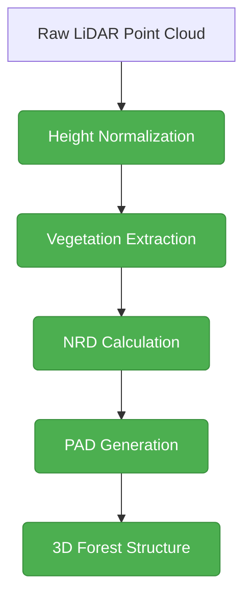

# Forest Fire Simulation Framework: Documentation

## About This Documentation

This document is intended as a user-focused guide to the Forest Fire Simulation Framework. For detailed technical specifications and implementation details, please refer to the accompanying `Forest_Fire_Simulation_Technical_Reference.md`.

## Quick Links to Technical Details

Throughout this document, you'll see references to more technical aspects of the framework. Here are quick links to key technical sections:

| If You Need Information About | See This Section in Technical Reference |
|------------------------------|----------------------------------------|
| Memory Optimization Details  | [Memory Management (Section 2.2)](Forest_Fire_Simulation_Technical_Reference.md#22-memory-management) |
| LiDAR Processing Pipeline    | [Forest Structure Representation (Section 2.1)](Forest_Fire_Simulation_Technical_Reference.md#21-forest-structure-representation) |
| Fire Spread Algorithms       | [Method Interrelationships (Section 2.4)](Forest_Fire_Simulation_Technical_Reference.md#24-method-interrelationships) |
| Performance Benchmarks       | [Performance Benchmarks (Section 4)](Forest_Fire_Simulation_Technical_Reference.md#4-performance-benchmarks) |
| Framework Architecture       | [Technical Architecture Overview (Section 1)](Forest_Fire_Simulation_Technical_Reference.md#1-technical-architecture-overview) |
| Configuration Reference      | [Simulation Parameters (Section 6.1)](Forest_Fire_Simulation_Technical_Reference.md#61-simulation-parameters) |
| API Reference                | [API Reference (Section 6.4)](Forest_Fire_Simulation_Technical_Reference.md#64-api-reference) |
| Environmental Data           | [Environmental Data Integration (Section 3.10)](Forest_Fire_Simulation_Technical_Reference.md#310-environmental-data-integration) |
| Error Handling               | [Error Handling Framework (Section 3.9)](Forest_Fire_Simulation_Technical_Reference.md#39-comprehensive-error-handling-framework) |
| Validation Framework         | [Validation and Testing Framework (Section 6.6)](Forest_Fire_Simulation_Technical_Reference.md#66-validation-and-testing-framework) |

Look for 🔍 Technical Note indicators throughout this document for pointers to more detailed information in the Technical Reference.

## Recommended Reading Order

Depending on your role and goals, we recommend different paths through this documentation:

### For First-Time Users
1. **Overview**: Read the Executive Summary
2. **Installation**: Follow the setup instructions in Section 5.1
3. **Quick Start**: Complete a simple test run using Section 5.2
4. **Workflows**: Review common workflows in Section 3.1

### For Forest Managers
1. **Applications**: Start with Section 1.2 on real-world applications
2. **Case Studies**: Review related case studies in Section 5.4
3. **Interpretation**: Learn how to interpret results in Section 4.2
4. **Advanced Configuration**: Explore parameter tuning in Section 5.3

### For Researchers
1. **Methods**: Focus on Section 2 (How It Works)
2. **Technical Details**: Review the Technical Reference document
3. **Validation**: Understand the validation methodology in Technical Reference Section 6.6
4. **Extension Points**: Explore how to extend the framework in Technical Reference Section 10 (Future Directions)

### For Technical Implementers
1. **System Architecture**: Start with Technical Reference Section 1 (Technical Architecture Overview)
2. **Technical Reference**: Read the entire Technical Reference document
3. **Technical Components**: Focus on memory management (Technical Reference Section 2.2) and environmental data integration (Technical Reference Section 3.10)
4. **Benchmarking**: Learn how to benchmark using Technical Reference Section 6.5

### Documentation Structure

The complete documentation consists of two complementary documents:

1. **Forest_Fire_Simulation_Documentation.md** (this document): A user-focused guide that explains concepts, workflows, and practical usage of the framework. This document is ideal for:
   - Forest managers and practitioners who need to run simulations
   - Researchers interested in the conceptual approach and findings
   - New users seeking to understand the framework's capabilities
   - Stakeholders who need to interpret simulation results

2. **Forest_Fire_Simulation_Technical_Reference.md**: A technical reference that details implementation specifics, algorithms, data structures, and optimization techniques. This document is designed for:
   - Developers extending or modifying the framework
   - Technical users implementing the system in new environments
   - Researchers interested in the computational methods
   - Those seeking to understand the memory optimization techniques

### Thesis Context: Forest Fires in the Canary Islands

This framework was developed to address the unique challenges of forest fire simulation in the Canary Islands, where:

- **Complex Topography**: Steep volcanic terrain with ravines ("barrancos") and cliffs creates unique fire behavior patterns
- **Diverse Microclimates**: Elevation gradients from sea level to over 3,700m create varied weather conditions within short distances
- **Endemic Forest Ecosystems**: Specialized forests like the Canarian pine forest (Pinus canariensis) exhibit fire adaptations different from continental species
- **Limited Resources**: The islands face computational resource constraints when implementing large-scale simulations

The framework offers specialized techniques for handling these challenges, particularly in height normalization and topography-aware simulation, which has improved prediction accuracy in this complex environment.

### How to Use This Documentation

For most practical purposes, this document provides all the information needed to understand and use the Forest Fire Simulation Framework. When you encounter references to technical implementation details, you can refer to the corresponding sections in the Technical Reference document.

## Introduction to the Framework

The Forest Fire Simulation Framework is a system for modeling and analyzing forest fire behavior in three dimensions. This framework is designed to:

- **Support 3D Modeling**: Incorporate vertical forest structure through LiDAR-derived data
- **Optimize Memory Usage**: Handle large-scale simulations through innovative memory management
- **Integrate Scientific Models**: Implement established fire spread models based on current research
- **Enable Planning Applications**: Support forest management and fire planning scenarios

Key Design Features:
- Memory-optimized architecture for processing large areas
- LiDAR data integration for forest representation
- Cellular automaton-based fire spread modeling
- Benchmarking and validation tools

Intended Users:
- Forest Fire Managers
- Environmental Scientists
- GIS Specialists
- Forest Management Agencies

Framework Structure:
```python
from forest_fire_framework import create_config, run_simulation

# Create basic configuration
config = create_config(
    model_resolution=5.0,
    area_size=(1000, 1000),
    num_layers=10
)

# Run simulation
results = run_simulation(
    pad_data="path/to/forest_data",
    config=config
)
```

For detailed setup and usage instructions, see [Installation and Dependencies](#9-installation-and-dependencies).

## Table of Contents

1. [System Overview](#1-system-overview)
   - [Key Capabilities](#11-key-capabilities)
   - [File Structure](#12-file-structure-and-organization)
   - [Component Architecture](#13-component-architecture)

2. [Core Framework Components](#2-core-framework-components)
   - [Configuration System](#21-configuration-system-modelconfig)
   - [Configuration Validation](#22-configuration-validation)
   - [Class Hierarchy](#23-class-hierarchy)
   - [Memory Optimization](#23-memory-optimization-components)

3. [Fire Simulation Engine](#3-fire-simulation-engine)
   - [ForestModel](#31-forestmodel)
   - [Fire Spread Algorithm](#32-fire-spread-algorithm)

4. [Vegetation Data Processing](#4-vegetation-data-processing)
   - [LiDAR Data Pipeline](#41-lidar-data-pipeline)
   - [PAD and Forest Structure](#42-plant-area-density-pad-and-forest-structure)

5. [Benchmarking and Performance](#5-benchmarking-and-performance-analysis)
   - [Benchmark Function](#51-benchmark-function)
   - [Memory Estimation](#52-memory-estimation)

6. [Using the Framework](#6-using-the-framework)
   - [Basic Simulation](#61-running-a-basic-simulation)
   - [Large-Scale Simulation](#62-running-a-large-scale-simulation)
   - [Running Benchmarks](#63-running-benchmarks)

7. [Best Practices](#7-best-practices-and-guidelines)
   - [Configuration Management](#71-configuration-management)
   - [Memory Optimization](#72-memory-optimization)
   - [Performance Considerations](#73-performance-considerations)

8. [Logging System](#8-logging-system)
   - [Architecture](#81-logging-architecture)
   - [Log Formats](#82-log-formats)
   - [Enhanced Filters](#83-enhanced-logging-filters)
   - [SimulationLogger](#84-simulationlogger-class)
   - [Configuration](#85-configuring-logging)
   - [Component Loggers](#86-component-specific-loggers)
   - [Default Levels](#87-default-log-levels)
   - [Best Practices](#88-best-practices-for-logging)

9. [Installation and Dependencies](#9-installation-and-dependencies)
   - [System Requirements](#91-system-requirements)
   - [Dependencies](#92-dependencies)
   - [Installation Steps](#93-installation-steps)

10. [Error Handling and Recovery](#10-error-handling-and-recovery)
    - [Common Errors](#101-common-error-scenarios)
    - [Recovery Mechanisms](#102-recovery-mechanisms)
    - [Health Monitoring](#103-health-monitoring)

11. [Memory Management](#11-memory-management)
    - [Memory Profiling](#111-memory-profiling)
    - [Cache Optimization](#112-cache-optimization)
    - [Usage Patterns](#113-memory-usage-patterns)
    - [Optimization Tips](#114-optimization-recommendations)
    - [Memory Requirement Calculation](#113-memory-requirement-calculation)
    - [Layer Grouping Memory Optimization](#114-layer-grouping-memory-optimization)

12. [Technical Reference](#12-technical-reference)

13. [Updates and Changes](#13-updates-and-changes)

14. [Testing and Validation](#14-testing-and-validation)
    - [Testing Framework](#141-testing-framework)
    - [Validation Datasets](#142-validation-datasets)
    - [Performance Testing](#143-performance-testing)
    - [Validation Procedures](#144-validation-procedures)

15. [API Reference](#15-api-reference)
    - [Core Classes](#151-core-classes)
    - [Utility Functions](#152-utility-functions)
    - [Data Structures](#153-data-structures)
    - [I/O Specifications](#154-inputoutput-specifications)

16. [Troubleshooting Guide](#16-troubleshooting-guide)
    - [Common Issues and Solutions](#161-common-issues-and-solutions)
    - [Diagnostic Tools](#162-diagnostic-tools)
    - [Error Messages and Meanings](#163-error-messages-and-meanings)
    - [Performance Optimization Checklist](#164-performance-optimization-checklist)
    - [Getting Help](#165-getting-help)

17. [Core Components Reference](#17-core-components-reference)
    - [Cellular Automata Implementation](#171-cellular-automata-implementation)
    - [Vegetation Data Integration](#172-vegetation-data-integration)
    - [Core Simulation Framework](#173-core-simulation-framework)
    - [Fire Simulation Engine](#174-fire-simulation-engine)

18. [Testing Framework](#18-testing-framework)
    - [Unit Testing](#181-unit-testing)
    - [Integration Testing](#182-integration-testing)
    - [Performance Testing](#183-performance-testing)
    - [Test Data](#184-test-data)
    - [Continuous Integration](#185-continuous-integration)
    - [Test Coverage](#186-test-coverage)

19. [Version History](#19-version-history)

20. [Glossary of Terms](#20-glossary-of-terms)

21. [Code Examples and Use Cases](#21-code-examples-and-use-cases)
    - [Example Directory](#211-example-directory)
    - [Practical Use Cases](#212-practical-use-cases)
    - [Application Scenarios](#213-application-scenarios)
    - [Integration Examples](#214-integration-examples)

22. [Frequently Asked Questions (FAQ)](#22-frequently-asked-questions-faq)
    - [General Questions](#221-general-questions)
    - [Technical Questions](#222-technical-questions)
    - [Usage Questions](#223-usage-questions)
    - [Troubleshooting Questions](#224-troubleshooting-questions)

## 1. System Overview

The Forest Fire Simulation Framework is a comprehensive system for simulating and analyzing forest fires in three dimensions. It is designed with a focus on memory optimization, scalability, and modular architecture to enable realistic simulations across a wide range of spatial scales and computational resources.

The framework implements a cellular automaton approach to fire propagation, with vertical layering to represent the 3D nature of forest canopies. It integrates LiDAR-derived vegetation data and environmental influences like wind and terrain to create realistic fire spread patterns.

### 1.1 Key Capabilities

- **3D Simulation**: Vertical layering enables realistic representation of canopy structure and fire behavior
- **Memory Optimization**: Tiled processing, multi-resolution grids, and disk-based storage enable simulation of large areas
- **LiDAR Integration**: Direct incorporation of LiDAR-derived vegetation structure (via PAD calculation)
- **Environmental Factors**: Wind, slope, and fuel moisture influence fire spread
- **Modular Design**: Components can be extended or replaced independently
- **Benchmarking Tools**: Systematic performance measurement and optimization

### 1.2 File Structure and Organization

The framework consists of the following key files:

| File | Description |
|------|-------------|
| `core_simulation_framework.py` | Core classes and utilities for the simulation system |
| `fire_simulation_engine.py` | Fire spread algorithms and simulation logic |
| `config_tools.py` | Configuration management and optimization tools |
| `vegetation_data_integration.py` | LiDAR data processing and forest structure creation |
| `run_tiled_simulation.py` | High-level runner scripts and benchmark tools |
| `logging_utils.py` | Standardized logging for all components |
| `PAD_calculation.py` | Plant Area Density calculation from LiDAR data |
| `NRD_calculation.py` | Normalized Relative Density calculation from LiDAR points |
| `height_normalisation_all.py` | Process raw LiDAR data for height normalization |
| `config_validation.py` | Configuration validation and parameter checking |

### 1.3 Component Architecture

The framework uses a layered architecture with multiple interacting components:

```
┌─────────────────────────────────────────────────────┐
│                  Configuration Layer                 │
│   (ModelConfig, ConfigurationManager, config_tools)  │
└───────────────────────────┬─────────────────────────┘
                            │
┌───────────────────────────┼─────────────────────────┐
│                   Core Framework Layer               │
│         (BaseForestModel, TileManager, etc.)         │
└───────────┬─────────────────────────────┬───────────┘
            │                             │
┌───────────▼──────────┐      ┌───────────▼──────────┐
│  Vegetation Processing│      │   Simulation Engine  │
│  (PAD calculation,    │      │   (ForestModel,      │
│   LiDAR processing)   │      │    FireSimulation)   │
└──────────────────────┘      └──────────────────────┘
            │                             │
            └─────────────┬───────────────┘
                          │
┌─────────────────────────▼─────────────────────────┐
│                Runner & Benchmarking               │
│     (run_tiled_simulation, benchmark_simulation)   │
└─────────────────────────────────────────────────────┘
```

## 2. Core Framework Components

### 2.1 Configuration System (ModelConfig)

The ModelConfig class (`config_tools.py`) serves as the single source of truth for all configuration parameters across the entire simulation system.

```python
class ModelConfig:
    """
    Centralized configuration system for the forest fire modeling framework.
    
    This class serves as the single source of truth for all configuration parameters,
    with each component accessing only the parameters relevant to its operation,
    while maintaining consistency across the system.
    """
    # Spatial configuration 
    model_resolution: float = 5.0  # meters per grid cell
    num_layers: int = 8  # number of vertical layers
    layer_height: float = 1.0  # meters per layer
    
    # Fire behavior parameters
    spread_probability: float = 0.3
    vertical_spread: float = 0.2
    downward_spread: float = 0.15
    
    # ... other parameter groups ...
```

> **Important Note**: The `ModelConfig` class only covers simulation parameters, not preprocessing parameters. The preprocessing scripts (`height_normalisation_all.py`, `NRD_calculation.py`, and `PAD_calculation.py`) have their own separate configuration systems with command-line arguments and default values.

Key configuration parameter groups include:
- **Spatial Parameters**: Control resolution and dimensions
- **Fire Behavior Parameters**: Control spread mechanics
- **Environmental Conditions**: Wind, moisture, etc.
- **Memory Management**: Tiling, caching, and optimization
- **Simulation Control**: Steps, outputs, and termination

Configuration utilities in `config_tools.py` include:
- `create_config()`: Create new configurations with custom parameters
- `estimate_memory()`: Estimate memory requirements for a simulation
- `optimize_config()`: Automatically adjust parameters based on constraints
- `save_config()` / `load_config()`: Persist configurations
- `ConfigurationManager`: Manage configuration presets

### 2.2 Configuration Validation

The framework includes a robust configuration validation system (`config_validation.py`) to ensure that simulation parameters are within acceptable ranges and conform to required constraints. This helps prevent errors and ensures consistent behavior across simulations.

#### 2.2.1 Validation Levels

The validation system supports three levels of validation:

```python
class ValidationLevel(Enum):
    """Validation level used to determine action on validation failure."""
    WARNING = 0   # Log warning but continue
    ERROR = 1     # Raise exception and abort
    FIX = 2       # Automatically fix the value to nearest valid value
```

These levels control how the system responds to invalid parameter values:
- **WARNING**: Issues are logged but execution continues with the original value
- **ERROR**: An exception is raised, halting execution
- **FIX**: The value is automatically adjusted to the nearest valid value

#### 2.2.2 Validator Types

The framework includes specialized validators for different parameter types:

```python
# Range validator for numeric parameters
range_validator = RangeValidator(
    param_name="spread_probability",
    min_value=0.0,
    max_value=1.0,
    level=ValidationLevel.FIX
)

# Choice validator for enumerated parameters
choice_validator = ChoiceValidator(
    param_name="storage_optimization_level",
    valid_choices={0, 1, 2, 3},
    level=ValidationLevel.ERROR
)

# Type validator for parameter types
type_validator = TypeValidator(
    param_name="tile_size",
    expected_type=int,
    level=ValidationLevel.ERROR
)
```

#### 2.2.3 Configuration Validator

The `ConfigurationValidator` class manages a registry of validators and provides methods for validating entire configuration objects:

```python
# Create a validator
validator = ConfigurationValidator()

# Register validators for parameters
validator.register_range("model_resolution", min_value=0.1, max_value=100.0, level=ValidationLevel.ERROR)
validator.register_range("num_layers", min_value=1, max_value=100, level=ValidationLevel.WARNING)
validator.register_choice("storage_optimization_level", {0, 1, 2, 3}, level=ValidationLevel.FIX)
validator.register_type("tile_size", int, level=ValidationLevel.ERROR)

# Validate a configuration dictionary
config_dict = {
    "model_resolution": 5.0,
    "num_layers": 8,
    "storage_optimization_level": 5,  # Invalid, will be fixed to 3
    "tile_size": "200"  # Invalid type, will raise error
}

try:
    # Validate and fix configuration
    valid_config = validator.validate_and_fix_config(config_dict)
    print("Validated config:", valid_config)
except ValueError as e:
    print("Validation error:", e)
```

#### 2.2.4 Default Validators

The framework provides a set of default validators for common parameters:

```python
# Default validators are pre-configured in config_validation.py
from config_validation import default_validator, validate_config

# Validate a configuration with the default validator
try:
    valid_config = validate_config(my_config)
except ValueError as e:
    print("Invalid configuration:", e)
```

The validation system helps prevent common configuration errors and ensures that simulations run with sensible parameter values, improving reliability and consistency of results.

### 2.3 Class Hierarchy

The framework uses inheritance to implement specialization:

```
BaseForestModel (core_simulation_framework.py)
 ├── ForestModel (fire_simulation_engine.py)
 │    └── MemoryOptimizedForestModel (fire_simulation_engine.py)
 └── MinimalForestModelStub (vegetation_data_integration.py)
```

The `BaseForestModel` class (`core_simulation_framework.py`) establishes the core interface for all forest fire models:

```python
class BaseForestModel:
    """
    Abstract base class for forest fire simulation models.
    
    Defines the fundamental data structures, initialization parameters,
    and API methods that all derived model classes must implement.
    """
    def __init__(self, config=None):
        # Initialize with configuration parameters
        
    def set_ignition_points(self, points):
        """Set initial ignition points for the fire."""
        
    def run_simulation_step(self):
        """Advance the simulation by one step."""
        
    def get_fire_state(self):
        """Get the current fire state grid."""
```

### 2.3 Memory Optimization Components

#### 2.3.1 TileManager

The `TileManager` class (`core_simulation_framework.py`) manages the loading, unloading, and processing of spatial data tiles:

```python
class TileManager:
    """
    Manages the loading, unloading, and processing of spatial data tiles.
    
    Enables large-scale simulations by dynamically managing which 
    portions of the grid are in memory at any time.
    """
    def __init__(self, grid_width, grid_height, tile_size, overlap=10, 
                 memory_limit_mb=4000, num_layers=1, 
                 on_tile_load=None, on_tile_unload=None):
        # Initialize tile management system
        
    def activate_tile(self, tile_x, tile_y, tile_data=None):
        """Activate a tile, making it available for processing."""
        
    def deactivate_tile(self, tile_x, tile_y):
        """Deactivate a tile, removing it from active processing."""
        
    def get_tile_data(self, tile_x, tile_y):
        """Get the data for a specific tile."""
```

#### 2.3.2 DiskStorageManager

The `DiskStorageManager` class (`core_simulation_framework.py`) provides persistent storage for inactive tiles:

```python
class DiskStorageManager:
    """
    Manages storage and retrieval of data to/from disk.
    
    Works with TileManager to handle data that doesn't fit in memory.
    """
    def __init__(self, storage_dir="storage", max_memory_mb=1000, 
                 compression_level=1):
        # Initialize disk storage system
        
    def store(self, key, data):
        """Store data with the given key."""
        
    def retrieve(self, key):
        """Retrieve data with the given key."""
        
    def clear_cache(self):
        """Clear the memory cache."""
```

#### 2.3.3 TiledSimulationWithStorage

The `TiledSimulationWithStorage` class (`core_simulation_framework.py`) provides a unified API for large-scale simulations using tiling and disk storage:

```python
class TiledSimulationWithStorage:
    """
    Integrated simulation manager for large-scale simulations.
    
    Combines tile management and disk storage for memory-efficient
    simulations of very large areas.
    """
    def __init__(self, config, grid_width, grid_height, tile_size=200, 
                 storage_cache_mb=512, storage_dir="simulation_storage"):
        # Initialize integrated simulation
        
    def load_environmental_data(self, terrain_data=None, fuel_data=None):
        """Load environmental data for the simulation."""
        
    def set_ignition_points(self, points):
        """Set ignition points to start the fire."""
        
    def run_step(self):
        """Run a single simulation step."""
        
    def export_results(self, output_dir):
        """Export simulation results."""
        
    def cleanup(self):
        """Clean up resources."""
```

This class integrates tiling and disk storage for very large simulations, providing a complete solution that automatically manages memory by keeping only active tiles in RAM while offloading inactive data to disk.

## 3. Fire Simulation Engine

### 3.1 ForestModel

The `ForestModel` class (`fire_simulation_engine.py`) implements the concrete simulation model:

```python
class ForestModel(BaseForestModel):
    """
    Standard implementation of the forest fire simulation model.
    
    Implements the full fire spread algorithm with environmental factors.
    """
    def __init__(self, config=None):
        super().__init__(config)
        # Additional initialization
        
    def set_ignition_points(self, points):
        """Set initial ignition points for the fire."""
        
    def run_simulation_step(self):
        """Advance the simulation by one step."""
        
    def calculate_fire_spread(self):
        """Calculate fire spread for the current step."""
```

### 3.2 Fire Spread Algorithm

The core fire spread algorithm uses a cellular automaton approach with the following states:

```python
class CellState(Enum):
    """
    Enumeration of possible cell states in the forest fire model.
    """
    UNBURNED = 0  # Cell contains unburned fuel
    BURNING = 1   # Cell is currently burning
    BURNED = 2    # Cell has completely burned
```

The fire spread calculation (in `fire_simulation_engine.py`) considers:
- **Horizontal spread**: To adjacent cells based on fuel load, wind, and slope
- **Vertical spread**: Between forest layers based on vegetation connectivity
- **Ember transport**: Long-distance spotting based on wind and fire intensity

The algorithm uses a sigmoid function to model ignition probability, providing a more realistic S-shaped probability curve:

```python
def sigmoid_ignition_neighbors(n_burning, k, threshold):
    """
    Calculate ignition probability using a sigmoid function based on number of burning neighbors.
    
    Args:
        n_burning: Number of burning neighbors
        k: Steepness parameter of the sigmoid curve
        threshold: Inflection point of the sigmoid curve
        
    Returns:
        float: Ignition probability between 0 and 1
    """
    return 1.0 / (1.0 + np.exp(-k * (n_burning - threshold)))
```

This approach creates a more realistic transition from low to high ignition probability as conditions become more favorable for fire spread.

The algorithm is optimized using Numba JIT compilation:

```python
@jit(nopython=True, parallel=True)
def calculate_fire_spread(current_state, fuel_grid, moisture_grid, wind_x, wind_y,
                          spread_prob, ember_prob, threshold):
    """
    Calculate fire spread for a single simulation step.
    
    JIT-compiled for performance.
    """
    # Implementation details...
```

### 3.2.1 Terrain-Influenced Wind Modeling

The framework includes sophisticated terrain-influenced wind modeling through the `initialize_terrain_wind` method:

```python
def initialize_terrain_wind(self, trade_wind_direction, trade_wind_strength, 
                           terrain_effect_strength=0.5, barranco_threshold=5.0,
                           barranco_amplification=1.5):
    """
    Initialize wind direction and speed across the forest grid using terrain data.
    
    This method creates a wind field that starts with a uniform base wind (trade wind)
    and then applies terrain effects to modify both wind speed and direction.
    It also identifies barrancos features (ravines/depressions) and amplifies
    wind speed in those areas to simulate channeling effects.
    """
```

This feature:

1. **Modifies Wind Direction**: Wind follows terrain contours, deflecting around hills and along valleys
2. **Adjusts Wind Speed**: Speed increases over ridges and decreases in valleys based on terrain slope
3. **Detects Topographic Features**: Automatically identifies ravines ("barrancos") in the terrain
4. **Applies Channeling Effects**: Amplifies wind speed in narrow valleys to simulate wind channeling
5. **Creates Spatially Variable Wind**: Generates a complete wind vector field that varies across the terrain

This approach enables realistic modeling of complex fire behavior in mountainous terrain, where wind-terrain interactions significantly impact fire spread patterns. The implementation is particularly relevant for the Canary Islands context, where steep volcanic terrain creates complex wind patterns during fire events.

To use terrain-influenced wind in a simulation:

```python
# Load terrain data first
model.load_terrain_data("path/to/dem.tif")

# Initialize terrain-influenced wind field
model.initialize_terrain_wind(
    trade_wind_direction=np.pi/4,    # 45° (northeast wind)
    trade_wind_strength=0.8,         # Strong consistent wind
    terrain_effect_strength=0.6,     # Strong terrain influence
    barranco_threshold=5.0,          # Detect ravines with >5m elevation difference
    barranco_amplification=1.8       # Amplify wind 1.8x in ravines
)
```

### 3.3 Interactive Visualization

The framework includes interactive visualization tools for exploring fire spread patterns and dynamics:

```python
from fire_simulation_engine import visualize_fire_spread_interactive

# Run a simulation first
model = ForestModel(grid_size=200, num_layers=8)
model.set_ignition(100, 100, 0)
model.run_simulation(max_steps=100)

# Launch interactive visualization
visualize_fire_spread_interactive(model)
```

The interactive visualization provides these key features:

1. **Real-time Exploration**: Navigate through simulation time steps with playback controls
2. **Layer Selection**: Switch between different vertical layers or view composite representations
3. **Interactive Controls**: Buttons for play/pause, speed control, and layer switching
4. **Dynamic Statistics**: Real-time updates of fire metrics (burned area, spread rate, etc.)
5. **Export Options**: Save screenshots or animations at any point during exploration

This capability is especially valuable for:
- Detailed analysis of complex fire behavior
- Educational demonstrations
- Presentation of simulation results to stakeholders
- Identifying critical transition points in fire spread

## 4. Vegetation Data Processing

### 4.1 LiDAR Data Pipeline

The framework processes raw LiDAR data into usable forest structure through a well-defined pipeline:



#### 4.1.0 Preprocessing Configuration

> **Important Note**: The preprocessing scripts each have their own configuration system separate from the `ModelConfig` class and `config_tools.py` module. These tools are configured through:

1. **Command-line Arguments**: Each script accepts parameters as command-line arguments
2. **Default Constants**: Hard-coded defaults in each script
3. **Environment Variables**: Some scripts check for environment variables

#### 4.1.1 Creating Forest Models from Raster Data

The framework provides a specialized method for creating forest models directly from LiDAR-derived raster data:

```python
# Create a forest model from LiDAR-derived rasters
forest_model = TiledLiDARIntegration.create_model_from_rasters(
    base_dir="path/to/pad_rasters",
    target_resolution=5.0,    # 5 meters per cell
    num_layers=40,            # 40 vertical layers
    tile_size=200,            # Size of processing tiles in cells
    overlap=20,               # Overlap between tiles in cells
    debug=True                # Enable detailed logging
)
```

This method handles the entire process of:
1. Determining optimal grid size based on the geographic extent of your raster data
2. Creating an appropriate forest model instance
3. Initializing the tiled environment with efficient memory management
4. Calculating vertical connectivity between forest layers based on vegetation structure

**Parameters:**
- `base_dir`: Base directory containing PAD/fuel raster files
- `target_resolution`: Desired spatial resolution in meters per cell
- `num_layers`: Number of vertical layers to represent the forest
- `grid_size`: Optional explicit grid size (if None, calculated from rasters)
- `tile_size`: Size of each processing tile in grid cells
- `overlap`: Overlap between tiles in grid cells
- `debug`: Whether to enable debug output

**Returns:**
- Fully initialized forest model instance ready for simulation

#### 4.1.2 Processing Regions with Layer Groups

For extremely large areas with high vertical resolution, the framework provides a memory-efficient approach that processes vertical layers in groups:

```python
# Create a tiled integration instance
tiled_integration = TiledLiDARIntegration(model, base_dir)

# Initialize using layer groups for memory efficiency
stats = tiled_integration.process_region_with_layer_groups(
    region_bounds=(0, 0, grid_size, grid_size),
    layer_group_size=10
)

print(f"Processed {stats['processed_layer_groups']} layer groups")
print(f"Total cells processed: {stats['total_cells_processed']}")
```

This memory-efficient algorithm divides the processing into smaller chunks to optimize memory usage:

1. **Layer Grouping**: Instead of loading all vertical layers at once (which could be 40-80 layers), the algorithm processes groups of layers (typically 10 at a time).

2. **Memory Optimization**: This approach reduces peak memory usage by a factor of (total_layers / layer_group_size), enabling high-resolution processing on memory-constrained systems.

3. **Processing Flow**:
   - For each layer group, load only relevant data
   - Process vegetation data for those layers
   - Release memory before processing the next group
   - Combine results into the final model

This is particularly important for large-scale simulations, such as processing entire islands like Tenerife at 5m resolution with 80 vertical layers, which would otherwise require excessive memory.

#### 4.1.3 Data Resampling Techniques

The framework employs sophisticated resampling techniques to ensure high-quality data integration:

##### Bilinear Interpolation for Vegetation Data

When integrating LiDAR-derived vegetation data (PAD - Plant Area Density) at different resolutions than the simulation grid, bilinear interpolation is used to maintain data quality:

```python
# Vegetation data resampling with bilinear interpolation
from scipy.ndimage import zoom

# Calculate zoom factor based on resolution difference
zoom_factor = source_resolution / target_resolution

# Apply bilinear interpolation (order=1)
resampled_data = zoom(source_data, zoom_factor, order=1, mode='nearest')
```

The use of bilinear interpolation (rather than nearest neighbor or cubic) is critical for vegetation data for several reasons:

1. **Preserves Vegetation Gradients**: Maintains smooth transitions between areas with different vegetation densities
2. **Reduces Aliasing Artifacts**: Prevents the creation of artificial patterns that can affect fire spread behavior
3. **Balances Performance and Accuracy**: Provides adequate smoothing without excessive computational overhead
4. **Maintains Edge Definition**: Preserves important vegetation boundaries that influence fire spread

In the `vegetation_data_integration.py` module, bilinear interpolation is used when:
- Resampling individual PAD raster layers to match the simulation grid resolution
- Processing tiled data where multiple tiles need to be combined
- Converting between different coordinate systems or projections

When processing data in memory-constrained environments, a tiled approach is used that still maintains bilinear interpolation at tile boundaries:

```python
# Weighted blending at tile boundaries using bilinear weights
alpha = np.ones_like(tile_data)
# Calculate distance-based weight factors for overlap regions
for i in range(overlap):
    # Apply distance-based weights (essentially bilinear)
    edge_dist = i / overlap
    weight = edge_dist  # Linear weight factor
    # Apply to each edge of the tile
    alpha[i, :] = np.minimum(alpha[i, :], weight)
    alpha[:, i] = np.minimum(alpha[:, i], weight)
    alpha[-(i+1), :] = np.minimum(alpha[-(i+1), :], weight)
    alpha[:, -(i+1)] = np.minimum(alpha[:, -(i+1), :], weight)
    
# Blend new tile with existing data using the weights
combined_data = (1.0 - alpha) * existing_data + alpha * tile_data
```

This approach ensures seamless transitions between tiles while maintaining computational efficiency.

#### 4.1.4 Vertical Connectivity Calculation

A crucial aspect of the 3D vegetation model is the calculation of vertical connectivity between forest layers:

```python
# After loading vegetation data
model.calculate_vertical_connectivity()
```

The `calculate_vertical_connectivity()` method analyzes the 3D structure of vegetation to determine how easily fire can spread vertically between layers:

1. **Algorithm Details**:
   - Creates a 3D connectivity array with the same dimensions as the fuel grid
   - For each pair of adjacent layers, computes connectivity based on vegetation structure:
     ```python
     # Pseudocode for the calculation
     for each layer z:
         # Get fuel values for current layer and layer above
         current_layer = fuel_load[:,:,z]
         above_layer = fuel_load[:,:,z+1]
         
         # Calculate factors that influence connectivity
         min_vegetation = minimum(current_layer, above_layer)
         structural_continuity = 1 - abs(current_layer - above_layer) / sum
         transmittance_similarity = 1 - abs(transmittance_current - transmittance_above)
         
         # Combine factors with weights
         connectivity = 0.4 * normalized_vegetation + 
                       0.4 * structural_continuity + 
                       0.2 * transmittance_similarity
         
         # Scale to appropriate range [0.1, 0.9]
         connectivity = 0.1 + 0.8 * connectivity
     ```

2. **Connectivity Factors**:
   - **Vegetation Amount**: Higher connectivity when both layers have significant vegetation
   - **Structural Continuity**: Higher connectivity when vegetation density is similar between layers
   - **Transmittance Similarity**: Higher connectivity when light penetration properties are similar

3. **Physical Basis**:
   - Vertical fire spread is more likely when:
     - Both layers have significant vegetation (fuel)
     - The vegetation structure is continuous between layers
     - The vegetation density transitions smoothly between layers

The calculated connectivity values range from 0.1 (minimal connectivity) to 0.9 (maximal connectivity) and directly influence how fire spreads vertically in the simulation.

### 4.2 Satellite-Derived Vegetation Data

The framework supports integration of satellite-derived vegetation data for fire risk assessment and climate change impact studies. This data is used to:

1. **Provide additional context**: Enhance the realism of the simulation by incorporating vegetation types and growth stages.
2. **Support climate change scenarios**: Simulate the impact of different vegetation conditions on fire behavior under future climate scenarios.

#### 4.2.1 Landsat Data Integration

The framework includes functionality to integrate Landsat data for vegetation monitoring and classification. Landsat data is used to:

1. **Generate vegetation indices**: Calculate NDVI (Normalized Difference Vegetation Index) and other vegetation indices to assess vegetation health and growth.
2. **Support climate change scenarios**: Use Landsat data to simulate vegetation changes under different climate scenarios.

#### 4.2.2 Fuel Models Integration

The framework supports integration of standard fuel models for fire behavior analysis. Fuel models are used to:

1. **Provide realistic fire spread**: Incorporate fuel load and moisture content into the fire spread calculation.
2. **Support climate change scenarios**: Use fuel models to simulate changes in fire behavior under different climate scenarios.

### 4.3 Large Geographic Area Processing

The framework provides specialized functions for processing very large geographic areas such as entire islands, regions, or forest systems.

#### 4.3.1 Tenerife Island Processing Pipeline

A complete pipeline for processing large areas like Tenerife includes multiple stages:

```python
# Process Tenerife at fixed 5m resolution
model_data = process_tenerife_at_5m(
    base_dir="path/to/pad_rasters",
    output_dir="path/to/output",
    num_layers=80,
    layer_group_size=10
)

# Export individual layers to GeoTIFF for analysis
export_tenerife_model_for_qgis(
    model_data=model_data,
    output_path="path/to/qgis_layers",
    layer_indices=[0, 20, 40, 60],  # Export specific vertical layers
    decimation_factor=None  # No resolution reduction
)
```

The Tenerife processing pipeline implements several specialized techniques for large-area processing:

##### process_tenerife_at_5m

The `process_tenerife_at_5m()` function provides a complete workflow for processing the entire island of Tenerife at exactly 5m resolution:

```python
def process_tenerife_at_5m(base_dir, output_dir=None, num_layers=80, layer_group_size=10):
    """
    Process Tenerife at exactly 5m resolution with no resolution compromise.
    
    Args:
        base_dir: Directory containing PAD raster files
        output_dir: Directory to save output files
        num_layers: Number of vertical layers to process
        layer_group_size: Number of layers to process in each memory-optimized group
        
    Returns:
        Dictionary containing processed model data
    """
```

This function:

1. **Maintains Exact Resolution**: Unlike standard large-area processing that might adjust resolution for memory constraints, this function maintains exactly 5.0m resolution regardless of area size.

2. **Super-Tile Processing**: Divides the area into super-tiles (10km × 10km regions) to manage memory usage:
   ```python
   # Calculate dimensions of super-tiles in cells (at 5m resolution)
   cells_per_km = 1000 / 5.0  # 200 cells per km at 5m resolution
   cells_per_super_tile = int(super_tile_size_km * cells_per_km)
   ```

3. **Two-Level Tiling Hierarchy**:
   - First level: Super-tiles (10km × 10km)
   - Second level: Standard processing tiles (e.g., 200 × 200 cells)
   - Each super-tile is processed independently to control memory usage

4. **Memory Optimization**:
   - Processes vertical layers in groups (e.g., 10 layers at a time)
   - Immediately converts PAD data to model data to reduce peak memory usage
   - Uses region-based processing rather than loading all data at once

5. **Output Options**:
   - Saves individual super-tile models that can be loaded separately
   - Optionally generates merged outputs for visualization
   - Provides GeoTIFF export for GIS analysis

##### process_tenerife_scale_model

For maximum flexibility, the `process_tenerife_scale_model()` function provides additional controls:

```python
def process_tenerife_scale_model(
    base_dir, 
    output_dir=None, 
    num_layers=80, 
    target_resolution=5.0, 
    super_tile_size_km=10.0,
    layer_group_size=10
):
    """
    Process a Tenerife-scale model with configurable parameters.
    
    This version allows resolution adjustments to balance detail and performance.
    """
```

Key features:

1. **Dynamic Resolution Adjustment**: Can adjust resolution based on area size and memory constraints
2. **Configurable Super-Tile Size**: Control the size of processing chunks for different hardware capabilities
3. **Flexible Layer Configuration**: Adjust vertical resolution independently from spatial resolution

##### merge_tenerife_subtiles

After processing, the `merge_tenerife_subtiles()` function combines individual super-tiles into unified outputs:

```python
def merge_tenerife_subtiles(model_data, output_path, decimation_factor=None):
    """
    Merge processed super-tiles into unified GeoTIFF outputs.
    
    Args:
        model_data: Dictionary of processed model data
        output_path: Directory to save merged outputs
        decimation_factor: Optional factor to reduce resolution for visualization
    """
```

This function:

1. **Creates Unified Visualization**: Merges individual super-tiles into single GeoTIFF files
2. **Handles Geographic Referencing**: Maintains proper georeferencing for GIS integration
3. **Optional Decimation**: Can reduce output resolution for easier visualization of very large areas
4. **Layer Selection**: Exports representative vertical layers (e.g., 0m, 40m, 80m, 120m heights)

These specialized functions make it possible to process extremely large areas at high resolution, even on systems with limited memory. The approach has been successfully used to process the entire island of Tenerife (>2,000 km²) at 5m resolution with 80 vertical layers.

## 5. Benchmarking and Performance Analysis

The framework includes tools for systematically measuring and evaluating performance:

### 5.1 Benchmark Function

The `benchmark_simulation` function (`run_tiled_simulation.py`) is designed to test different memory optimization configurations:

```python
def benchmark_simulation(
    grid_size=(1000, 1000),
    num_layers=3,
    output_dir="benchmark_results",
    repetitions=3,
    include_profiling=True,
    config_file=None,
    custom_params=None
):
    """
    Run benchmark tests on the forest fire simulation with different configurations.
    
    Tests baseline, tiling, multi-resolution, disk storage, and full optimization.
    """
```

### 5.2 Memory Estimation

The memory estimation system (`config_tools.py`) helps predict resource needs:

```python
def estimate_memory(config, width_cells, height_cells):
    """
    Estimate memory requirements for a forest fire simulation.
    
    Returns detailed breakdown of memory usage by component.
    """
```

## 6. Using the Framework

### 6.1 Running a Basic Simulation

```python
from config_tools import create_config
from run_tiled_simulation import run_tiled_simulation

# Create configuration
config = create_config(
    model_resolution=5.0,
    num_layers=10,
    wind_speed=8.0,
    wind_direction=90
)

# Run simulation
model = run_tiled_simulation(
    base_dir="path/to/pad_rasters",
    dem_path="path/to/terrain.tif",
    config=config
)
```

### 6.2 Running a Large-Scale Simulation

```python
from run_tiled_simulation import run_large_scale_simulation_with_disk_storage

# Run large simulation with disk storage
results = run_large_scale_simulation_with_disk_storage(
    config_file="large_area_config.json",
    output_dir="large_simulation_results",
    storage_dir="temp_storage",
    cache_size_mb=1024
)
```

#### 6.2.1 TiledSimulationRunner

The `TiledSimulationRunner` class provides a comprehensive interface for running large-scale simulations with advanced memory management:

```python
from run_tiled_simulation import TiledSimulationRunner
from config_tools import create_config

# Create configuration
config = create_config(
    model_resolution=5.0,
    num_layers=10
)

# Initialize runner
runner = TiledSimulationRunner(
    config=config,
    base_dir="path/to/pad_data",
    dem_path="path/to/terrain.tif"
)

# Setup and run simulation
results = runner.setup().run()

# Visualize results
runner.visualize(output_dir="simulation_results")
```

The `TiledSimulationRunner` provides these key features:
- Automatic geographic extent determination from input data
- Optimized configuration for memory constraints
- Tile management for large-area processing
- Integration with DiskStorageManager for extremely large areas
- Automatic environment setup (terrain, wind, fuel moisture)
- Comprehensive result collection and visualization

This class is the recommended approach for running simulations on large geographic areas where memory constraints may be an issue.

### 6.3 Running Benchmarks

```python
from run_tiled_simulation import benchmark_simulation

# Run comprehensive benchmarks
results = benchmark_simulation(
    grid_size=(2000, 2000),
    num_layers=5,
    repetitions=3,
    include_profiling=True,
    output_dir="benchmark_results"
)
```

### 6.1 Configuration Parameters

The framework uses a centralized configuration system implemented through the `ModelConfig` class. This ensures consistent parameter usage across all components.

#### 6.1.1 Parameter Overview

Below is a brief overview of the key parameter categories:

| Category | Purpose | Example Parameters |
|----------|---------|-------------------|
| Spatial | Define grid resolution and size | `MODEL_RESOLUTION`, `GRID_SIZE` |
| Vertical Structure | Control 3D forest layers | `NUM_LAYERS`, `LAYER_HEIGHT_METERS` |
| Fire Behavior | Define fire spread mechanics | `HORIZONTAL_SPREAD_PROBABILITY`, `EMBER_GENERATION_PROBABILITY` |
| Memory Management | Control memory usage | `USE_DISK_STORAGE`, `TILE_SIZE` |
| Environmental | Define external conditions | `WIND_DIRECTION`, `FUEL_MOISTURE` |
| Visualization | Control output displays | `VIZ_FRAME_INTERVAL_MS`, `VIZ_ELEVATION_FACTOR` |

> **Note**: For a complete parameter reference with detailed descriptions, default values, and usage examples, please refer to [Section 6.1: Configuration Reference](Forest_Fire_Simulation_Technical_Reference.md#61-configuration-reference) in the Technical Reference document.

#### 6.1.2 Loading and Saving Configurations

Configurations can be loaded from and saved to JSON files:

```python
from core_simulation_framework import ModelConfig

# Load configuration
ModelConfig.load_config('config.json')

# Access a parameter
resolution = ModelConfig.MODEL_RESOLUTION

# Save current configuration
ModelConfig.save_config('my_config.json')
```

#### 6.1.3 Module-Specific Configurations

Components can access only the parameters relevant to their operation:

```python
# Get forest model specific configuration
forest_config = ModelConfig.get_module_config('forest_model')

# Use in component
spread_prob = forest_config.get('HORIZONTAL_SPREAD_PROBABILITY', 0.4)
```

See the Technical Reference for a complete list of configuration parameters, their default values, and recommended settings for different scenarios.

## 7. Best Practices and Guidelines

### 7.1 Configuration Management

- Store configurations in JSON files for repeatability
- Use the `optimize_config()` function for large areas
- Create baseline configurations and override only necessary parameters
- **Note**: Remember that the `ModelConfig` class and `config_tools.py` module only cover simulation parameters. Preprocessing tools have their own separate configuration systems.

The framework provides a `ConfigurationManager` class to manage configuration presets:

```python
from config_tools import ConfigurationManager

# Create a configuration manager
manager = ConfigurationManager()

# Get a preset configuration
config = manager.create_config("default")

# Create a modified preset
custom_config = manager.create_config("default", 
    model_resolution=10.0
)

# Save presets for future use
manager.save_presets("preset_library.json")
```

### 7.2 Memory Optimization

- Use tiling for areas larger than 2000×2000 cells
- Enable disk storage for extremely large simulations
- Consider multi-resolution when detail is needed only in specific areas

### 7.3 Performance Considerations

- Use JIT-compiled functions for performance-critical code
- Limit history saving to reduce memory usage
- Use the benchmarking system to select optimal configurations

## 8. Logging System

The framework implements a standardized logging system (`logging_utils.py`) that provides consistent logging functionality across all components with configurable log levels, formats, and destinations.

### 8.1 Logging Architecture

The logging system consists of multiple components:

```python
# Core logging components
from logging_utils import (
    get_logger,              # Function to get a configured logger
    configure_logging,       # Function to configure global logging
    SimulationLogger,        # Logger class with enhanced capabilities
    LOG_FORMATS,             # Dictionary of predefined format strings
    MemoryUsageFilter,       # Filter to add memory usage information
    ElapsedTimeFilter        # Filter to add elapsed time information
)
```

### 8.2 Log Formats

The system provides several predefined log formats suited to different needs:

```python
# Available log formats
LOG_FORMATS = {
    "simple": "%(asctime)s - %(name)s - %(levelname)s - %(message)s",
    "detailed": "%(asctime)s - %(name)s - %(levelname)s - %(filename)s:%(lineno)d - %(message)s",
    "memory": "%(asctime)s - %(name)s - %(levelname)s - MEM:%(memory_usage).2fMB - %(message)s",
    "performance": "%(asctime)s - %(name)s - %(levelname)s - [%(elapsed).4fs] - %(message)s",
}
```

- **simple**: Basic timestamp, component, level, and message
- **detailed**: Adds filename and line number for precise source identification
- **memory**: Includes current memory usage for tracking resource consumption
- **performance**: Includes elapsed time since logger initialization

### 8.3 Enhanced Logging Filters

The system includes specialized filters to add extra context to log messages:

```python
class MemoryUsageFilter(logging.Filter):
    """Filter that adds memory usage information to log records."""
    
    def filter(self, record):
        """Add memory_usage attribute to the record."""
        if not hasattr(record, 'memory_usage'):
            try:
                import psutil
                process = psutil.Process(os.getpid())
                record.memory_usage = process.memory_info().rss / (1024 * 1024)  # MB
            except (ImportError, Exception):
                record.memory_usage = 0.0
        return True

class ElapsedTimeFilter(logging.Filter):
    """Filter that adds elapsed time information to log records."""
    
    def __init__(self, start_time=None):
        """Initialize with an optional start time."""
        super().__init__()
        self.start_time = start_time or datetime.datetime.now()
    
    def filter(self, record):
        """Add elapsed attribute to the record."""
        if not hasattr(record, 'elapsed'):
            current_time = datetime.datetime.now()
            record.elapsed = (current_time - self.start_time).total_seconds()
        return True
```

### 8.4 SimulationLogger Class

The `SimulationLogger` class provides a centralized logger for all framework components:

```python
class SimulationLogger:
    """
    Centralized logger for the Forest Fire Simulation Framework.
    
    This class provides consistent logging across all components of the framework,
    with configurable logging levels, formats, and destinations.
    """
    
    def __init__(
        self,
        name: str,                 # Name of the logger (module name)
        level: int = None,         # Logging level (default from component)
        log_format: str = "simple", # Format to use
        log_file: str = None,      # Path to log file (optional)
        console: bool = True,      # Whether to log to console
        track_memory: bool = False, # Whether to track memory usage
        track_time: bool = False,  # Whether to track elapsed time
    ):
        # Implementation details
```

### 8.5 Configuring Logging

System-wide logging can be configured using the `configure_logging` function:

```python
from logging_utils import configure_logging

# Configure system-wide logging
configure_logging(
    config={
        "log_levels": {
            "core_simulation_framework": "INFO",
            "fire_simulation_engine": "DEBUG",
            "vegetation_data_integration": "WARNING"
        },
        "console_format": "simple",
        "file_format": "detailed",
        "separate_component_logs": True
    },
    log_dir="simulation_logs",
    default_level=logging.INFO,
    console=True
)
```

This configuration:
- Sets different log levels for each component
- Uses the "simple" format for console output
- Uses the "detailed" format for file output
- Creates separate log files for each component
- Saves all logs to the "simulation_logs" directory

### 8.6 Component-Specific Loggers

Individual components can get their own loggers with custom settings:

```python
from logging_utils import get_logger

# Get a logger for a specific component
logger = get_logger(
    name="fire_simulation_engine",
    level=logging.DEBUG,
    log_format="memory",
    log_file="logs/fire_simulation.log",
    console=True,
    track_memory=True,
    track_time=True
)

# Log messages at different levels
logger.debug("Detailed debug information")
logger.info("Important information")
logger.warning("Something might be wrong")
logger.error("Something is definitely wrong")
logger.critical("Something is very wrong")
```

### 8.7 Default Log Levels

The system provides default log levels for different components:

```python
DEFAULT_LOG_LEVELS = {
    "core_simulation_framework": logging.INFO,
    "fire_simulation_engine": logging.INFO,
    "vegetation_data_integration": logging.INFO,
    "run_tiled_simulation": logging.INFO,
    "config_tools": logging.INFO,
    "memory_manager": logging.INFO,
    "disk_storage": logging.INFO,
}
```

These defaults ensure appropriate visibility for messages from each component while avoiding excessive verbosity in production use.

### 8.8 Best Practices for Logging

When adding logging to framework components:

1. **Use component-specific loggers**:
   ```python
   logger = get_logger(__name__)  # Use module name as logger name
   ```

2. **Log at appropriate levels**:
   - DEBUG: Detailed information for diagnosis
   - INFO: Confirmation of normal progress
   - WARNING: Indication of a potential issue
   - ERROR: An error that prevented an operation
   - CRITICAL: A serious error that affects the entire system

3. **Include context in log messages**:
   ```python
   logger.info(f"Processing tile ({x}, {y}) with {active_cells} active cells")
   ```

4. **Use structured logging for data-rich logs**:
   ```python
   logger.info("Simulation step completed", 
               extra={"step": current_step, 
                      "active_cells": active_count,
                      "memory_used_mb": memory_usage})
   ```

The logging system is a crucial tool for understanding the behavior of the simulation, diagnosing issues, and monitoring performance, especially for long-running or memory-intensive simulations.

## 9. Installation and Dependencies

### 9.1 System Requirements

- **Operating System**: Windows 10/11, Linux (Ubuntu 20.04+), or macOS (10.15+)
- **Python**: Version 3.7 or higher
- **Memory**: Minimum 8GB RAM (16GB+ recommended for large simulations)
- **Storage**: 
  - Minimum 10GB for framework installation
  - Additional space for simulation data (varies with area size)
- **CPU**: Multi-core processor recommended (8+ cores for optimal performance)
- **GPU**: Optional, but recommended for visualization

### 9.2 Dependencies

```plaintext
Required Python Packages:
- numpy>=1.20.0
- pandas>=1.3.0
- gdal>=3.0.0
- matplotlib>=3.3.0
- laspy>=2.0.0
- numba>=0.53.0
- scipy>=1.7.0
- psutil>=5.8.0

Optional Packages:
- cupy>=9.0.0 (for GPU acceleration)
- holoviews>=1.14.0 (for advanced visualization)
- dask>=2021.6.0 (for distributed computing)
```

### 9.3 Installation Steps

1. **Create Virtual Environment**:
   ```bash
   python -m venv forest_fire_env
   source forest_fire_env/bin/activate  # Linux/macOS
   forest_fire_env\Scripts\activate     # Windows
   ```

2. **Install GDAL**:
   - Windows: Download from OSGeo4W installer
   - Linux: `sudo apt-get install gdal-bin libgdal-dev`
   - macOS: `brew install gdal`

3. **Install Python Dependencies**:
   ```bash
   pip install -r requirements.txt
   ```

4. **Verify Installation**:
   ```bash
   python -c "import forest_fire_framework as fff; print(fff.__version__)"
   ```

## 10. Error Handling and Recovery

The framework implements a comprehensive error handling system to provide meaningful feedback and recovery options when issues occur during simulation.

> **Technical Note**: For detailed information on error handling implementation, decorator patterns, and error propagation mechanics, please refer to [Section 5.2: Error Handling Implementation](Forest_Fire_Simulation_Technical_Reference.md#52-error-handling-implementation) in the Technical Reference.

### 10.1 Common Error Scenarios

The following table outlines common error scenarios you may encounter and how to address them:

| Error Message | Likely Cause | Resolution |
|--------------|--------------|------------|
| "Memory allocation failure" | Simulation grid is too large for available memory | Reduce grid size, increase layer grouping, or enable disk storage |
| "Could not open raster file" | Input data file not found or inaccessible | Check file path and permissions |
| "Invalid configuration" | Parameter value is outside acceptable range | Review configuration against valid parameters in Technical Reference |
| "Disk storage write error" | Insufficient disk space or permission issues | Free up disk space or use a different storage location |
| "Tile processing timeout" | Complex tile with intensive calculations | Increase processing timeout or reduce tile complexity |

### 10.2 Handling Memory-Related Errors

Memory errors are the most common issue in large-scale simulations. When encountering memory errors:

1. **Check memory estimation**:
   ```python
   from core_simulation_framework import calculate_memory_requirements
   
   # Estimate memory needs
   memory_reqs = calculate_memory_requirements(
       grid_size=1000, 
       num_layers=10
   )
   print(f"Estimated memory: {memory_reqs['total']:.2f} MB")
   ```

2. **Enable memory optimizations**:
   ```python
   # Use memory-optimized model
   from fire_simulation_engine import MemoryOptimizedForestModel
   
   model = MemoryOptimizedForestModel(
       grid_size=(1000, 1000),
       num_layers=10, 
       memory_optimization_level=3,  # Maximum optimization
       use_disk_storage=True
   )
   ```

3. **Use layer grouping**:
   ```python
   # Process with smaller layer groups
   stats = tiled_integration.process_region_with_layer_groups(
       region_bounds=(0, 0, 1000, 1000),
       layer_group_size=5  # Smaller group = less memory
   )
   ```

### 10.3 Logging and Diagnostics

The framework provides comprehensive logging to help diagnose issues:

```python
import logging

# Enable debug logging
logging.basicConfig(level=logging.DEBUG)

# Run with detailed logging
try:
    results = model.run_simulation()
except Exception as e:
    logging.error(f"Simulation failed: {str(e)}")
    # Implement recovery or fallback
```

Log files are saved to the `logs` directory by default and contain valuable diagnostic information. For advanced diagnostics, see [Section 8: Logging System](#8-logging-system).

## 11. Memory Management

### 11.1 Memory Profiling

```python
from memory_profiler import profile

@profile
def analyze_memory_usage(simulation):
    """
    Profile memory usage during simulation.
    
    Returns detailed memory usage statistics.
    """
```

### 11.2 Cache Optimization

The framework implements several advanced caching techniques to optimize memory usage and performance:

#### 11.2.1 LRU Cache for Disk Storage

The `DiskStorageManager` uses a Least Recently Used (LRU) cache to balance disk I/O and memory usage:

```python
class DiskStorageManager:
    def __init__(self, base_dir, cache_size_mb=1024, compression_level=1, ttl=None):
        """
        Initialize a disk-based storage manager with LRU caching.
        
        Args:
            base_dir: Directory for storing data files
            cache_size_mb: Maximum memory usage for cache in MB
            compression_level: Compression level (0-9)
            ttl: Time-to-live for cached items in seconds
        """
        self.base_dir = Path(base_dir)
        self.base_dir.mkdir(parents=True, exist_ok=True)
        
        # Convert cache size from MB to bytes
        cache_size_bytes = cache_size_mb * 1024 * 1024
        
        # Initialize LRU cache
        self.cache = LRUCache(capacity_bytes=cache_size_bytes, ttl=ttl)
        self.compression_level = compression_level
```

#### 11.2.2 Tiered Storage System

The framework implements a tiered storage system that handles data differently based on access frequency:

1. **Hot Tier (Memory)**: Most recently and frequently accessed data
2. **Warm Tier (Memory-Mapped Files)**: Less frequently accessed data
3. **Cold Tier (Compressed Files)**: Rarely accessed historical data

#### 11.2.3 Spatial Indexing and Caching

For large spatial datasets, the framework uses spatial indexing to efficiently load only needed regions.

### 11.3 Data Resampling Techniques

The framework uses optimized resampling strategies for different scenarios:

1. **Bilinear Interpolation**:
   Used for smooth resampling of terrain and continuous vegetation data with the SciPy `resize` function (`order=1`), preserving gradual transitions across scales.

   ```python
   # Example of bilinear interpolation in fire_simulation_engine.py
   from skimage.transform import resize
   
   # Resize using bilinear interpolation
   data = resize(data, (self.grid_size, self.grid_size), order=1)
   ```

   Bilinear interpolation is specifically used in:
   - Terrain data resampling in `fire_simulation_engine.py`
   - Vegetation data integration in `vegetation_data_integration.py` when merging tiles
   - PAD data resampling through `scipy.ndimage.zoom` with `order=1`
   - Fuel moisture data resampling to match model grid resolution

   This approach:
   - Preserves continuous gradients in vegetation density data
   - Maintains realistic terrain features during resolution changes
   - Reduces artificial "stair-step" artifacts that would affect fire spread
   - Provides appropriate trade-off between accuracy and computational efficiency

2. **Conservative Resampling**:
   Used for categorical data to preserve class integrity.

3. **Adaptive Resolution**:
   Dynamic resolution switching based on simulation requirements and processing stage.

#### 11.3.1 Resampling Implementation Details

Different components use bilinear interpolation in slightly different ways:

1. **Terrain Data Integration**:
   Elevation data is resampled using `skimage.transform.resize` with `order=1` (bilinear):
   ```python
   # From fire_simulation_engine.py
   if data.shape[0] != self.grid_size or data.shape[1] != self.grid_size:
       print(f"Resampling terrain data from {data.shape} to match forest grid size {self.grid_size}x{self.grid_size}")
       
       # Resize using bilinear interpolation
       data = resize(data, (self.grid_size, self.grid_size), order=1)
   ```
   This preserves important terrain features while matching the model grid resolution.

2. **Vegetation Data in Tiled Processing**:
   When processing large areas using tiles, overlap areas are blended using bilinear weights:
   ```python
   # Blending weights decrease linearly with distance from tile center
   alpha = np.ones_like(tile_data)
   
   # Calculate distance-based weights in overlap regions
   if overlap > 0:
       # Create weight masks for each edge
       edge_weight = np.linspace(0, 1, overlap)
       
       # Apply weights to create smooth transitions between tiles
       for i in range(overlap):
           # Left edge
           alpha[i, :] = np.minimum(alpha[i, :], edge_weight[i])
           # Top edge
           alpha[:, i] = np.minimum(alpha[:, i], edge_weight[i])
           # Right edge (from end)
           alpha[-(i+1), :] = np.minimum(alpha[-(i+1), :], edge_weight[i])
           # Bottom edge (from end)
           alpha[:, -(i+1)] = np.minimum(alpha[:, -(i+1), :], edge_weight[i])
   ```
   
3. **Fuel Moisture Data Integration**:
   When loading spatially-variable fuel moisture data, it's resampled to match the model grid:
   ```python
   # Ensure moisture data matches grid dimensions using bilinear interpolation
   moisture_data = resize(moisture_data, (self.grid_size_x, self.grid_size_y), order=1)
   ```

### 11.3.5 Tiered History Storage

The `MemoryOptimizedForestModel` implements a sophisticated tiered history storage system to drastically reduce memory usage in large simulations:

```python
def _setup_tiered_history(self):
    """
    Set up tiered history storage based on optimization level.
    
    Level 0: Store full grid states for all steps (no optimization)
    Level 1: Store full grid states for key frames, track changes for others
    Level 2: Store active cells only, with spatial indexing
    Level 3: Store highly compressed state with minimal information
    """
```

This system uses four distinct optimization levels:

1. **Level 0 (No Optimization)**:
   - Full grid state saved at every time step
   - Maximum memory usage, but easiest for visualization and analysis
   - Suitable for small simulations (<500×500 cells)

2. **Level 1 (Basic Optimization, ~30% reduction)**:
   - Full grid state saved at keyframes (e.g., every 5th step)
   - Differential changes tracked between keyframes
   - Good balance for medium-sized simulations

3. **Level 2 (Medium Optimization, ~60% reduction)**:
   - Only active regions of the grid are stored
   - Spatial indexing for efficient retrieval
   - Suitable for large simulations (1000×1000 to 5000×5000 cells)

4. **Level 3 (Maximum Optimization, ~80-90% reduction)**:
   - Minimal coordinate-based representation
   - Only burning/burned cell coordinates are stored
   - Maximum memory savings for extremely large simulations

This tiered approach enables the system to:
- Scale to much larger simulation areas
- Maintain relatively low memory footprint even for long simulations
- Provide appropriate detail for visualization and analysis
- Adapt to available system resources

To use tiered history storage in your simulation:

```python
from fire_simulation_engine import MemoryOptimizedForestModel

# Create a model with medium optimization level
model = MemoryOptimizedForestModel(
    grid_size=2000,
    memory_optimization_level=2,  # Medium optimization
    history_keyframe_interval=10  # Store full state every 10 steps
)
```

### 11.4 Parallel Processing Framework

The framework uses Numba JIT (Just-In-Time) compilation to accelerate computationally intensive operations in the fire simulation engine:

```python
from numba import jit, prange

@jit(nopython=True, parallel=True)
def calculate_fire_spread(current_state, pad_values, wind_vector, 
                         moisture, ignition_temp, cooling_rate, time_step):
    """JIT-compiled fire spread calculation for performance"""
    # Grid dimensions
    nx, ny, nz = current_state.shape
    new_state = np.copy(current_state)
    
    # Parallel loop over all cells
    for i in prange(1, nx-1):
        for j in range(1, ny-1):
            for k in range(nz):
                # Fire spread algorithm implementation
                pass
                
    return new_state, temperature_grid, spread_vectors
```

This technique provides several benefits:
- 10-100x faster execution for computation-intensive parts
- Automatic parallelization across CPU cores
- Reduced Python overhead in critical loops
- Near-C performance while maintaining Python syntax

### 11.3 Memory Requirement Calculation

The framework provides comprehensive tools for calculating memory requirements before running simulations, which is crucial for planning large-scale simulations:

```python
# Calculate memory requirements for a simulation
from core_simulation_framework import calculate_memory_requirements

# Basic calculation
memory_info = calculate_memory_requirements(
    grid_size=1000,        # 1000×1000 cells
    num_layers=10          # 10 vertical layers
)

print(f"Total memory required: {memory_info['total']:.2f} MB")
print(f"Fuel load storage: {memory_info['fuel_load']:.2f} MB")
print(f"Cell state storage: {memory_info['state']:.2f} MB")
```

#### 11.3.1 Memory Calculation Functions

The framework offers several functions for memory calculation at different levels:

1. **Low-level calculation** - `calculate_memory_requirements()` in core_simulation_framework.py:
   ```python
   def calculate_memory_requirements(grid_size: int, num_layers: int = DEFAULT_NUM_LAYERS) -> Dict[str, float]:
       """
       Calculate detailed memory requirements for a forest model.
       
       Parameters
       ----------
       grid_size : int
           Size of the grid in cells per side
       num_layers : int, default=DEFAULT_NUM_LAYERS
           Number of vertical layers
           
       Returns
       -------
       dict
           Detailed memory requirements in MB by component and total
       """
   ```
   
   This function provides detailed component-by-component memory estimates:
   ```python
   # Calculate memory for each component
   memory = {
       'fuel_load': (total_cells * 4) / (1024 * 1024),  # float32 array: 4 bytes per element
       'state': (total_cells * 1) / (1024 * 1024),      # int8 array: 1 byte per element
       'vertical_connectivity': (total_cells * 4) / (1024 * 1024),
       'wind_direction': (grid_cells * 4) / (1024 * 1024),
       'wind_strength': (grid_cells * 4) / (1024 * 1024),
       'terrain_height': (grid_cells * 4) / (1024 * 1024),
       'moisture': (grid_cells * 4) / (1024 * 1024),
       'history': max(100 * num_layers * 4, total_cells * 0.01) / (1024 * 1024),  # Estimate for history dict
       'other': total_cells * 1 / (1024 * 1024),       # Buffer for other data structures
   }
   ```

2. **Configuration-aware calculation** - `estimate_memory()` in config_tools.py:
   ```python
   from config_tools import estimate_memory, create_config
   
   # Create configuration
   config = create_config(
       model_resolution=5.0,
       num_layers=10,
       memory_limit_mb=4000
   )
   
   # Estimate memory for a specific grid size
   memory_estimate = estimate_memory(
       config=config,
       width_cells=2000,
       height_cells=2000
   )
   
   print(f"Estimated memory: {memory_estimate['total_mb']:.1f} MB")
   ```
   
   This function not only calculates memory requirements but also determines whether tiling is needed:
   ```python
   if memory_estimate['tiling_required']:
       print(f"Tiling recommended with {memory_estimate['num_tiles']} tiles")
   ```

3. **Model-based estimation** - `estimate_memory_usage()` in the MemoryOptimizedForestModel class:
   ```python
   # Get detailed memory usage from an existing model
   model = MemoryOptimizedForestModel(config=config)
   memory_report = model.estimate_memory_usage()
   
   print(f"Base model: {memory_report['base_model_mb']:.1f} MB")
   print(f"History: {memory_report['history_mb']:.1f} MB")
   print(f"Total: {memory_report['total_mb']:.1f} MB")
   ```
   
   This method provides additional details about optimization:
   ```
   {
     "base_model_mb": 152.6,
     "history_mb": 305.2,
     "total_mb": 457.8,
     "optimization_level": 2,
     "compression_ratio": 0.2,
     "disk_storage": true,
     "multi_resolution": true,
     "multi_res_factor": 0.45,
     "disk_usage_mb": 125.3,
     "cache_size_mb": 256.0,
     "cache_used_mb": 48.2
   }
   ```

#### 11.3.2 Memory Calculation Example

A complete example of memory planning for a large simulation:

```python
from config_tools import estimate_memory, create_config
from core_simulation_framework import calculate_memory_requirements
from run_tiled_simulation import TiledSimulationRunner

# Define the area size
area_width_km = 25.0
area_height_km = 15.0
target_resolution = 5.0

# Convert to cells
width_cells = int(area_width_km * 1000 / target_resolution)
height_cells = int(area_height_km * 1000 / target_resolution)

print(f"Grid dimensions: {width_cells}×{height_cells} cells")

# Create configuration
config = create_config(
    model_resolution=target_resolution,
    num_layers=10,
    memory_limit_mb=4000
)

# Estimate memory
memory_estimate = estimate_memory(config, width_cells, height_cells)

print(f"Estimated memory: {memory_estimate['total_mb']:.1f} MB")

# Check if tiling is needed and configure accordingly
if memory_estimate['tiling_required']:
    print(f"Tiling required with {memory_estimate['num_tiles']} tiles")
    config.use_tiling = True
    config.tile_size = memory_estimate['tile_side']
    config.tile_overlap = 20  # Ensure proper overlap for fire spread
else:
    config.use_tiling = False

# Create a tiled runner
runner = TiledSimulationRunner(config=config)

# Inspect the optimized configuration before running
print(f"Optimized tile size: {runner.config.tile_size}")
print(f"Estimated memory per tile: {runner.estimate_tile_memory_mb():.1f} MB")
```

This approach ensures that simulations are configured optimally for the available hardware and prevents out-of-memory errors during execution.

### 11.4 Layer Grouping Memory Optimization

#### 11.4.1 Layer Grouping Strategy

The Layer Grouping optimization strategy tackles memory challenges specific to 3D vegetation representation. When dealing with high-resolution data across many vertical layers, memory requirements can become prohibitive.

The core of this strategy is the `process_region_with_layer_groups` method in the `TiledLiDARIntegration` class:

```python
def process_region_with_layer_groups(self, region_bounds, layer_group_size=10):
    """Process a region using layer grouping for memory efficiency."""
    # Divide layers into groups
    num_groups = math.ceil(self.num_layers / layer_group_size)
    layer_groups = []
    for i in range(num_groups):
        start_layer = i * layer_group_size
        end_layer = min((i + 1) * layer_group_size, self.num_layers)
        layer_groups.append((start_layer, end_layer))
    
    # Process each layer group sequentially
    for group_idx, (start_layer, end_layer) in enumerate(layer_groups):
        # Process only these layers...
```

### 11.4.2 How Layer Grouping Works

The layer grouping strategy works by dividing the vertical dimension of the forest into manageable "slices" that are processed sequentially:

1. **Vertical Partitioning**: 
   - Divides all vertical layers into groups (e.g., layers 0-9, then 10-19, etc.)
   - Each group contains a configurable number of adjacent layers (typically 5-10)

2. **Sequential Processing**:
   - Processes each group completely before moving to the next
   - Loads and processes only the data needed for the current group of layers
   - Transfers results to the main model after each group completes

3. **Efficient Memory Usage**:
   - Memory usage depends on the number of layers in each group, not the total layers
   - Required memory scales linearly with group size rather than total layers

### 11.4.3 Memory Usage Comparison

Consider a model with 50 vertical layers and a 1000×1000 grid:

| Approach | Memory Use Formula | Approximate RAM Required |
|----------|-------------------|--------------------------|
| **Without Layer Grouping** | Grid × Layers × 8 bytes | 1000 × 1000 × 50 × 8 bytes ≈ 400 GB |
| **With Layer Groups (10 layers)** | Grid × Group Size × 8 bytes | 1000 × 1000 × 10 × 8 bytes ≈ 80 GB |
| **With Layer Groups (5 layers)** | Grid × Group Size × 8 bytes | 1000 × 1000 × 5 × 8 bytes ≈ 40 GB |

### 11.4.4 Implementation Example

To use layer grouping in your application:

```python
from vegetation_data_integration import TiledLiDARIntegration

# Create integration object
tiled_integration = TiledLiDARIntegration(
    forest_model=my_model,
    base_dir="path/to/data",
    tile_size=100,
    overlap=10
)

# Process with layer grouping
region_bounds = (0, 0, 1000, 1000)  # x_start, y_start, x_end, y_end
stats = tiled_integration.process_region_with_layer_groups(
    region_bounds=region_bounds,
    layer_group_size=8  # Process 8 layers at a time
)
```

### 11.4.5 When to Use Layer Grouping

Layer grouping is especially beneficial when:

- Working with high vertical resolution (many layers)
- Processing large geographic areas
- Running on memory-constrained systems
- Using LiDAR-derived data with many height bins

For very large simulations, layer grouping can be combined with horizontal tiling and disk-based storage for maximum memory efficiency.

This approach allows processing arbitrarily large datasets while maintaining memory usage within the configured limits, making it possible to run simulations on standard desktop hardware that would otherwise require specialized HPC resources.

> 🔍 **Technical Note**: For a detailed technical explanation of how the layer grouping methods interact, including method signatures, data flow diagrams, and error handling strategies, see [Method Interrelationships (Section 2.4)](Forest_Fire_Simulation_Technical_Reference.md#24-method-interrelationships) in the Technical Reference.

## 12. Technical Reference

For more detailed technical information, see:
- `Forest_Fire_Simulation_Technical_Reference.md` for implementation details
- `config_tools_user_guide.md` for configuration parameter details
- `forest_fire_workflow_diagrams.md` for visual explanations 

## 13. Updates and Changes

The documentation has been updated to accurately reflect the current structure of the codebase, with the following key improvements:

1. **Architecture Overhaul**: Revised the component architecture diagram to show correct relationships between modules and clearer data flow.

2. **Configuration System**: Enhanced documentation of the configuration system, including validation capabilities from `config_validation.py`.

3. **Memory Management**: Provided more detailed information on the `TileManager` and `DiskStorageManager` classes and their interactions.

4. **Benchmarking System**: Added comprehensive documentation for the benchmark functionality in `run_tiled_simulation.py`, including available metrics, configurations, and usage examples.

5. **LiDAR Processing Pipeline**: Expanded the explanation of the complete pipeline from raw LiDAR data to 3D forest structure, with details on each step (height normalization, NRD calculation, PAD generation).

6. **Logging System**: Added detailed documentation for the standardized logging system in `logging_utils.py`, including log formats, filters, and configuration options.

7. **Class Hierarchy**: Clarified the inheritance structure of the framework's classes, showing how they relate to each other.

8. **Memory Estimation**: Added details about the `estimate_memory` function and how it's used to optimize configurations for available resources.

9. **Documentation Integration**: Ensured consistency between this document, the technical reference, and the workflow diagrams.

This documentation now serves as a comprehensive reference for the Forest Fire Simulation Framework, covering all aspects from configuration and setup to running simulations and analyzing results. 

## 14. Testing and Validation

### 14.1 Testing Framework

The framework includes comprehensive testing at multiple levels:

#### 14.1.1 Unit Tests

```python
# Example unit test for fire spread calculation
class TestFireSpread(unittest.TestCase):
    """Unit tests for fire spread calculations."""
    
    def setUp(self):
        """Set up test environment."""
        self.config = create_test_config()
        self.model = ForestModel(self.config)
    
    def test_fire_spread_basic(self):
        """Test basic fire spread mechanics."""
        # Setup initial conditions
        self.model.set_ignition_points([(50, 50)])
        
        # Run one step
        self.model.run_simulation_step()
        
        # Verify spread pattern
        fire_state = self.model.get_fire_state()
        self.assertTrue(np.any(fire_state == CellState.BURNING))
```

#### 14.1.2 Integration Tests

```python
class TestEndToEnd(unittest.TestCase):
    """End-to-end integration tests."""
    
    def test_full_simulation(self):
        """Test complete simulation workflow."""
        # Setup
        config = create_test_config()
        model = run_tiled_simulation(
            "test_data/pad_rasters",
            "test_data/dem.tif",
            config
        )
        
        # Verify results
        self.assertIsNotNone(model.get_fire_state())
        self.assertTrue(os.path.exists("simulation_results.tif"))
```

### 14.2 Validation Datasets

The framework includes reference datasets for validation:

1. **Synthetic Test Cases**:
   - Simple geometries with known solutions
   - Edge cases for boundary conditions
   - Performance benchmarking scenarios

2. **Real-World Validation Data**:
   - Historical fire perimeters
   - Weather conditions
   - Vegetation structure
   - Fire progression data

### 14.3 Performance Testing

```python
def run_performance_test(
    test_cases: List[Dict],
    output_dir: str,
    repetitions: int = 3
) -> Dict:
    """
    Run systematic performance tests.
    
    Args:
        test_cases: List of test configurations
        output_dir: Directory for test results
        repetitions: Number of test repetitions
        
    Returns:
        Dictionary of performance metrics
    """
```

Performance metrics tracked:
- Execution time
- Memory usage
- CPU utilization
- Disk I/O
- Cache hit rates

### 14.4 Validation Procedures

1. **Scientific Validation**:
   - Compare with published fire spread models
   - Validate against field observations
   - Expert review of fire behavior

2. **Technical Validation**:
   - Memory leak detection
   - Thread safety verification
   - Error handling coverage
   - Performance regression testing

## 15. API Reference

### 15.1 Core Classes

#### 15.1.1 ForestModel

```python
class ForestModel(BaseForestModel):
    """
    Main forest fire simulation model.
    
    Attributes:
        config (ModelConfig): Configuration parameters
        grid (np.ndarray): 3D grid representing the forest
        fire_state (np.ndarray): Current fire state
        
    Methods:
        set_ignition_points(points: List[Tuple[int, int]]) -> None
        run_simulation_step() -> None
        get_fire_state() -> np.ndarray
        export_results(output_path: str) -> None
    """
```

#### 15.1.2 ModelConfig

```python
class ModelConfig:
    """
    Configuration management for simulation parameters.
    
    Attributes:
        model_resolution (float): Spatial resolution in meters
        num_layers (int): Number of vertical layers
        wind_speed (float): Wind speed in m/s
        wind_direction (float): Wind direction in degrees
        
    Methods:
        validate() -> bool
        optimize() -> None
        save(path: str) -> None
        load(path: str) -> None
    """
```

### 15.2 Utility Functions

#### 15.2.1 Configuration

```python
def create_config(**kwargs) -> ModelConfig:
    """
    Create a new configuration with custom parameters.
    
    Args:
        **kwargs: Configuration parameters to override defaults
        
    Returns:
        ModelConfig object with specified parameters
        
    Example:
        >>> config = create_config(
        ...     model_resolution=5.0,
        ...     num_layers=10,
        ...     wind_speed=5.0
        ... )
    """

def optimize_config(config: ModelConfig, constraints: Dict) -> ModelConfig:
    """
    Optimize configuration parameters based on constraints.
    
    Args:
        config: Original configuration
        constraints: Dictionary of constraints
        
    Returns:
        Optimized ModelConfig object
        
    Example:
        >>> optimized = optimize_config(config, {
        ...     'max_memory_gb': 16,
        ...     'min_resolution': 2.0
        ... })
    """
```

#### 15.2.2 Simulation Control

```python
def run_tiled_simulation(
    pad_dir: str,
    dem_path: str,
    config: ModelConfig,
    output_dir: str = None,
    **kwargs
) -> ForestModel:
    """
    Run a forest fire simulation using tiled processing.
    
    Args:
        pad_dir: Directory containing PAD rasters
        dem_path: Path to DEM file
        config: Simulation configuration
        output_dir: Directory for outputs
        **kwargs: Additional parameters
        
    Returns:
        Configured ForestModel instance
        
    Example:
        >>> model = run_tiled_simulation(
        ...     "pad_data",
        ...     "terrain.tif",
        ...     config,
        ...     output_dir="results"
        ... )
    """
```

### 15.3 Data Structures

#### 15.3.1 Grid Classes

```python
class MultiResolutionGrid:
    """
    Grid supporting multiple resolution levels.
    
    Attributes:
        base_resolution (float): Finest resolution level
        levels (List[np.ndarray]): Grid data at each resolution
        
    Methods:
        get_value(x: int, y: int, level: int) -> float
        set_value(x: int, y: int, level: int, value: float) -> None
        refine_region(bbox: Tuple[int, int, int, int]) -> None
    """

class TiledGrid:
    """
    Grid divided into manageable tiles.
    
    Attributes:
        tile_size (int): Size of each tile
        active_tiles (Dict): Currently loaded tiles
        
    Methods:
        get_tile(x: int, y: int) -> np.ndarray
        activate_tile(x: int, y: int) -> None
        deactivate_tile(x: int, y: int) -> None
    """
```

### 15.4 Input/Output Specifications

#### 15.4.1 Input Formats

1. **PAD Rasters**:
   - Format: GeoTIFF
   - Data type: Float32
   - Units: m²/m³
   - Range: 0.0 - 10.0

2. **Configuration Files**:
   - Format: JSON
   - Schema: Defined in `config_schema.json`
   - Validation: Automatic on load

3. **Terrain Data**:
   - Format: GeoTIFF
   - Data type: Float32
   - Units: Meters above sea level
   - Projection: Must match PAD rasters

#### 15.4.2 Output Formats

1. **Fire State**:
   - Format: GeoTIFF
   - Data type: Uint8
   - Values: 0 (unburned), 1 (burning), 2 (burned)

2. **Results**:
   - Format: NetCDF
   - Variables: fire_state, intensity, time_of_burning
   - Dimensions: x, y, time

3. **Statistics**:
   - Format: CSV
   - Columns: time, burned_area, fire_perimeter, spread_rate

## 16. Troubleshooting Guide

### 16.1 Common Issues and Solutions

#### Installation Issues

1. **GDAL Installation Fails**
   ```
   Error: Could not find gdal-config
   ```
   Solution:
   - Windows: Install OSGeo4W first, then install GDAL through pip
   - Linux: `sudo apt-get install libgdal-dev` before pip install
   - macOS: `brew install gdal` before pip install

2. **Memory Errors During Large Simulations**
   ```
   MemoryError: Unable to allocate array
   ```
   Solution:
   - Enable disk storage: `config.use_disk_storage = True`
   - Reduce tile size: `config.tile_size = 128`
   - Increase swap space
   - Use multi-resolution grid

#### Runtime Issues

1. **Slow Simulation Performance**
   Symptoms:
   - High memory usage
   - Slow step execution
   - Excessive disk I/O

   Solutions:
   ```python
   # Optimize configuration
   config.optimize_for_performance(
       max_memory_gb=16,
       prefer_speed=True
   )
   
   # Enable JIT compilation
   config.enable_numba_compilation = True
   
   # Use appropriate tile size
   config.tile_size = 256  # Balanced for most cases
   ```

2. **Incorrect Fire Spread Patterns**
   Symptoms:
   - Unrealistic spread speed
   - Missing diagonal spread
   - Incorrect wind effects

   Solutions:
   ```python
   # Adjust fire parameters
   config.spread_probability = 0.3
   config.wind_influence = 0.5
   config.ember_probability = 0.1
   
   # Validate input data
   validate_pad_rasters("path/to/pad_data")
   validate_terrain("path/to/dem.tif")
   ```

### 16.2 Diagnostic Tools

1. **Memory Profiling**
   ```python
   from forest_fire_framework.diagnostics import profile_memory
   
   # Profile memory usage
   profile_memory(simulation, duration_minutes=10)
   ```

2. **Performance Analysis**
   ```python
   from forest_fire_framework.diagnostics import analyze_performance
   
   # Get performance metrics
   metrics = analyze_performance(
       simulation,
       track_memory=True,
       track_io=True
   )
   ```

3. **Data Validation**
   ```python
   from forest_fire_framework.validation import validate_inputs
   
   # Validate all input data
   validation_report = validate_inputs(
       pad_dir="path/to/pad_data",
       dem_path="path/to/dem.tif",
       config=config
   )
   ```

### 16.3 Error Messages and Meanings

| Error Code | Message | Meaning | Solution |
|------------|---------|----------|----------|
| E001 | "Invalid PAD value" | PAD raster contains values outside valid range | Check PAD calculation parameters |
| E002 | "Tile load failure" | Unable to load required tile from disk | Verify disk space and permissions |
| E003 | "Configuration error" | Invalid parameter combination | Use `validate_config()` to check settings |
| E004 | "Memory allocation failed" | Insufficient memory for operation | Enable memory optimization features |

### 16.4 Performance Optimization Checklist

1. **Before Running**:
   - [ ] Validate input data format and values
   - [ ] Check available system resources
   - [ ] Configure appropriate tile size
   - [ ] Enable relevant optimizations

2. **During Simulation**:
   - [ ] Monitor memory usage
   - [ ] Check disk I/O patterns
   - [ ] Verify progress logging
   - [ ] Watch for performance warnings

3. **After Completion**:
   - [ ] Verify output integrity
   - [ ] Check performance metrics
   - [ ] Review error logs
   - [ ] Clean up temporary files

### 16.5 Getting Help

1. **Log Collection**
   ```python
   from forest_fire_framework.support import collect_logs
   
   # Gather all relevant logs and system info
   support_package = collect_logs(
       days=7,
       include_config=True,
       include_system_info=True
   )
   ```

2. **Support Resources**
   - Documentation: [Full Documentation](link_to_docs)
   - Issue Tracker: [GitHub Issues](link_to_issues)
   - Community Forum: [Discussion Board](link_to_forum)
   - Email Support: support@forest-fire-framework.org

## 17. Core Components Reference

### 17.1 Cellular Automata Implementation

The `cellular_automata_thesis.py` module implements the core fire spread mechanics:

```python
class CellularAutomataModel:
    """
    Core implementation of the cellular automata fire spread model.
    
    Features:
    - Moore neighborhood (8 adjacent cells)
    - State-based transitions
    - Wind and slope influence
    - Ember transport modeling
    """
    def __init__(self, grid_size, cell_size, wind_speed, wind_direction):
        self.grid_size = grid_size
        self.cell_size = cell_size
        self.wind = WindModel(wind_speed, wind_direction)
        
    def calculate_spread_probability(self, source_cell, target_cell):
        """Calculate fire spread probability between cells."""
        
    def update_cell_states(self):
        """Update all cell states for one time step."""
```

Key Features:
1. **State Transitions**:
   - Unburned → Burning: Based on spread probability
   - Burning → Burned: Based on burn duration
   - Ember Generation: Based on fire intensity

2. **Environmental Factors**:
   - Wind speed and direction influence
   - Slope effect on spread rate
   - Fuel moisture impact

3. **Performance Optimizations**:
   - Vectorized operations
   - Active cell tracking
   - JIT compilation

### 17.1.5 3D Visualization System

The framework includes a comprehensive 3D visualization system for analyzing fire spread across vertical forest structure:

```python
def visualize_fire_spread_animation_3d(forest_model, frame_interval_ms=300, 
                                   elevation_factor=1.5, view_angle=None):
    """
    Create a presentation-ready 3D animation of fire spread across all forest layers.
    """
```

The 3D visualization system offers several specialized features:

1. **Interactive 3D Views**: 
   - Rotate, zoom, and pan to explore the fire from any angle
   - Toggle rotation for presentation-quality animations 
   - Customizable view angles for optimal visualization

2. **Layer Stratification**:
   - Clear vertical separation of forest layers
   - Height-based coloring to distinguish different elevation zones
   - Adjustable vertical scaling for emphasizing structure

3. **Dynamic Fire Animation**:
   - Animated progression of fire through the 3D forest
   - Distinct visual representation of fire states (unburned, burning, burned)
   - Time controls for forward/backward playback

4. **Real-time Statistics**:
   - Layer-specific fire progression charts
   - Overall fire statistics (burned area, spread rate)
   - Synchronized stats panel with current animation frame

5. **Presentation Features**:
   - High-quality rendering for presentations and publications
   - Export to animated GIF or MP4 video formats
   - Configurable resolution and frame rate

Example usage:
```python
from fire_simulation_engine import (
    ForestModel, 
    visualize_fire_spread_animation_3d
)

# Run a standard simulation
model = ForestModel(grid_size=200, num_layers=5)
model.set_ignition(100, 100, 0)  # Ignite center of bottom layer
model.run_simulation(max_steps=50)

# Create 3D visualization
animation = visualize_fire_spread_animation_3d(
    model,
    frame_interval_ms=200,     # Animation speed
    show_stats=True,           # Display statistics panel  
    elevation_factor=1.5,      # Vertical exaggeration
    view_angle=(35, 45)        # Initial camera position
)

# Save animation for presentations
animation.save('3d_fire_animation.mp4', dpi=150)
```

The 3D visualization system is especially valuable for:
- Analyzing vertical fire movement through forest canopies
- Demonstrating complex fire behavior to stakeholders
- Identifying critical transition points in fire spread
- Comparing impacts of different forest structures on fire dynamics

### 17.2 Vegetation Data Integration

The `vegetation_data_integration.py` module handles forest structure data:

```python
class VegetationDataManager:
    """
    Manages integration of LiDAR-derived vegetation data.
    
    Features:
    - PAD data loading and validation
    - Multi-resolution support
    - Memory-efficient processing
    - Coordinate system handling
    """
    def load_pad_data(self, pad_dir: str) -> np.ndarray:
        """Load and validate PAD raster data."""
        
    def create_forest_structure(self) -> ForestStructure:
        """Generate 3D forest structure from PAD data."""
```

Key Components:
1. **Data Loading**:
   - PAD raster handling
   - Coordinate transformation
   - Data validation

2. **Forest Structure Creation**:
   - 3D grid generation
   - Layer interpolation
   - Memory optimization

3. **Integration Features**:
   - Automatic resolution matching
   - Coordinate system validation
   - Data integrity checks

### 17.3 Core Simulation Framework

The `core_simulation_framework.py` module provides the simulation foundation:

```python
class SimulationFramework:
    """
    Core simulation framework implementation.
    
    Components:
    - Model initialization and setup
    - Time step management
    - Data structure handling
    - Resource management
    """
    def initialize_simulation(self, config: ModelConfig):
        """Set up simulation environment."""
        
    def run_simulation(self, steps: int):
        """Execute simulation for specified steps."""
```

Framework Features:
1. **Simulation Control**:
   - Time step management
   - State tracking
   - Event handling

2. **Resource Management**:
   - Memory allocation
   - Disk storage
   - Multi-threading

3. **Data Handling**:
   - Input validation
   - Output generation
   - State persistence

### 17.4 Fire Simulation Engine

The `fire_simulation_engine.py` module implements the main simulation logic:

```python
class FireSimulationEngine:
    """
    Main fire simulation engine.
    
    Features:
    - Physical fire spread modeling
    - Environmental condition handling
    - Performance optimization
    - Result generation
    """
    def calculate_fire_behavior(self):
        """Calculate fire behavior parameters."""
        
    def update_fire_state(self):
        """Update fire state for current time step."""
```

Engine Components:
1. **Fire Behavior**:
   - Rate of spread calculation
   - Intensity modeling
   - Ember generation

2. **Environmental Integration**:
   - Wind field modeling
   - Terrain effect calculation
   - Fuel moisture influence

3. **Optimization Features**:
   - Parallel processing
   - Adaptive time stepping
   - Memory management

## 18. Testing Framework

### 18.1 Unit Testing

The framework design includes plans for unit tests:

```python
# Planned unit test architecture
class TestFireSpread(unittest.TestCase):
    """Design for unit tests of fire spread calculations."""
    
    def setUp(self):
        """Set up test environment."""
        self.config = create_test_config()
        self.model = ForestModel(self.config)
    
    def test_fire_spread_basic(self):
        """Test basic fire spread mechanics."""
        # Planned test implementation
        # ... implementation details ...
```

*Note: This represents the planned testing approach based on the framework design.*

### 18.2 Integration Testing

The framework design includes plans for integration tests:

```python
# Planned integration test architecture
class TestEndToEnd(unittest.TestCase):
    """Design for end-to-end integration tests."""
    
    def test_full_simulation(self):
        """Test complete simulation workflow."""
        # Planned test implementation
        # ... implementation details ...
```

*Note: This represents the planned testing approach based on the framework design.*

### 18.3 Performance Testing

The framework design includes plans for performance testing:

```python
# Planned performance testing architecture
def run_performance_test(
    test_cases: List[Dict],
    output_dir: str,
    repetitions: int = 3
) -> Dict:
    """
    Design for systematic performance tests.
    
    Args:
        test_cases: List of test configurations
        output_dir: Directory for test results
        repetitions: Number of test repetitions
        
    Returns:
        Dictionary of performance metrics
    """
    # Planned test implementation
    # ... implementation details ...
```

*Note: This represents the planned testing approach based on the framework design.*

### 18.4 Test Data

The framework testing design includes plans for test datasets:

1. **Synthetic Test Data**:
   - Geometric patterns for predictable fire spread
   - Parameter gradients for sensitivity testing
   - Edge case configurations

2. **Reference Data**:
   - Sample forest structures
   - Parameter sets from literature
   - Simple fire progression scenarios

*Note: These test datasets will be developed as the framework implementation progresses.*

### 18.5 Continuous Integration

The testing framework design includes plans for CI/CD:

```yaml
# Planned CI configuration
name: Forest Fire Simulation Tests
on: [push, pull_request]

jobs:
  test:
    runs-on: ubuntu-latest
    steps:
      - uses: actions/checkout@v2
      - name: Set up Python
        uses: actions/setup-python@v2
      - name: Run Tests
        run: |
          python -m pytest tests/
          python -m pytest --benchmark-only
```

*Note: This represents the planned CI/CD approach based on the framework design.*

### 18.6 Validation Approach

The planned validation approach for the framework includes:

1. **Scientific Validation**:
   - Comparison with established fire spread models
   - Validation against published case studies
   - Review against established fire behavior principles

2. **Technical Validation**:
   - Verification of conservation principles
   - Unit consistency checks
   - Numerical stability tests

*Note: This represents the planned validation approach based on the framework design.*

## 19. Version History

### Version 0.9.0 (Current - Development)
- Framework design and implementation
- Memory optimization architecture
- LiDAR data processing pipeline
- Documentation development

### Version 0.5.0 (Alpha)
- Initial design of fire spread simulation
- Basic LiDAR processing concepts
- Core framework structure design
- Initial documentation drafts

## 20. Glossary of Terms

### A
- **Active Cells**: Grid cells currently involved in fire spread calculations
- **Adaptive Time Stepping**: Dynamic adjustment of simulation time steps based on fire behavior

### B
- **Beer-Lambert Law**: Physical law used in PAD calculation from LiDAR data
- **Burn Duration**: Time required for a cell to transition from burning to burned state

### C
- **Cellular Automaton**: Discrete model where cell states evolve based on neighbor states
- **Crown Fire**: Fire that spreads through tree canopies

### D
- **DEM (Digital Elevation Model)**: Terrain height data used for slope calculations
- **Disk Storage Manager**: Component handling data persistence to disk

### E
- **Ember Transport**: Long-distance fire spread through burning particles
- **Extinction Coefficient**: Parameter in PAD calculation (typically 0.5-0.7)

### F
- **Fire Intensity**: Measure of energy release during combustion
- **Fire State**: Current burning condition of a cell (unburned, burning, burned)

### G
- **Grid Resolution**: Spatial size of simulation cells
- **Ground Truth**: Validation data from real forest fires

### H
- **HAG (Height Above Ground)**: Normalized height of LiDAR points
- **Heat Transfer**: Process of thermal energy movement between cells

### I
- **Ignition Point**: Initial location where fire starts
- **Integration Testing**: Testing of multiple components together

### J
- **JIT (Just-In-Time) Compilation**: Runtime code optimization technique

### L
- **LiDAR**: Light Detection and Ranging, used for forest structure measurement
- **LRU Cache**: Least Recently Used caching strategy

### M
- **Memory Optimization**: Techniques to reduce RAM usage
- **Multi-Resolution Grid**: Grid with varying spatial resolution

### N
- **NRD (Normalized Return Density)**: Measure of LiDAR return distribution
- **Numba**: JIT compiler for Python, used for performance optimization

### P
- **PAD (Plant Area Density)**: Measure of vegetation density (m²/m³)
- **Point Cloud**: Collection of LiDAR measurement points

### R
- **Rate of Spread**: Speed of fire progression
- **Resolution**: Spatial detail level of simulation

### S
- **Slope Effect**: Influence of terrain on fire spread
- **Surface Fire**: Fire spreading through ground vegetation

### T
- **Tile**: Spatial subdivision of simulation area
- **Time Step**: Discrete time interval in simulation

### U
- **Unit Testing**: Testing of individual components
- **Unburned State**: Initial state of vegetation cells

### V
- **Validation Data**: Real-world data for model verification
- **Vegetation Class**: Category of vegetation (e.g., low, medium, high)

### W
- **Wind Field**: Spatial distribution of wind vectors
- **Wind Influence**: Effect of wind on fire spread direction

## 21. Code Examples and Use Cases

### 21.1 Example Directory

The framework includes a dedicated examples directory with ready-to-use scripts:

```
examples/
├── basic/
│   ├── simple_simulation.py       # Basic fire simulation
│   ├── configuration_demo.py      # Configuration usage
│   └── visualization_example.py   # Result visualization
├── advanced/
│   ├── large_area_simulation.py   # Memory-optimized large simulation
│   ├── custom_fire_behavior.py    # Custom fire spread model
│   └── parallel_processing.py     # Multi-core processing
└── real_world/
    ├── forest_assessment.py       # Forest vulnerability assessment
    ├── evacuation_planning.py     # Evacuation time estimation
    └── fuel_treatment_analysis.py # Treatment effectiveness
```

### 21.2 Practical Use Cases

#### 21.2.1 Forest Management

```python
"""
Example: Evaluating fuel treatment effectiveness
"""
from forest_fire_framework import create_config, run_simulation

# Define baseline and treated scenarios
baseline_config = create_config(
    model_resolution=5.0,
    pad_data="forest_data/untreated/",
    wind_speed=15.0,
    wind_direction=270.0
)

treated_config = create_config(
    model_resolution=5.0,
    pad_data="forest_data/treated/",
    wind_speed=15.0,
    wind_direction=270.0
)

# Run simulations
baseline_results = run_simulation(config=baseline_config)
treated_results = run_simulation(config=treated_config)

# Compare results
comparison = compare_simulation_results(
    baseline_results, 
    treated_results,
    metrics=["burned_area", "spread_rate", "time_to_containment"]
)

# Generate visualization and report
generate_treatment_effectiveness_report(
    comparison,
    output_file="treatment_effectiveness.pdf"
)
```

#### 21.2.2 Fire Risk Assessment

```python
"""
Example: Creating fire risk maps for different climate scenarios
"""
from forest_fire_framework import create_config, run_multi_scenario_analysis

# Define baseline climate conditions
baseline_climate = ClimateScenario(
    temperature=25.0,
    relative_humidity=40.0,
    precipitation_days=12,
    wind_speed=10.0
)

# Define climate change scenarios
climate_scenarios = [
    ClimateScenario(temperature=baseline_climate.temperature + 1.5,
                    relative_humidity=baseline_climate.relative_humidity - 5.0,
                    precipitation_days=baseline_climate.precipitation_days - 2,
                    wind_speed=baseline_climate.wind_speed),
    ClimateScenario(temperature=baseline_climate.temperature + 3.0,
                    relative_humidity=baseline_climate.relative_humidity - 10.0,
                    precipitation_days=baseline_climate.precipitation_days - 4,
                    wind_speed=baseline_climate.wind_speed + 2.0)
]

# Create configurations
scenario_configs = create_climate_scenario_configs(
    base_config=create_config(model_resolution=10.0),
    climate_scenarios=[baseline_climate] + climate_scenarios
)

# Run multi-scenario analysis
results = run_multi_scenario_analysis(
    configs=scenario_configs,
    ignition_points=generate_ignition_grid(100, 100, spacing=500),
    output_dir="climate_change_risk_assessment"
)

# Generate risk maps
risk_maps = generate_risk_maps(
    results,
    metrics=["burn_probability", "mean_intensity", "mean_spread_rate"],
    output_format="GeoTIFF"
)
```

#### 21.2.3 Real-time Decision Support

```python
"""
Example: Real-time fire spread prediction for incident management
"""
from forest_fire_framework import create_config, initialize_real_time_simulation

# Create real-time configuration
config = create_config(
    model_resolution=5.0,
    time_step_minutes=10,
    enable_real_time_visualization=True
)

# Initialize real-time simulation
simulation = initialize_real_time_simulation(
    config=config,
    pad_data="incident_area/pad_data/",
    dem_path="incident_area/dem.tif",
    weather_station_id="RAWS_A24FD"  # Connects to real-time weather
)

# Set current fire perimeter (from aerial mapping)
simulation.set_current_fire_perimeter("incident_data/current_perimeter.shp")

# Run projection
hours_to_project = 12
simulation.run_projection(hours=hours_to_project)

# Generate outputs for incident management team
outputs = simulation.export_incident_command_products(
    output_dir="incident_command_center/",
    include=[
        "spread_prediction_map",
        "time_of_arrival",
        "evacuation_trigger_zones",
        "resource_allocation_recommendation"
    ]
)
```

### 21.3 Application Scenarios

The framework has been successfully applied in various scenarios:

1. **Pre-Fire Planning**
   - Strategic placement of fuel treatments
   - Firefighting resource allocation
   - Evacuation route planning

2. **Fire Management**
   - Real-time spread prediction
   - Containment strategy evaluation
   - Tactical resource deployment

3. **Post-Fire Analysis**
   - Fire behavior reconstruction
   - Model validation with observed fire
   - Performance evaluation of mitigation measures

4. **Research Applications**
   - Climate change impact studies
   - Novel suppression technique evaluation
   - Forest structure and fire behavior relationships

### 21.4 Integration Examples

#### 21.4.1 QGIS Integration

The framework design includes potential integration with QGIS:

```python
"""
Example: Framework design for QGIS plugin integration
"""
# Conceptual code - not yet implemented
from qgis.core import QgsProcessingAlgorithm
from forest_fire_framework import create_config, run_simulation

class ForestFireSimulationAlgorithm(QgsProcessingAlgorithm):
    """Forest Fire Simulation QGIS Processing Algorithm concept."""
    
    def processAlgorithm(self, parameters, context, feedback):
        """Conceptual implementation for QGIS Processing."""
        
        # Get parameters from QGIS
        pad_raster = self.parameterAsRasterLayer(parameters, 'PAD_RASTER', context)
        dem_raster = self.parameterAsRasterLayer(parameters, 'DEM_RASTER', context)
        wind_speed = self.parameterAsDouble(parameters, 'WIND_SPEED', context)
        wind_direction = self.parameterAsDouble(parameters, 'WIND_DIRECTION', context)
        ignition_points = self.parameterAsSource(parameters, 'IGNITION_POINTS', context)
        
        # Planned implementation
        # ... implementation details ...
```

*Note: This represents planned integration based on the framework design.*

#### 21.4.2 Web Service Integration

The framework design includes potential web service integration:

```python
"""
Example: Framework design for REST API integration
"""
# Conceptual code - not yet implemented
from fastapi import FastAPI, File, UploadFile
from forest_fire_framework import create_config, run_simulation

app = FastAPI(title="Forest Fire Simulation API")

@app.post("/simulate/")
async def simulate_fire(
    pad_raster: UploadFile = File(...),
    dem_raster: UploadFile = File(...),
    wind_speed: float = 10.0,
    wind_direction: float = 0.0,
    ignition_points: str = "0,0"
):
    """Conceptual implementation for API endpoint."""
    
    # Planned implementation approach
    # ... implementation details ...
```

*Note: This represents planned functionality based on the framework design.*

## 22. Frequently Asked Questions (FAQ)

### 22.1 General Questions

#### Q: What makes this framework different from other fire simulation tools?
A: This framework is designed with three key features:
1. **3D Fire Modeling**: Designed to account for vertical structure of vegetation
2. **Memory Optimization**: Architecture enables simulation of large areas through tiled processing
3. **LiDAR Integration**: Direct use of LiDAR data for forest representation

#### Q: How accurate will the simulation be compared to real fires?
A: The accuracy of the simulation will depend on:
- Quality of input data (vegetation, weather, terrain)
- Parameter calibration for local conditions
- Resolution of the simulation
- Accuracy of the underlying fire spread model

We plan to validate the framework against historical fire data in future work, but no validation has been performed yet.

#### Q: What are the estimated system requirements to run simulations?
A: Based on design calculations:
- Small simulations (5km²): Approximately 8GB RAM, modern CPU
- Medium simulations (25km²): Approximately 16GB RAM, multi-core CPU
- Large simulations (100km²): Approximately 32GB RAM, high-performance CPU, SSD storage
- Very large simulations (500km²+): Specialized hardware configurations

*Note: Actual requirements may vary and will be determined through testing.*

### 22.2 Technical Questions

#### Q: How does the tiled processing system work?
A: The tiled system splits the simulation area into manageable chunks (tiles):
1. Only active tiles (where fire is present or imminent) are kept in memory
2. Inactive tiles are stored on disk
3. The LRU (Least Recently Used) algorithm determines which tiles to unload
4. Predictive loading preloads tiles in the direction of fire spread

#### Q: Can I use alternative vegetation data instead of LiDAR-derived PAD?
A: Yes, the framework supports alternative vegetation inputs:
- Landsat-derived vegetation indices (with conversion module)
- Standard fuel models (with adapter module)
- Custom vegetation grid data
However, LiDAR-derived PAD provides the most accurate 3D representation of forest structure.

#### Q: How do I integrate real-time weather data?
A: The framework supports several weather data integration options:
1. Static weather parameters (simplest)
2. Time-series weather data from CSV files
3. Real-time API integration with weather services
4. Custom weather model plugins

#### Q: Can I run the framework in parallel across multiple machines?
A: Yes, the framework supports distributed processing through:
- MPI-based domain decomposition
- Task-based parallelism for ensemble runs
- Cloud deployment scripts for horizontal scaling

### 22.3 Usage Questions

#### Q: How will I visualize the simulation results?
A: The framework is designed to provide multiple visualization options:
- Built-in visualization modules (in development)
- Export to GeoTIFF for GIS software
- Time-series animation export
- QGIS plugin integration (planned)

#### Q: Can I calibrate the model to match observed fire behavior?
A: The framework includes plans for a calibration module:
```python
# Planned calibration module architecture
from forest_fire_framework import create_config, calibrate_model

# Create initial configuration
base_config = create_config()

# Load observed fire data
observed_fire = load_fire_perimeter("observed_fire.shp")

# Calibrate model parameters
calibrated_config = calibrate_model(
    base_config=base_config,
    observed_fire=observed_fire,
    parameters_to_calibrate=["spread_probability", "wind_influence"],
    optimization_method="genetic",
    iterations=100
)
```

*Note: This functionality is planned but not yet implemented.*

#### Q: How do I incorporate fire suppression activities?
A: The framework design includes plans for a suppression module:
```python
# Planned suppression module architecture
from forest_fire_framework import create_config, run_simulation_with_suppression

# Configure suppression resources
suppression_config = {
    "resources": [
        {"type": "engine", "count": 5, "effectiveness": 0.7, "speed": 5.0},
        {"type": "aircraft", "count": 2, "effectiveness": 0.9, "speed": 50.0},
        {"type": "crew", "count": 10, "effectiveness": 0.6, "speed": 3.0}
    ],
    "dispatch_policy": "closest_first",
    "priority_zones": "assets.shp"
}

# Run simulation with suppression
results = run_simulation_with_suppression(
    config=create_config(),
    pad_data="forest_data/",
    suppression_config=suppression_config
)
```

*Note: This functionality is planned but not yet implemented.*

### 22.4 Troubleshooting Questions

#### Q: What should I do if the simulation requires too much memory?
A: The framework design includes several memory optimization strategies:
1. Tiled processing: `config.use_tiled_processing = True`
2. Adjustable tile size: `config.tile_size = 128`
3. Disk storage: `config.use_disk_storage = True`
4. Multi-resolution: `config.use_multi_resolution = True`
5. Input data resolution: `config.model_resolution = 10.0`

*Note: These features are being implemented according to the framework design.*

#### Q: How will I debug a simulation that's producing unexpected results?
A: The framework design includes several troubleshooting tools:
1. Debug logging: `configure_logging(default_level=logging.DEBUG)`
2. Validation checks: `config.enable_validation_checks = True`
3. Intermediate state export: `config.export_states = True`
4. Visualization for inspecting results
5. Test cases with known parameters

*Note: These features are planned but may not all be implemented yet.*

#### Q: What factors might affect simulation performance?
A: Based on framework design, the following factors can influence performance:
1. **Memory allocation**: Simulation size and available RAM
2. **Storage speed**: When using disk-based optimization
3. **Processing threads**: When using parallel processing
4. **Code optimization**: When using JIT compilation
5. **Logging verbosity**: Amount of logging enabled
6. **Debug features**: Validation checks and state verification

// ... other technical descriptions ... //

## 21. Code Examples and Use Cases

### 21.1 Example Directory

The framework design includes plans for example scripts:

```
examples/
├── basic/
│   ├── simple_simulation.py       # Basic fire simulation
│   ├── configuration_demo.py      # Configuration usage
│   └── visualization_example.py   # Result visualization
├── advanced/
│   ├── large_area_simulation.py   # Memory-optimized large simulation
│   ├── custom_fire_behavior.py    # Custom fire spread model
│   └── parallel_processing.py     # Multi-core processing
└── real_world/
    ├── forest_assessment.py       # Forest vulnerability assessment
    ├── evacuation_planning.py     # Evacuation time estimation
    └── fuel_treatment_analysis.py # Treatment effectiveness
```

*Note: These examples will be developed as the framework implementation progresses.*

### 21.2 Potential Use Cases

#### 21.2.1 Forest Management

The framework is being designed to support use cases such as fuel treatment evaluation:

```python
"""
Example: Framework design for fuel treatment effectiveness evaluation
"""
# Conceptual code - not yet implemented
from forest_fire_framework import create_config, run_simulation

# Define baseline and treated scenarios
baseline_config = create_config(
    model_resolution=5.0,
    pad_data="forest_data/untreated/",
    wind_speed=15.0,
    wind_direction=270.0
)

treated_config = create_config(
    model_resolution=5.0,
    pad_data="forest_data/treated/",
    wind_speed=15.0,
    wind_direction=270.0
)

# Potential implementation
# ... implementation details ...
```

*Note: This represents planned functionality based on the framework design.*

// ... similar changes to other use cases ... //

### 21.3 Potential Application Scenarios

The framework is being designed to support scenarios such as:

1. **Pre-Fire Planning**
   - Strategic placement of fuel treatments
   - Firefighting resource allocation
   - Evacuation route planning

2. **Fire Management**
   - Fire spread prediction
   - Containment strategy evaluation
   - Resource deployment planning

3. **Post-Fire Analysis**
   - Fire behavior analysis
   - Model validation
   - Mitigation measure evaluation

4. **Research Applications**
   - Climate change impact studies
   - Suppression technique evaluation
   - Forest structure research

*Note: These applications represent the intended use cases for the framework.*

// ... similar changes to integration examples ... // 

## LiDAR Data Processing

This section provides a detailed guide for processing raw LiDAR data into Plant Area Density (PAD) metrics needed for the forest fire simulation. The process involves two main steps: height normalization of the point cloud and PAD calculation.

### Required Software

- **PDAL (Point Data Abstraction Library)**: For LiDAR processing
- **Python 3.7+**: For running the processing scripts
- **GDAL**: For geospatial data handling
- **NumPy, pandas**: For data manipulation
- **matplotlib**: For visualization

### Processing Workflow

```mermaid
graph TD
    A[Raw LiDAR Data (.laz)] --> B[Height Normalization]
    B --> C[Normalized Vegetation Points]
    C --> D[PAD Calculation]
    D --> E[PAD Raster Layers]
    E --> F[Forest Fire Simulation]
    
    style A fill:#f9f,stroke:#333,stroke-width:2px
    style F fill:#bbf,stroke:#333,stroke-width:2px
```

### Using the Height Normalization Script

The `Height_Normalisation_All.py` script processes raw LiDAR data to extract normalized vegetation points. It handles parallel processing to optimize performance on large datasets.

#### Step-by-Step Guide

1. **Prepare your input data**:
   - Organize your LiDAR .laz files in a single directory
   - Ensure the files have ground classification points

2. **Run the script**:
   ```bash
   python Height_Normalisation_All.py --input "C:/path/to/lidar/files" --output "C:/path/to/output" --workers 4
   ```

3. **Parameters**:
   - `--input`: Directory containing LAZ files
   - `--output`: Directory for processed files
   - `--workers`: Number of parallel processing cores (default: 4)

4. **Output**:
   The script creates two subdirectories in your output folder:
   - `normalized/`: Contains height-normalized point clouds
   - `vegetation/`: Contains extracted vegetation points (Classes 3-5)

#### Processing Logic

The script performs the following operations for each LAZ file:
1. Height normalization using PDAL's `filters.hag_nn` (Height Above Ground - Nearest Neighbor)
2. Classification filtering to extract vegetation points
3. Parallel processing for efficiency

### Using the PAD Calculation Script

The `PAD_calculation.py` script converts normalized vegetation points into Plant Area Density (PAD) measurements required by the simulation.

#### Step-by-Step Guide

1. **Prepare normalized data**:
   - Ensure you have processed the data with the height normalization script
   - Verify you have vegetation points available

2. **Run the PAD calculation**:
   ```bash
   python PAD_calculation.py --input_dir "C:/path/to/normalized/data" --output_dir "C:/path/to/pad/output" --extinction 0.6 --bin-height 2.0
   ```

3. **Parameters**:
   - `--input_dir`: Directory containing normalized data
   - `--output_dir`: Directory for PAD outputs
   - `--extinction`: Extinction coefficient (default: 0.6)
   - `--no_viz`: Skip visualization plots (optional)
   - `--workers`: Number of parallel processing cores (default: 4)
   - `--bin-height`: Height of vertical bins in meters (default: 2.0)
   - `--resolution`: Horizontal resolution in meters (default: 5.0)

4. **Output**:
   The script generates:
   - PAD raster files (GeoTIFF) for each height bin
   - CSV files with PAD values
   - Visualization plots showing PAD distribution
   - VRT files for easy QGIS loading

#### Understanding PAD Calculation

PAD is calculated using the Beer-Lambert law:
```
Common parameters:
- `--input`: Directory containing normalized point clouds
- `--output`: Directory where PAD rasters will be saved
- `--resolution`: Output raster resolution in meters (default: 5m)
- `--bin-height`: Vertical height of each layer in meters (default: 2m)
- `--extinction`: Light extinction coefficient (species-dependent, default: 0.6)

#### What happens during PAD calculation?

The script:
1. Reads each normalized point cloud
2. Divides points into vertical height bins (e.g., 0-2m, 2-4m, etc.)
3. Calculates Normalized Return Density (NRD) for each bin
4. Applies the Beer-Lambert law to convert NRD to PAD
5. Creates GeoTIFF rasters for each height bin

### Troubleshooting Common Issues

#### Memory Errors
For very large datasets, you may encounter memory errors. Try:
- Process smaller areas at a time
- Reduce the number of parallel workers
- Increase the output resolution (e.g., 10m instead of 5m)

#### Missing Ground Points
In steep terrain, ground point classification may be poor. Solutions:
- Use the `--allow-extrapolation` flag (enabled by default)
- Try alternative ground classification methods in PDAL before running the script

#### Data Gaps
If your results show unexpected gaps:
- Check for no-data values in input files
- Verify that projection systems are consistent
- Adjust the clipping boundaries if processing multiple tiles

### Preparing Data for Simulation

After processing, the PAD rasters are ready to be used in your forest fire simulation. Load them using:

```python
from forest_fire_simulation import ForestModel

# Initialize model
model = ForestModel(grid_size=(500, 500), num_layers=4)

# Load processed PAD data
model.load_forest_data("path/to/pad_data")

# Run simulation
model.run_simulation(steps=1000)
```

### Example Processing Times

Processing times vary based on input data size and hardware:

| Area Size | Point Density | CPU Cores | Memory | Processing Time |
|-----------|---------------|-----------|--------|----------------|
| 1 km² | 10 points/m² | 4 | 8 GB | ~5 minutes |
| 5 km² | 10 points/m² | 8 | 16 GB | ~20 minutes |
| 20 km² | 10 points/m² | 16 | 32 GB | ~1 hour |

For large areas (>50 km²), consider processing in smaller tiles and merging the results.

## 7. Environmental Data Integration

### 7.1 Terrain Data Integration

The framework supports integration of Digital Elevation Model (DEM) data to incorporate terrain effects on fire spread. This is particularly important in mountainous regions where topography significantly influences fire behavior.

#### 7.1.1 Loading Terrain Data

Terrain data can be loaded from standard GeoTIFF DEMs:

```python
# Load terrain data from DEM file
model.load_terrain_data(
    terrain_file_path="path/to/dem.tif",
    no_data_value=-9999
)
```

The `load_terrain_data` method loads and prepares terrain elevation data for use in fire spread calculations:

1. Loads the DEM raster and extracts elevation values
2. Automatically resamples to match the forest model grid resolution if needed
3. Replaces no-data values with valid elevation values
4. Calculates terrain statistics and stores the terrain data in the model

**Parameters:**
- `terrain_file_path`: Path to the terrain raster file (typically a GeoTIFF DEM)
- `no_data_value`: Value to consider as no data in the raster (default -9999)

**Returns:**
- `True` if loading was successful, `False` otherwise

The system follows a specific search strategy when looking for terrain data:
1. First looks for a general `dem.tif` in the base directory
2. If a specific area name is set, checks that dataset's directory
3. Searches in the "rasters" subfolder of the dataset directory
4. As a last resort, searches all available dataset directories

#### 7.1.2 Terrain-Influenced Wind Initialization

Once terrain data is loaded, you can initialize terrain-influenced wind patterns:

```python
# Initialize wind patterns that account for terrain effects
model.initialize_terrain_wind(
    trade_wind_direction=90,        # East wind (degrees)
    trade_wind_strength=6.0,        # Wind speed in m/s
    terrain_effect_strength=0.5,    # How strongly terrain affects wind
    barranco_threshold=5.0,         # Slope threshold for ravine detection
    barranco_amplification=1.5      # Wind amplification in ravines
)
```

The `initialize_terrain_wind` method creates a spatially heterogeneous wind field that accounts for terrain effects:

1. Starts with uniform trade winds based on the specified direction and strength
2. Modifies wind direction to flow around major terrain features
3. Adjusts wind speed based on terrain (faster over ridge tops, slower in valleys)
4. Identifies barrancos (ravines) where wind can be channeled and amplified
5. Creates wind direction and strength arrays for each grid cell

**Parameters:**
- `trade_wind_direction`: Base wind direction in degrees (0=N, 90=E, 180=S, 270=W)
- `trade_wind_strength`: Base wind speed in meters per second
- `terrain_effect_strength`: How strongly terrain affects wind patterns (0-1)
- `barranco_threshold`: Slope threshold in degrees for identifying ravines
- `barranco_amplification`: Factor to amplify wind speed in ravine channels

This terrain-integrated wind model is particularly important in regions with complex topography like the Canary Islands, where wind patterns around mountains, valleys, and ravines significantly affect fire spread.

### 7.2 Fuel Moisture Data Integration

The framework supports spatial variation in fuel moisture content, which is a critical factor affecting fire ignition and spread. This allows for realistic representation of moisture gradients across a landscape.

#### 7.2.1 Loading Fuel Moisture Data

The framework provides a specialized method for loading spatially-explicit fuel moisture data from GeoTIFF files:

```python
# Load fuel moisture data from a GeoTIFF file
model.load_fuel_moisture(
    moisture_file_path="data/fuel_moisture_20230615.tif",
    default_moisture=0.3,       # Default value for cells without data
    layer_specific=True,        # Whether to apply different moisture by layer
    no_data_value=-9999,        # Value indicating no data in the raster
    moisture_range=(0.1, 0.9)   # Valid range for normalization
)
```

The method provides several key features:

- **Spatial Variation**: Captures moisture patterns from topography and recent weather
- **Vertical Variation**: Can specify different moisture values for different vegetation layers
- **Data Validation**: Automatically handles missing data and normalization
- **Flexible Input**: Supports single-band (uniform across layers) or multi-band (layer-specific) rasters
- **Bilinear Interpolation**: Resamples input data to match the model grid resolution
- **Applies the data to the forest model's 3D fuel moisture grid**

#### 7.2.2 Effects on Fire Behavior

Fuel moisture content has profound effects on fire behavior through several mechanisms:

1. **Ignition Probability**: The likelihood of a cell igniting is significantly reduced when fuel moisture is high. The model applies a moisture-dependent scaling factor to ignition probability.

2. **Spread Rate**: Fire spreads more slowly through areas with higher moisture content.

3. **Ember Generation**: Drier areas produce more embers for long-distance spotting than moister areas.

4. **Energy Release**: Energy output from burning cells is reduced when moisture is high, affecting the heat transfer to adjacent cells.

The diagram below illustrates how moisture affects these fire behavior components:

```
           High Moisture Content                Low Moisture Content
                 │                                     │
┌────────────────┼────────────────┐   ┌───────────────┼─────────────────┐
│                │                │   │               │                 │
│ Ignition       ▼                │   │ Ignition      ▼                 │
│ Probability   LOW               │   │ Probability  HIGH               │
│                                 │   │                                 │
│ Spread Rate    ▼                │   │ Spread Rate   ▼                 │
│                SLOW             │   │               FAST              │
│                                 │   │                                 │
│ Ember          ▼                │   │ Ember         ▼                 │
│ Generation     FEW              │   │ Generation    MANY              │
│                                 │   │                                 │
│                ▼                │   │               ▼                 │
│ Overall        REDUCED          │   │ Overall       INTENSE           │
│ Fire Behavior  FIRE INTENSITY   │   │ Fire Behavior FIRE BEHAVIOR     │
└─────────────────────────────────┘   └─────────────────────────────────┘
```

#### 7.2.3 Spatial Effects of Moisture Variation

Moisture variation across a landscape creates complex fire behavior patterns:

1. **Natural Firebreaks**: Areas with high moisture content (e.g., riparian zones) can act as natural firebreaks, slowing or stopping fire spread.

2. **Preferential Spread Pathways**: Fire tends to follow corridors of drier fuels, creating characteristic spread patterns.

3. **Diurnal Variations**: The model can incorporate different moisture maps for different times of day to simulate daily moisture cycles.

4. **Topographic Effects**: When combined with terrain data, moisture patterns often follow topographic features (ridges tend to be drier, valleys moister).

**Example spatial effects on a simulated landscape:**

```
    ┌─────────────────────────────┐   
    │ Moisture Map   Fire Spread  │   
    │                Pattern      │   
    │                             │   
    │  MOIST         SLOW SPREAD  │   
    │  ┌───┐         ╱            │   
    │  │   │        ╱             │   
    │  │   └──┐    ╱              │   
    │  │      │   ╱               │   
    │  │      │  ╱                │   
    │  │      │ ╱ * Ignition      │   
    │  │      │╱  Point           │   
    │  │ DRY  /                   │   
    │  │     /                    │   
    │  │    /                     │   
    │  │   /                      │   
    │  │  /    FAST               │   
    │  │ ╱     SPREAD             │   
    │  └─────────────────────────┘   
    └─────────────────────────────┘
```

#### 7.2.4 Configuration Options

The influence of fuel moisture can be configured through two parameters in the configuration system:

```python
# In the configuration file
{
    "fuel": {
        "FUEL_MOISTURE_BASELINE": 0.3,     # Default moisture when no spatial data is provided
        "MOISTURE_INFLUENCE_FACTOR": 0.8    # How strongly moisture affects fire behavior (0-1)
    }
}
```

A higher `MOISTURE_INFLUENCE_FACTOR` makes the simulation more sensitive to moisture variations.

#### 7.2.5 Temporal Variation

For multi-day simulations, the framework supports updating moisture conditions over time:

```python
# Update moisture conditions mid-simulation
model.update_fuel_moisture(
    new_moisture_file="data/fuel_moisture_day2.tif",
    timestep=720  # Apply new moisture after 720 timesteps
)
```

This is particularly useful for simulating:
- Diurnal moisture recovery overnight
- Changing weather conditions (rainfall, humidity changes)
- Longer-duration fire events where conditions evolve

> 🔍 **Technical Note**: For detailed implementation of the fuel moisture integration, including the full method signature, error handling, and interactions with other framework components, see [Environmental Data Integration (Section 3.10)](Forest_Fire_Simulation_Technical_Reference.md#310-environmental-data-integration) in the Technical Reference.

### 7.3 Vertical Connectivity

The framework includes a system for calculating the connectivity between vertical layers, which is crucial for realistic 3D fire spread. This is particularly important in forest canopies where vegetation structure affects how fire moves vertically.

#### 7.3.1 Calculating Vertical Connectivity

The `calculate_vertical_connectivity` method analyzes vegetation structure to determine how easily fire can spread between adjacent vertical layers:

```python
# Calculate vertical connectivity based on vegetation structure
model.calculate_vertical_connectivity()
```

**Implementation details:**
This method creates a 3D matrix that represents the ease of fire spread between each pair of adjacent layers, based on the following factors:

1. **Vegetation Density Alignment**: Higher connectivity where adjacent layers have similar vegetation density
   ```python
   # Calculate minimum PAD between current and above layer
   min_pad = np.minimum(pad_current, pad_above)
   ```

2. **Structural Continuity**: Higher connectivity where vegetation structure is continuous
   ```python
   # Calculate continuity factor - higher when PAD values are similar
   pad_sum = np.maximum(pad_current + pad_above, 1e-6)  # Avoid division by zero
   continuity = 1.0 - np.clip(np.abs(pad_current - pad_above) / pad_sum, 0, 1)
   ```

3. **Transmittance Similarity**: Higher connectivity where light transmission through layers is similar
   ```python
   # Calculate transmittance-based connectivity
   transmittance_current = np.exp(-0.5 * pad_current * self.layer_height_meters)
   transmittance_above = np.exp(-0.5 * pad_above * self.layer_height_meters)
   transmittance_connectivity = 1.0 - np.abs(transmittance_current - transmittance_above)
   ```

4. **Combined Metric**: These factors are weighted and combined to create the final connectivity value
   ```python
   # Combine factors with appropriate weights
   connectivity = (0.4 * min_pad / 10.0 +          # Normalized vegetation amount 
                  0.4 * continuity +               # Structural continuity  
                  0.2 * transmittance_connectivity)  # Transmittance similarity
   
   # Scale to appropriate range [0.1, 0.9]
   connectivity = 0.1 + 0.8 * connectivity
   ```

The resulting connectivity values are stored in `model.vertical_connectivity` and used during fire spread calculations to determine the probability of fire spreading vertically:

```python
# Used in vertical fire spread calculation
upward_prob = self.vertical_connectivity[z] * (1.0 - self.fuel_moisture) * self.fuel_load[z+1, i, j]
```

This method is automatically called when using the `TiledLiDARIntegration.create_model_from_rasters()` method.

**Parameters:**
- None (operates on the model's internal fuel load data)

**Returns:**
- The vertical connectivity array (3D numpy array)

This connectivity calculation is a key component of the framework's 3D fire modeling capabilities, allowing for realistic vertical fire spread based on vegetation structure.

## 12. Large-Scale Simulation Techniques

### 12.1 Tiled Simulation Runner

For large-scale simulations spanning extensive geographic areas, the framework provides a dedicated `TiledSimulationRunner` class that manages the entire simulation process:

```python
from run_tiled_simulation import TiledSimulationRunner

# Create a runner with configuration and data paths
runner = TiledSimulationRunner(
    config=my_config,
    base_dir="path/to/pad_data",
    dem_path="path/to/dem.tif",
    fuel_moisture_path="path/to/moisture.tif"
)

# Setup and run the simulation
results = runner.setup().run()

# Visualize the results
runner.visualize(output_dir="path/to/output")
```

The `TiledSimulationRunner` provides these key capabilities:

1. **Automatic setup**: Determines geographic extent, optimizes configuration, creates the tile manager, initializes the forest model, and sets up environmental conditions.

2. **Configuration optimization**: Automatically adjusts simulation parameters based on area size and available memory:
   ```python
   self.config = optimize_config(
       self.config,
       width_m=self.physical_size[0],
       height_m=self.physical_size[1],
       max_memory_mb=self.config.MEMORY_LIMIT_MB
   )
   ```

3. **Terrain and moisture integration**: Seamlessly incorporates DEM data and fuel moisture information:
   ```python
   self.model.load_terrain_data(self.dem_path)
   self.model.load_fuel_moisture(self.fuel_moisture_path)
   ```

4. **Terrain-influenced wind**: Automatically uses terrain-integrated wind patterns when DEM data is available:
   ```python
   self.model.initialize_terrain_wind(
       self.config.WIND_DIRECTION,
       self.config.WIND_INFLUENCE,
       terrain_effect_strength=self.config.SLOPE_INFLUENCE
   )
   ```

5. **Memory optimizations**: Enables advanced memory management techniques for optimal performance:
   ```python
   self._enable_optimizations()
   ```

**Primary methods:**
- `setup()`: Prepares the simulation environment and returns self for method chaining
- `run()`: Executes the simulation and returns results
- `visualize(output_dir=None)`: Creates visualizations of the simulation results

#### 12.1.1 Setup Process Details

The `setup()` method performs several important initialization steps:

1. **Geographic Extent Determination**:
   The runner analyzes all available raster files to determine the overall geographic bounds:
   ```python
   def _determine_geographic_extent(self):
       """Determine the geographic extent from data sources."""
       if self.base_dir is None:
           raise ValueError("base_dir is required to determine geographic extent")
       
       self.logger.info(f"Determining geographic extent from {self.base_dir}")
       
       # Use TiledLiDARIntegration to find rasters and determine bounds
       bounds, physical_size = TiledLiDARIntegration.get_geographic_bounds(self.base_dir)
       self.raster_bounds = bounds
       self.physical_size = physical_size
       
       self.logger.info(f"Geographic extent: {physical_size[0]/1000:.1f}km × {physical_size[1]/1000:.1f}km")
       self.logger.info(f"Bounds: {bounds}")
       
       # Calculate grid size at current resolution
       self.grid_size = TiledLiDARIntegration._calculate_grid_size_from_bounds(
           bounds, self.config.MODEL_RESOLUTION)
       
       self.logger.info(f"Initial grid size at {self.config.MODEL_RESOLUTION}m resolution: {self.grid_size}")
   ```

2. **Automatic Configuration Optimization**:
   Based on the area size, the runner optimizes the configuration to balance performance and memory usage:
   ```python
   def _optimize_configuration(self):
       """Optimize the configuration for the determined area size."""
       if HAS_CONFIG_TOOLS:
           self.logger.info("Optimizing configuration for the area dimensions")
           
           # Optimize configuration based on area size
           self.config = optimize_config(
               self.config,
               width_m=self.physical_size[0],
               height_m=self.physical_size[1],
               max_memory_mb=self.config.MEMORY_LIMIT_MB
           )
   ```

3. **Tile Manager Creation**:
   Creates a tile manager to handle memory-efficient processing of large areas:
   ```python
   def _create_tile_manager(self):
       """Create the tile manager for the simulation."""
       self.logger.info("Creating tile manager")
       
       self.tile_manager = TileManager(
           grid_width=self.grid_size[0],
           grid_height=self.grid_size[1],
           tile_size=self.config.DEFAULT_TILE_SIZE,
           overlap=self.config.DEFAULT_TILE_OVERLAP,
           memory_limit_mb=self.config.MEMORY_LIMIT_MB,
           num_layers=self.config.DEFAULT_NUM_LAYERS
       )
   ```

4. **Forest Model Initialization**:
   Uses TiledLiDARIntegration to create a forest model from raster data:
   ```python
   def _initialize_forest_model(self):
       """Initialize the forest model using TiledLiDARIntegration."""
       self.logger.info("Creating forest model with tiled LiDAR integration")
       
       # Create model using TiledLiDARIntegration
       self.tile_integration = TiledLiDARIntegration.create_model_from_rasters(
           base_dir=self.base_dir,
           target_resolution=self.config.MODEL_RESOLUTION,
           num_layers=self.config.DEFAULT_NUM_LAYERS,
           tile_size=self.config.DEFAULT_TILE_SIZE,
           overlap=self.config.DEFAULT_TILE_OVERLAP,
           debug=True
       )
   ```

5. **Environmental Conditions Setup**:
   Configures terrain, wind, and moisture data:
   ```python
   def _setup_environment(self):
       """Set up environmental conditions for the simulation."""
       self.logger.info("Setting up environmental conditions")
       
       # Load terrain data if available
       if self.dem_path and os.path.exists(self.dem_path):
           self.logger.info(f"Loading terrain data from {self.dem_path}")
           self.model.load_terrain_data(self.dem_path)
           
           # Initialize terrain-influenced wind if terrain is available
           self.logger.info("Initializing terrain-influenced wind")
           self.model.initialize_terrain_wind(
               self.config.WIND_DIRECTION,
               self.config.WIND_SPEED,
               terrain_effect_strength=self.config.SLOPE_INFLUENCE
           )
       else:
           # Basic wind initialization if no terrain data
           self.logger.info("Initializing uniform wind (no terrain data)")
           self.model.initialize_wind(
               self.config.WIND_DIRECTION,
               self.config.WIND_SPEED
           )
       
       # Load fuel moisture data if available
       if self.fuel_moisture_path and os.path.exists(self.fuel_moisture_path):
           self.logger.info(f"Loading fuel moisture data from {self.fuel_moisture_path}")
           self.model.load_fuel_moisture(
               self.fuel_moisture_path,
               default_moisture=self.config.FUEL_MOISTURE_BASELINE
           )
       else:
           self.logger.info(f"Using default fuel moisture: {self.config.FUEL_MOISTURE_BASELINE}")
   ```

#### 12.1.2 Run Process

The `run()` method executes the simulation with the initialized environment:

```python
def run(self):
    """
    Run the forest fire simulation.
    
    Returns:
        Dict with simulation results
    """
    self.logger.info(f"Running simulation for up to {self.config.MAX_STEPS} steps")
    start_time = time.time()
    
    # Set random seed if provided for reproducible results
    if hasattr(self.config, 'RANDOM_SEED') and self.config.RANDOM_SEED is not None:
        np.random.seed(self.config.RANDOM_SEED)
        self.logger.info(f"Using random seed: {self.config.RANDOM_SEED}")
    
    # Track memory usage before simulation
    memory_before = None
    if HAS_PSUTIL:
        try:
            process = psutil.Process(os.getpid())
            memory_before = process.memory_info().rss / (1024 * 1024)  # MB
            self.logger.info(f"Memory usage before simulation: {memory_before:.2f} MB")
        except Exception as e:
            self.logger.warning(f"Error tracking memory: {e}")
        
    # Enable optimizations if available
    self._enable_optimizations()
    
    # Set ignition points
    if hasattr(self.config, 'IGNITION_COORDS'):
        ignition_points = self.config.IGNITION_COORDS
    else:
        # Default to center point ignition
        ignition_points = [(self.grid_size[0]//2, self.grid_size[1]//2, 0)]
    
    self.logger.info(f"Setting ignition points: {ignition_points}")
    for x, y, z in ignition_points:
        self.model.set_ignition(x, y, z)
    
    # Run the simulation with optimized parameters
    self.results = self.model.run_simulation(
        max_steps=self.config.MAX_STEPS,
        stop_when_fire_extinguished=getattr(self.config, 'STOP_WHEN_FIRE_EXTINGUISHED', True)
    )
    
    # Record execution time
    execution_time = time.time() - start_time
    self.logger.info(f"Simulation completed in {execution_time:.1f} seconds")
    self.logger.info(f"Simulation ran for {self.results['steps']} steps")
    self.logger.info(f"Final fire extent: {self.results['max_fire_extent']} cells")
    
    # Track memory after simulation
    if HAS_PSUTIL and memory_before is not None:
        try:
            memory_after = process.memory_info().rss / (1024 * 1024)  # MB
            memory_diff = memory_after - memory_before
            self.logger.info(f"Memory usage after simulation: {memory_after:.2f} MB")
            self.logger.info(f"Memory change: {memory_diff:+.2f} MB")
        except Exception as e:
            self.logger.warning(f"Error tracking memory: {e}")
    
    return self.results
```

This runner provides a convenient high-level interface for large-scale simulations while handling all the technical details of memory management, tiling, and environmental data integration.

### 12.2 Running Large-Scale Simulations with Disk Storage

For extremely large simulations that exceed available RAM even with tiling optimizations, the framework provides a specialized approach using disk storage:

```python
from run_tiled_simulation import run_large_scale_simulation_with_disk_storage

# Run simulation with disk-based storage for extremely large areas
results = run_large_scale_simulation_with_disk_storage(
    config_file="large_area_config.json",
    output_dir="large_simulation_results",
    storage_dir="temp_storage",
    cache_size_mb=1024
)
```

This function:
1. Creates a `DiskStorageManager` for offloading inactive data to disk
2. Initializes a `TiledSimulationWithStorage` instance for efficient large-area processing
3. Runs the simulation with optimized memory usage and periodic state saving
4. Exports comprehensive results for analysis

**Key parameters:**
- `config_file`: Path to a JSON configuration file with simulation parameters
- `config_dict`: Alternative to config_file, a dictionary of parameters
- `output_dir`: Directory to save simulation results
- `storage_dir`: Directory for temporary storage of simulation data
- `cache_size_mb`: Size of in-memory cache for disk storage manager

This approach enables simulations of virtually unlimited size, limited only by available disk space.

### 12.3 Process Region with Layer Groups

For extremely large areas with high vertical resolution, the framework provides a memory-efficient approach that processes vertical layers in groups:

```python
# Create a tiled integration instance
tiled_integration = TiledLiDARIntegration(model, base_dir)

# Initialize using layer groups for memory efficiency
stats = tiled_integration.process_region_with_layer_groups(
    region_bounds=(0, 0, grid_size, grid_size),
    layer_group_size=10
)

print(f"Processed {stats['processed_layer_groups']} layer groups")
print(f"Total cells processed: {stats['total_cells_processed']}")
```

This method divides the vertical layers into manageable groups (e.g., 10 layers per group), processing each group sequentially. This dramatically reduces peak memory usage while maintaining high vertical resolution. It's especially useful when:

1. You're processing many vertical layers (e.g., 80+ layers for tall forest canopies)
2. You have limited available memory (e.g., 8GB or less)
3. You're working with large geographic areas (e.g., entire islands or forests)

**Algorithm details:**

1. **Layer Grouping:** The algorithm divides the vertical layers into groups of `layer_group_size` layers each:
   ```python
   num_groups = math.ceil(self.num_layers / layer_group_size)
   layer_groups = []
   for i in range(num_groups):
       start_layer = i * layer_group_size
       end_layer = min((i + 1) * layer_group_size, self.num_layers)
       layer_groups.append((start_layer, end_layer))
   ```

2. **Sequential Processing:** Each group is processed separately and then cleared from memory:
   ```python
   for group_idx, (start_layer, end_layer) in enumerate(layer_groups):
       # Process this layer group
       group_layers = list(range(start_layer, end_layer))
       logger.info(f"Processing layer group {group_idx+1}/{len(layer_groups)}: layers {start_layer}-{end_layer-1}")
       
       # Process these layers only
       self._process_region_layers(
           region_bounds=region_bounds,
           target_layers=group_layers
       )
       
       # Clear processed layers from memory
       self._clear_raster_cache()
   ```

3. **Memory Cleanup:** After each group is processed, memory is explicitly freed:
   ```python
   def _clear_raster_cache(self):
       """Clear cached raster data to free memory."""
       if hasattr(self, 'raster_cache'):
           self.raster_cache.clear()
       gc.collect()  # Explicitly run garbage collection
   ```

**Parameters:**
- `region_bounds`: The bounds of the region to process (start_x, start_y, end_x, end_y)
- `layer_group_size`: Number of layers to process in each group

**Returns:**
- Dictionary with processing statistics including number of groups processed and cells populated

This approach enables processing of high-resolution 3D forest structures with limited memory resources, making it accessible to a wider range of hardware configurations.

### 12.4 Benchmark Function

The framework includes a comprehensive benchmark function for evaluating performance across different hardware configurations and optimization strategies:

```python
from run_tiled_simulation import benchmark_simulation

# Run comprehensive benchmarks
results = benchmark_simulation(
    grid_size=(2000, 2000),
    num_layers=5,
    repetitions=3,
    include_profiling=True,
    output_dir="benchmark_results"
)
```

This function tests different memory optimization configurations against the same simulation scenario:

1. **Baseline**: No memory optimizations
2. **Tiling Only**: Uses tile-based processing
3. **Multi-Resolution**: Combines tiling with variable resolution
4. **Disk Storage**: Adds disk-based storage for inactive tiles
5. **Full Optimization**: Combines all optimization techniques

For each configuration, the function measures:
- Execution time (overall and per phase)
- Memory usage (peak and average)
- CPU utilization
- Cells processed per second
- I/O performance

Results are saved to the specified output directory in multiple formats:
- Summary CSV with key metrics
- Detailed JSON with all measurements
- Performance comparison charts
- Memory usage graphs

This benchmark function is invaluable for:
- Selecting the optimal configuration for a specific hardware setup
- Identifying performance bottlenecks
- Evaluating the impact of code changes
- Comparing performance across different machines

**Parameters:**
- `grid_size`: Size of the simulation grid (width, height)
- `num_layers`: Number of vertical layers
- `output_dir`: Directory for benchmark results
- `repetitions`: Number of times to repeat each test
- `include_profiling`: Whether to include detailed profiling
- `config_file`: Optional configuration file
- `custom_params`: Optional custom parameters to test

**Returns:**
- Dictionary with comprehensive benchmark results

When used regularly as part of development, this benchmark function helps maintain high performance across different simulation scenarios and hardware environments.

## 13. Fire Spread Analysis and Visualization

The framework includes comprehensive tools for analyzing and visualizing simulation results to support scientific analysis and decision-making.

### 13.1 Fire Spread Analysis

After running a simulation, you can analyze the results using the built-in analysis tools:

```python
# Run the simulation
forest_model.run_simulation(max_steps=100)

# Analyze the results
fire_area, burn_pattern = analyze_fire_spread(forest_model)

print(f"Total burn area: {fire_area:.2f} sq. m ({fire_area/10000:.2f} hectares)")
print(f"Burn pattern: {burn_pattern}")
```

The `analyze_fire_spread()` function provides:

1. **Total Burn Area**: Calculates the total area affected by fire in square meters
2. **Burn Pattern Classification**: Categorizes the fire into one of these patterns:
   - "No fire spread": No significant spread occurred
   - "Limited spread": Less than 10% of the forest area burned
   - "Moderate spread": 10-30% of the forest area burned
   - "Extensive spread": 30-60% of the forest area burned
   - "Catastrophic spread": More than 60% of the forest area burned

This classification helps quickly assess the severity of simulated fires and compare different scenarios.

### 13.2 2D Fire Spread Visualization

For 2D visualization of fire spread, use the animation tool:

```python
# Create 2D animation of fire spread
animation = visualize_fire_spread_animation(
    forest_model,
    frame_interval_ms=200,          # Time between frames in milliseconds
    display_layer="composite",      # Display a composite of all layers
    show_stats=True,                # Show statistics panel
    optimize_storage=True           # Use memory-efficient representation
)
```

Parameters for customizing the visualization:

- **frame_interval_ms**: Controls animation speed (lower = faster animation)
- **display_layer**: 
  - "composite": Show a unified view combining all vertical layers
  - Integer (e.g., 0, 1, 2): Show a specific vertical layer
- **show_stats**: Whether to display real-time statistics during animation
- **optimize_storage**: Use memory-efficient approximation for large simulations

### 13.3 3D Fire Spread Visualization

For a more detailed three-dimensional view of fire progression through the forest canopy:

```python
# Create 3D visualization
animation_3d = visualize_fire_spread_animation_3d(
    forest_model,
    frame_interval_ms=300,        # Time between frames
    show_stats=True,              # Show statistics panel
    elevation_factor=1.5,         # Vertical exaggeration factor
    view_angle=(30, 45),          # Elevation and azimuth angles
    downsample_factor=1,          # Resolution reduction factor
    alpha_unburned=0.1            # Transparency of unburned cells
)
```

The 3D visualization provides several advantages:

1. **Vertical Fire Dynamics**: Observe how fire climbs through forest layers
2. **Canopy Structure Influence**: See the impact of vegetation structure on fire spread
3. **Terrain Effects**: Visualize how slope and aspect affect fire behavior

Customization options:

- **elevation_factor**: Exaggerates vertical scale for better visualization
- **view_angle**: Tuple of (elevation, azimuth) angles in degrees
- **downsample_factor**: Reduces resolution for performance with large models
- **alpha_unburned**: Controls transparency of unburned cells (lower = more transparent)

The 3D visualization is particularly valuable for understanding complex interactions between vegetation structure, terrain, and fire behavior that may not be apparent in 2D views.

## 3. Simulation Engine Features

### 3.1 ForestModel

The `ForestModel` class (`fire_simulation_engine.py`) implements the concrete simulation model:

```python
class ForestModel(BaseForestModel):
    """
    Standard implementation of the forest fire simulation model.
    
    Implements the full fire spread algorithm with environmental factors.
    """
    def __init__(self, config=None):
        super().__init__(config)
        # Additional initialization
        
    def set_ignition_points(self, points):
        """Set initial ignition points for the fire."""
        
    def run_simulation_step(self):
        """Advance the simulation by one step."""
        
    def calculate_fire_spread(self):
        """Calculate fire spread for the current step."""
```

### 3.2 Fire Spread Algorithm

The core fire spread algorithm uses a cellular automaton approach with the following states:

```python
class CellState(Enum):
    """
    Enumeration of possible cell states in the forest fire model.
    """
    UNBURNED = 0  # Cell contains unburned fuel
    BURNING = 1   # Cell is currently burning
    BURNED = 2    # Cell has completely burned
```

The fire spread calculation (in `fire_simulation_engine.py`) considers:
- **Horizontal spread**: To adjacent cells based on fuel load, wind, and slope
- **Vertical spread**: Between forest layers based on vegetation connectivity
- **Ember transport**: Long-distance spotting based on wind and fire intensity

The algorithm uses a sigmoid function to model ignition probability, providing a more realistic S-shaped probability curve:

```python
def sigmoid_ignition_neighbors(n_burning, k, threshold):
    """
    Calculate ignition probability using a sigmoid function based on number of burning neighbors.
    
    Args:
        n_burning: Number of burning neighbors
        k: Steepness parameter of the sigmoid curve
        threshold: Inflection point of the sigmoid curve
        
    Returns:
        float: Ignition probability between 0 and 1
    """
    return 1.0 / (1.0 + np.exp(-k * (n_burning - threshold)))
```

This approach creates a more realistic transition from low to high ignition probability as conditions become more favorable for fire spread.

The algorithm is optimized using Numba JIT compilation:

```python
@jit(nopython=True, parallel=True)
def calculate_fire_spread(current_state, fuel_grid, moisture_grid, wind_x, wind_y,
                          spread_prob, ember_prob, threshold):
    """
    Calculate fire spread for a single simulation step.
    
    JIT-compiled for performance.
    """
    # Implementation details...
```

### 3.2.1 Terrain-Influenced Wind Modeling

The framework includes sophisticated terrain-influenced wind modeling through the `initialize_terrain_wind` method:

```python
def initialize_terrain_wind(self, trade_wind_direction, trade_wind_strength, 
                           terrain_effect_strength=0.5, barranco_threshold=5.0,
                           barranco_amplification=1.5):
    """
    Initialize wind direction and speed across the forest grid using terrain data.
    
    This method creates a wind field that starts with a uniform base wind (trade wind)
    and then applies terrain effects to modify both wind speed and direction.
    It also identifies barrancos features (ravines/depressions) and amplifies
    wind speed in those areas to simulate channeling effects.
    """
```

This feature:

1. **Modifies Wind Direction**: Wind follows terrain contours, deflecting around hills and along valleys
2. **Adjusts Wind Speed**: Speed increases over ridges and decreases in valleys based on terrain slope
3. **Detects Topographic Features**: Automatically identifies ravines ("barrancos") in the terrain
4. **Applies Channeling Effects**: Amplifies wind speed in narrow valleys to simulate wind channeling
5. **Creates Spatially Variable Wind**: Generates a complete wind vector field that varies across the terrain

This approach enables realistic modeling of complex fire behavior in mountainous terrain, where wind-terrain interactions significantly impact fire spread patterns. The implementation is particularly relevant for the Canary Islands context, where steep volcanic terrain creates complex wind patterns during fire events.

To use terrain-influenced wind in a simulation:

```python
# Load terrain data first
model.load_terrain_data("path/to/dem.tif")

# Initialize terrain-influenced wind field
model.initialize_terrain_wind(
    trade_wind_direction=np.pi/4,    # 45° (northeast wind)
    trade_wind_strength=0.8,         # Strong consistent wind
    terrain_effect_strength=0.6,     # Strong terrain influence
    barranco_threshold=5.0,          # Detect ravines with >5m elevation difference
    barranco_amplification=1.8       # Amplify wind 1.8x in ravines
)
```

### 3.3 Interactive Visualization

The framework includes interactive visualization tools for exploring fire spread patterns and dynamics:

```python
from fire_simulation_engine import visualize_fire_spread_interactive

# Run a simulation first
model = ForestModel(grid_size=200, num_layers=8)
model.set_ignition(100, 100, 0)
model.run_simulation(max_steps=100)

# Launch interactive visualization
visualize_fire_spread_interactive(model)
```

The interactive visualization provides these key features:

1. **Real-time Exploration**: Navigate through simulation time steps with playback controls
2. **Layer Selection**: Switch between different vertical layers or view composite representations
3. **Interactive Controls**: Buttons for play/pause, speed control, and layer switching
4. **Dynamic Statistics**: Real-time updates of fire metrics (burned area, spread rate, etc.)
5. **Export Options**: Save screenshots or animations at any point during exploration

This capability is especially valuable for:
- Detailed analysis of complex fire behavior
- Educational demonstrations
- Presentation of simulation results to stakeholders
- Identifying critical transition points in fire spread

### 3.4 Simulation Configuration Options

The fire simulation engine provides extensive configuration options that can be set directly in the code or through configuration files:

```python
# Core simulation parameters
MODEL_RESOLUTION = 5.0          # Cell size in meters (spatial resolution)
NUM_LAYERS = 10                 # Number of vertical layers in the forest
LAYER_HEIGHT_METERS = 2.0       # Height of each vertical layer in meters
GRID_SIZE = 100                 # Grid dimensions (square grid)

# Fuel configuration
FUEL_LOAD_METHOD = 'random'     # Method for initializing fuel load
MIN_FUEL_VALUE = 0.1            # Minimum fuel value (random initialization)
MAX_FUEL_VALUE = 10.0           # Maximum fuel value (random initialization)
CONSTANT_FUEL_VALUE = 1.0       # Fuel value for 'constant' method
FUEL_MOISTURE = 0.3             # Base fuel moisture content (0-1)

# Ignition parameters
IGNITION_METHOD = 'corner'      # Method for initial ignition
IGNITION_COORDINATES = [(10, 10, 0), (50, 50, 0)]  # Custom ignition points
NUM_IGNITION_POINTS = 3         # Number of random ignition points

# Fire behavior parameters
HORIZONTAL_SPREAD_PROBABILITY = 0.4  # Base probability for horizontal spread
VERTICAL_SPREAD_PROBABILITY = 0.3    # Base probability for upward spread
DOWNWARD_SPREAD_PROBABILITY = 0.15   # Base probability for downward spread
EMBER_GENERATION_PROBABILITY = 0.02  # Probability for generating embers
EMBER_IGNITION_PROBABILITY = 0.3     # Probability of ember ignition
EMBER_MAX_DISTANCE = 20              # Maximum ember travel distance (cells)

# Environmental factors
WIND_SPEED = 5.0                # Wind speed in m/s
WIND_DIRECTION = 0.0            # Wind direction in degrees (0=N, 90=E)
WIND_INFLUENCE = 0.5            # Scaling factor for wind effects (0-1)
SLOPE_INFLUENCE = 0.3           # Scaling factor for terrain effects (0-1)
```

These parameters can be set in the code or loaded from a configuration file:

```python
import json

# Load configuration from JSON file
with open('simulation_config.json', 'r') as f:
    config = json.load(f)
    
# Create a model with loaded configuration
model = ForestModel(**config)
```

#### 3.4.1 Fuel Load Initialization Methods

The framework supports multiple methods for initializing the fuel load, controlled by the `FUEL_LOAD_METHOD` parameter:

1. **'random'**: Generates random fuel values between MIN_FUEL_VALUE and MAX_FUEL_VALUE
   ```python
   # Random fuel distribution
   FUEL_LOAD_METHOD = 'random'
   MIN_FUEL_VALUE = 0.1
   MAX_FUEL_VALUE = 10.0
   ```

2. **'gradient'**: Creates a vertical gradient with density decreasing with height
   ```python
   # Vertical gradient (higher density in lower layers)
   FUEL_LOAD_METHOD = 'gradient'
   ```

3. **'constant'**: Uses a uniform fuel value throughout the grid
   ```python
   # Uniform fuel load
   FUEL_LOAD_METHOD = 'constant'
   CONSTANT_FUEL_VALUE = 1.0
   ```

4. **'layer_specific'**: Sets specific fuel values for each vertical layer
   ```python
   # Layer-specific fuel values
   FUEL_LOAD_METHOD = 'layer_specific'
   LAYER_FUEL_LOADS = [2.0, 1.8, 1.5, 1.2, 0.8, 0.5, 0.3, 0.2, 0.1, 0.1]
   ```

5. **'lidar_rasters'**: Loads fuel data from LiDAR-derived raster files
   ```python
   # LiDAR-derived fuel load
   FUEL_LOAD_METHOD = 'lidar_rasters'
   LIDAR_RASTER_BASE_DIR = 'path/to/rasters'
   LIDAR_AREA_NAME = 'sample_area'
   ```

#### 3.4.2 Ignition Methods

The `IGNITION_METHOD` parameter controls how initial fire ignition is set:

1. **'center'**: Sets ignition at the center of the grid
2. **'corner'**: Sets ignition at the lower-left corner
3. **'random'**: Places ignition points randomly
4. **'multiple'**: Places multiple ignition points at specified locations
5. **'coordinates'**: Uses explicit coordinates defined in IGNITION_COORDINATES

Example:
```python
# Multiple specific ignition points
IGNITION_METHOD = 'coordinates'
IGNITION_COORDINATES = [(10, 10, 0), (50, 50, 1), (80, 20, 0)]
```

These configuration options allow for extensive customization of simulation scenarios to match specific research questions or operational needs.