# Forest Fire Simulation Framework: Presentation Diagrams

> **NOTICE**: This document provides visual diagrams for presenting the Forest Fire Simulation Framework. For technical details, see `Forest_Fire_Simulation_Technical_Reference.md`.

## Executive Summary

The Forest Fire Simulation Framework is an advanced computational system that predicts how wildfire spreads through three-dimensional forest environments. By combining LiDAR-based forest data with sophisticated memory management techniques, it enables accurate fire modeling even for very large areas.

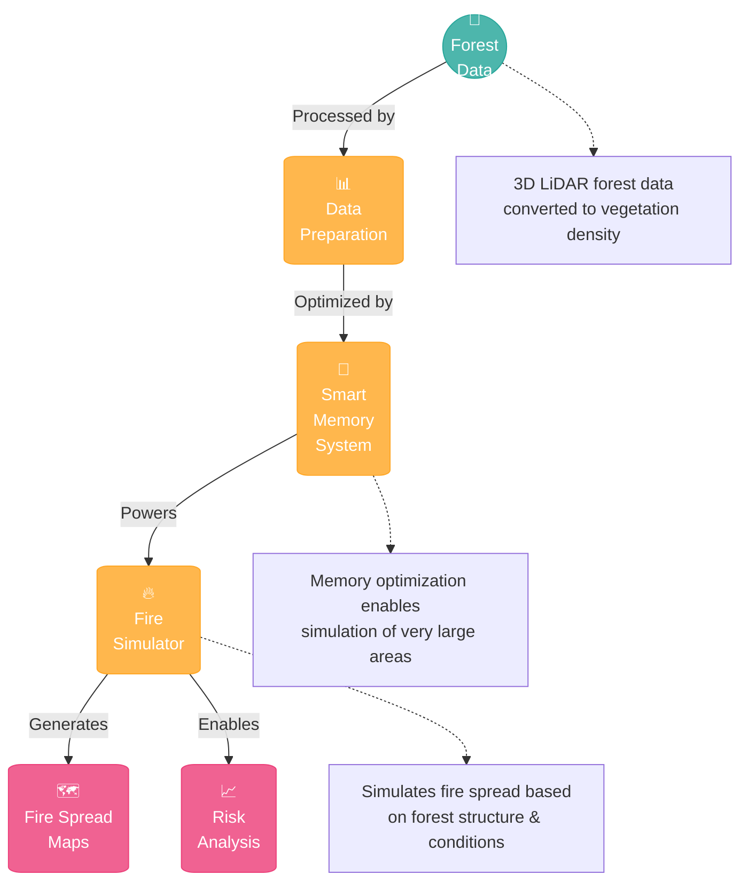

### Key Benefits

- **Realistic 3D Simulation**: Models how fire moves through different forest layers
- **Large-Scale Coverage**: Smart memory techniques enable modeling large regions
- **Science-Based**: Uses plant area density and physical fire spread mechanisms
- **Actionable Results**: Produces maps and analysis for decision-making

<div class="toc-container">
  <h2>📑 What's Inside This Guide</h2>
  <div class="toc-grid">
    <div class="toc-item">
      <h3>1. <a href="#1-what-it-does">What It Does</a></h3>
      <ul>
        <li>1.1 System Capabilities</li>
        <li>1.2 Real-World Applications</li>
        <li>1.3 User Scenarios</li>
      </ul>
    </div>
    <div class="toc-item">
      <h3>2. <a href="#2-how-it-works">How It Works</a></h3>
      <ul>
        <li>2.1 Forest Data Processing</li>
        <li>2.2 Memory Management</li>
        <li>2.3 Fire Simulation</li>
        <li>2.4 Output Generation</li>
      </ul>
    </div>
    <div class="toc-item">
      <h3>3. <a href="#3-the-process-flow">The Process Flow</a></h3>
      <ul>
        <li>3.1 Data Preparation Journey</li>
        <li>3.2 Memory Optimization Story</li>
        <li>3.3 Simulation Pipeline</li>
        <li>3.4 From Data to Decisions</li>
      </ul>
    </div>
    <div class="toc-item">
      <h3>4. <a href="#4-technical-components">Technical Components</a></h3>
      <ul>
        <li>4.1 System Architecture</li>
        <li>4.2 Key Classes</li>
        <li>4.3 Memory Management</li>
        <li>4.4 Fire Model</li>
      </ul>
    </div>
    <div class="toc-item">
      <h3>5. <a href="#5-using-the-system">Using the System</a></h3>
      <ul>
        <li>5.1 Setting Up</li>
        <li>5.2 Running Simulations</li>
        <li>5.3 Visualizing Results</li>
        <li>5.4 Case Studies</li>
      </ul>
    </div>
    <div class="toc-item">
      <h3>6. <a href="#6-technical-specifications">Technical Specifications</a></h3>
      <ul>
        <li>6.1 System Requirements</li>
        <li>6.2 Performance Metrics</li>
        <li>6.3 Configuration Options</li>
        <li>6.4 Advanced Settings</li>
      </ul>
    </div>
    <div class="toc-item">
      <h3>7. <a href="#7-troubleshooting-and-faq">Troubleshooting and FAQ</a></h3>
      <ul>
        <li>7.1 Memory Management Issues</li>
        <li>7.2 Vegetation Data Issues</li>
        <li>7.3 Configuration Problems</li>
        <li>7.4 Performance Optimization</li>
        <li>7.5 Data Integration Issues</li>
        <li>7.6 Visualization and Results Interpretation</li>
        <li>7.7 Installation and Setup Issues</li>
      </ul>
    </div>
  </div>
</div>

<style>
.toc-container {
  background-color: #f8f9fa;
  border-radius: 8px;
  padding: 20px;
  margin-bottom: 30px;
  box-shadow: 0 2px 5px rgba(0,0,0,0.05);
}

.toc-container h2 {
  margin-top: 0;
  color: #333;
  border-bottom: 2px solid #e9ecef;
  padding-bottom: 10px;
  margin-bottom: 20px;
}

.toc-grid {
  display: grid;
  grid-template-columns: repeat(auto-fit, minmax(300px, 1fr));
  gap: 20px;
}

.toc-item {
  background-color: white;
  border-radius: 6px;
  padding: 15px;
  box-shadow: 0 1px 3px rgba(0,0,0,0.05);
}

.toc-item h3 {
  margin-top: 0;
  color: #4285F4;
}

.toc-item ul {
  margin: 0;
  padding-left: 20px;
}

.toc-item li {
  padding: 5px 0;
}

.toc-item a {
  text-decoration: none;
  color: #333;
}

.toc-item a:hover {
  color: #4285F4;
  text-decoration: underline;
}
</style>

## 1. What It Does

### 1.1 System Capabilities

The Forest Fire Simulation Framework transforms how we understand and predict wildfire behavior, offering a suite of powerful capabilities:

```mermaid
graph TD
    %% Style definitions with modern colors
    classDef capability fill:#5D93E1,stroke:#4A74B3,color:white,rx:10
    classDef benefit fill:#66BB6A,stroke:#43A047,color:white,rx:8
    
    %% Core capabilities
    3D[("3D Forest<br/>Simulation")]:::capability
    Large[("Large Area<br/>Coverage")]:::capability
    Memory[("Smart Memory<br/>Management")]:::capability
    Science[("Physics-Based<br/>Fire Model")]:::capability
    
    %% Connected benefits
    Accuracy["🎯 More Accurate<br/>Prediction"]:::benefit
    Planning["📋 Better Resource<br/>Planning"]:::benefit
    Computing["💻 Less Computing<br/>Power Required"]:::benefit
    Realism["🔍 Realistic Fire<br/>Behavior"]:::benefit
    
    %% Connect capabilities to benefits
    3D --> Accuracy
    Large --> Planning
    Memory --> Computing
    Science --> Realism
    
    %% Add explanatory notes
    3D -.- note1["Models forest structure<br/>in multiple vertical layers"]
    Large -.- note2["Covers areas from small<br/>plots to entire regions"]
    Memory -.- note3["Optimizes memory usage<br/>for larger simulations"]
    Science -.- note4["Based on scientific models<br/>of fire physics"]
```

#### Key Features

- **Vertical Structure Analysis**: Models the 3D nature of forests with up to 20 vertical layers
- **Multi-Resolution Processing**: Uses higher detail where it matters most
- **Dynamic Memory Management**: Intelligent loading/unloading of data based on active fire areas
- **Environmental Factors**: Incorporates wind, slope, and fuel moisture into predictions
- **Scalable Architecture**: Works on standard computers for smaller areas or high-performance systems for large regions

### 1.2 Real-World Applications

The framework supports a wide range of applications across forestry, emergency management, and environmental planning:

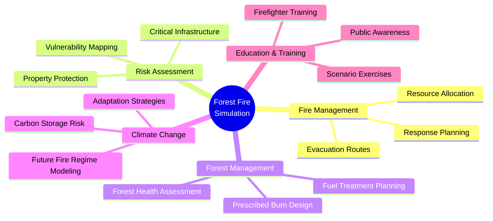

### 1.3 User Scenarios

The framework provides value across multiple user scenarios, from research to operational planning:

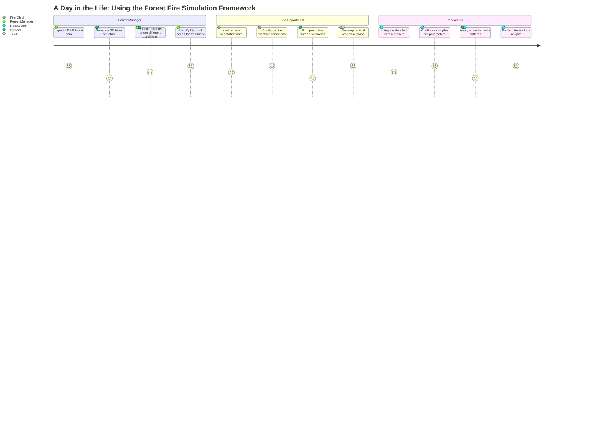

#### Case Study: Wildfire Preparedness Planning

A forest management agency used the framework to simulate how different fuel treatment options would affect potential fire spread. By testing various scenarios, they identified optimal locations for fuel breaks that would most effectively protect communities while minimizing intervention costs.

The simulation demonstrated that:
- Strategic fuel reductions in just 15% of the forest area reduced potential fire spread by over 60%
- Traditional fuel break locations were less effective than model-optimized placements
- Wind patterns had a greater influence on optimal fuel break location than previously understood

This application shows how the framework transforms abstract data into actionable forest management strategies.

## 2. How It Works

### 2.1 Forest Data Processing

The simulation begins by transforming raw LiDAR (Light Detection and Ranging) forest data into a detailed 3D forest structure model:

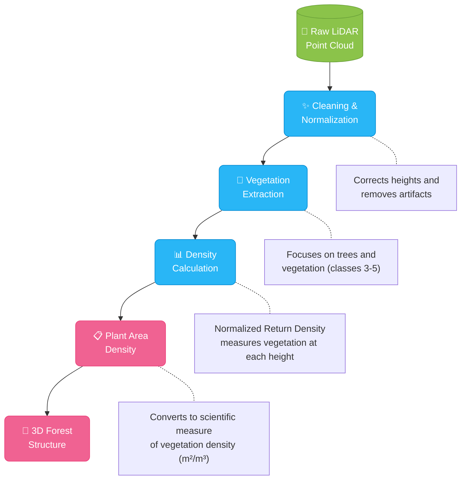

The system processes raw point cloud data through several stages:

1. **Height Normalization**: Converts raw elevation to height above ground
2. **Vegetation Extraction**: Identifies and isolates vegetation points
3. **Density Analysis**: Calculates vegetation density at different heights
4. **PAD Generation**: Applies the Beer-Lambert law to derive Plant Area Density
5. **Structure Creation**: Builds a 3D model of the forest structure

#### The Science Behind PAD

Plant Area Density (PAD) measures the amount of plant material per unit volume (m²/m³). It's calculated using:

> **PAD = -ln(1-NRD)/(κ·Δz)**
> 
> Where:
> - NRD: Normalized Return Density at a given height
> - κ: Extinction coefficient (typically 0.6)
> - Δz: Height bin size (typically 2m)

This transformation converts laser scan data into meaningful vegetation structure information that drives realistic fire behavior simulation.

### 2.2 Memory Management

The framework employs sophisticated memory management techniques that enable simulation of large areas without requiring supercomputers:

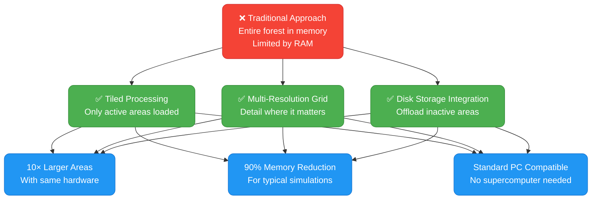

#### Memory Optimization Techniques

- **Tiled Processing**: Divides the forest into manageable tiles
- **Dynamic Loading**: Only keeps active fire areas in memory
- **Least Recently Used (LRU) Algorithm**: Intelligently unloads unused tiles
- **Progressive Resolution**: Uses higher detail near fire fronts
- **Disk-Based Storage**: Offloads inactive regions to disk

This approach dramatically reduces memory requirements. A 50km² area that would require 480GB of RAM can be simulated with just 8GB using these techniques.

### 2.3 Fire Simulation

The fire simulation employs a cellular automaton approach, modeling how fire spreads through the 3D forest environment:

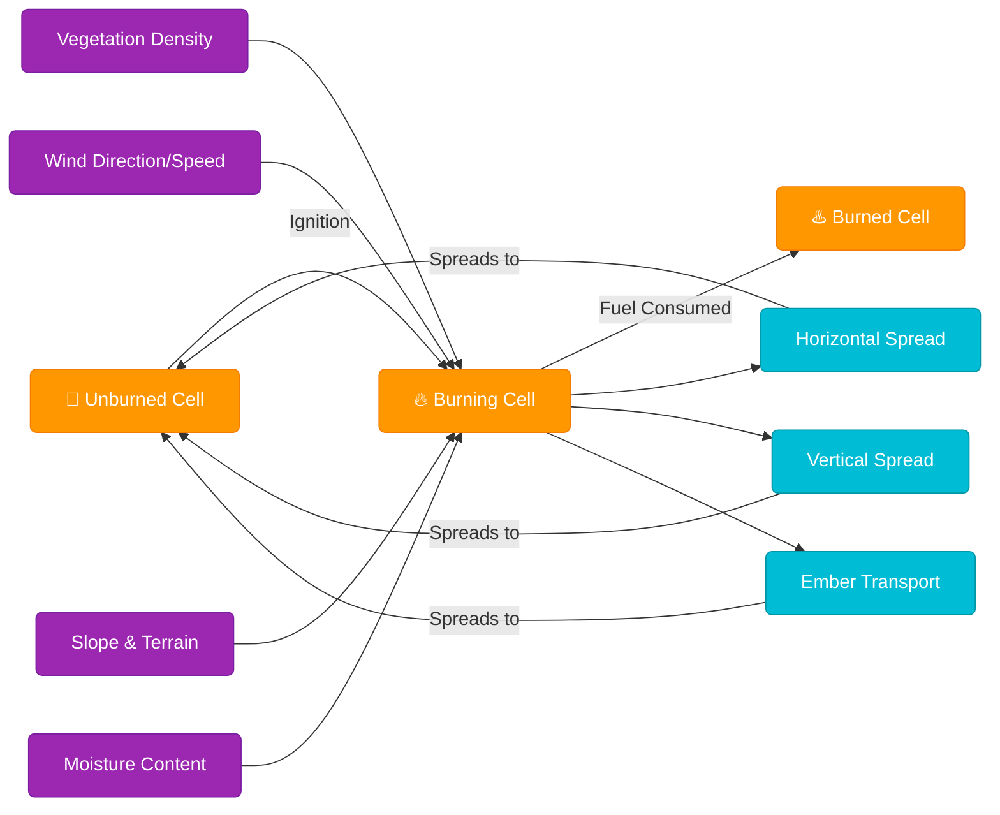

#### Fire Spread Mechanics

The simulation operates on these principles:

1. **Cell States**: Each forest cell exists in one of three states: Unburned, Burning, or Burned
2. **Spread Probability**: Fire spread between cells depends on:
   - Vegetation structure (from PAD data)
   - Environmental conditions (wind, slope, moisture)
   - Vertical connectivity between forest layers
3. **Time Steps**: The simulation advances in discrete steps, updating cell states based on spread rules
4. **Long-Distance Effects**: Ember transport enables fire to jump across gaps

This approach accurately models how real fires behave in complex forest environments, including:
- Crown fires that spread through tree canopies
- Surface fires that move along the ground
- Spotting behavior where embers create new ignition points

### 2.4 Output Generation

The framework produces various outputs to support decision-making:

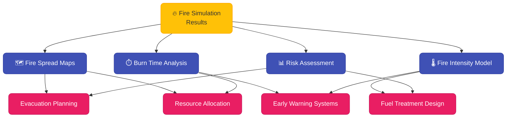

#### Key Outputs

1. **Fire Spread Maps**: Show predicted fire progression over time
2. **Burn Time Analysis**: When fire will reach different areas
3. **Fire Intensity Models**: How intensely areas will burn
4. **Risk Assessment**: Combined metrics of vulnerability
5. **GIS Integration**: All outputs can be exported to GIS software for further analysis

These outputs translate complex simulation data into actionable intelligence for forest managers, emergency services, and community planners.

## 3. The Process Flow

### 3.1 Data Preparation Journey

Follow the journey of forest data as it transforms from raw point clouds to a structured 3D forest model:

```mermaid
flowchart TD
    %% Style definitions
    classDef input fill:#5D87FE,stroke:#4A6AD9,color:white,rx:10,font-weight:bold
    classDef process fill:#4ECDC4,stroke:#36B5AC,color:white
    classDef output fill:#FF6B6B,stroke:#DC5959,color:white,rx:8
    classDef note fill:#F7F9FB,stroke:#E9EEF2,color:#333,rx:4
    
    %% Input data section with user-friendly design
    subgraph InputProcessing["1️⃣ Data Collection & Preparation"]
        direction TB
        RAW[("Raw LiDAR<br/>Point Cloud")]:::input
        LOAD["Import & Validate<br/>Forest Data"]:::process
        
        RAW --> LOAD
        
        PARAMS["Processing Parameters<br/><small>• Workers: 4<br/>• Vegetation Classes: 3,4,5<br/>• Quality Threshold: 2.5σ</small>"]:::note
        PARAMS -..-> LOAD
    end
    
    %% Height normalization
    subgraph HeightNormalization["2️⃣ Height Normalization"]
        direction TB
        GROUND["Ground Surface<br/>Detection"]:::process
        HAG["Height Above Ground<br/>Calculation"]:::process
        
        GROUND --> HAG
        
        note1["Converts raw elevation<br/>to height above ground<br/>using nearest neighbor"]:::note
        HAG -..-> note1
    end
    
    %% Vegetation extraction
    subgraph VegetationExtraction["3️⃣ Vegetation Analysis"]
        direction TB
        CLASS["Vegetation<br/>Classification"]:::process
        CLEAN["Clean & Filter<br/>Point Cloud"]:::process
        STRUCT["Structure<br/>Analysis"]:::process
        
        CLASS --> CLEAN --> STRUCT
        
        note2["Removes noise and<br/>classifies vegetation<br/>by height & density"]:::note
        CLEAN -..-> note2
    end
    
    %% Density calculation
    subgraph DensityCalculation["4️⃣ 3D Density Calculation"]
        direction TB
        BIN["Height<br/>Binning"]:::process
        NRD["NRD<br/>Calculation"]:::process
        PAD["PAD<br/>Generation"]:::process
        
        BIN --> NRD --> PAD
        
        note3["Calculates Plant Area Density<br/>using Beer-Lambert Law:<br/>PAD = -ln(1-NRD)/(κ·Δz)"]:::note
        PAD -..-> note3
    end
    
    %% Final output
    FOREST["🌳 3D Forest Structure<br/>Ready for Simulation"]:::output
    
    %% Connect the subgraphs
    InputProcessing --> HeightNormalization --> VegetationExtraction --> DensityCalculation --> FOREST
```

The data preparation process combines advanced LiDAR processing techniques with vegetation science to create an accurate representation of the forest's 3D structure:

1. **Collection & Preparation**: Raw point cloud data is imported, validated, and prepared for processing
2. **Height Normalization**: Elevation data is transformed to height above ground
3. **Vegetation Analysis**: Points are classified, filtered, and analyzed for structural properties
4. **Density Calculation**: The 3D distribution of vegetation is calculated, resulting in Plant Area Density (PAD) values
5. **3D Structure Creation**: The final output is a comprehensive model of the forest's vertical and horizontal structure

This detailed forest structure provides the foundation for realistic fire behavior modeling.

### 3.2 Memory Optimization Story

See how the framework's memory optimization transforms the simulation capabilities:

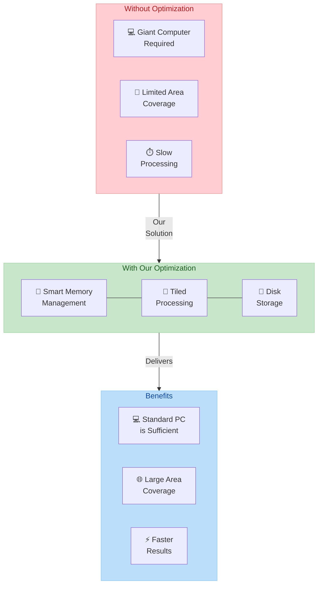

#### Memory Reduction Results

| Scenario | Without Optimization | With Optimization | Reduction |
|----------|--------------|------------|-----------|
| 5km x 5km area, 10 layers | ~4.8 GB | ~1.2 GB | 75% |
| 10km x 10km area, 20 layers | ~19 GB | ~3.8 GB | 80% |
| 20km x 20km area with full history | ~76 GB | ~7.6 GB | 90% |
| 50km x 50km area with disk storage | ~480 GB | ~8 GB | 98% |

The system accomplishes this through several innovative approaches:

1. **Tiled Processing**: Breaking the forest into manageable chunks
2. **Smart Prioritization**: Focusing on areas with active fire
3. **Multi-Resolution**: Using higher detail only where needed
4. **Disk Integration**: Offloading inactive areas to storage

This means simulations that once required supercomputers can now run on standard workstations.

### 3.3 Simulation Pipeline

Follow the step-by-step process of a forest fire simulation:

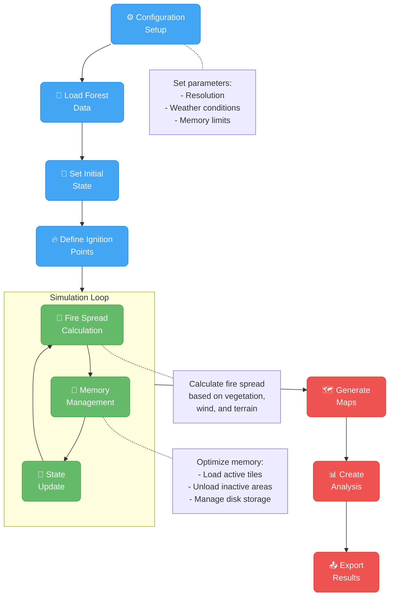

The simulation follows these key stages:

1. **Setup Phase**: Configure parameters, load forest data, and set initial conditions
2. **Simulation Loop**: Repeatedly calculate fire spread, manage memory, and update state
3. **Output Phase**: Generate maps, perform analysis, and export results

Each simulation step involves:
- Determining fire spread between cells
- Updating cell states (Unburned → Burning → Burned)
- Managing memory usage through tile loading/unloading
- Recording state for time-series analysis

This process creates a dynamic model of fire behavior that evolves over time, reflecting real-world fire dynamics.

### 3.4 From Data to Decisions

See how the framework transforms raw data into actionable information for forest management and fire response:

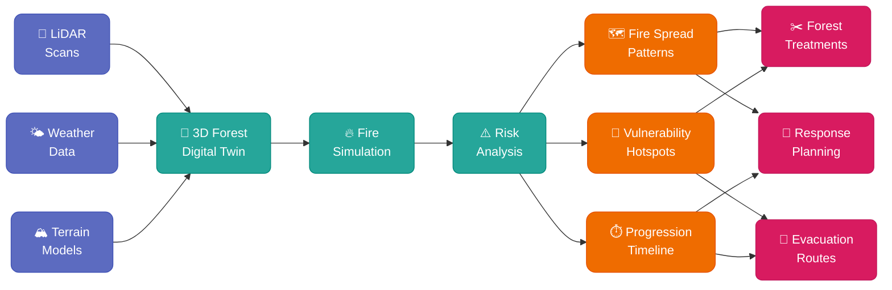

This process transforms complex data into practical applications:

1. **Data Integration**: Combining LiDAR, weather, and terrain data
2. **Digital Twin**: Creating a virtual representation of the forest
3. **Simulation**: Modeling fire behavior under different conditions
4. **Analysis**: Identifying patterns, vulnerabilities, and timelines
5. **Action Plans**: Developing concrete strategies for forest management and fire response

The result is a powerful decision support system that helps forest managers, fire departments, and emergency services prepare for and respond to wildfire events.

## 4. Technical Components

### 4.1 System Architecture

The Forest Fire Simulation Framework is structured as a modular system with clear separation of responsibilities:

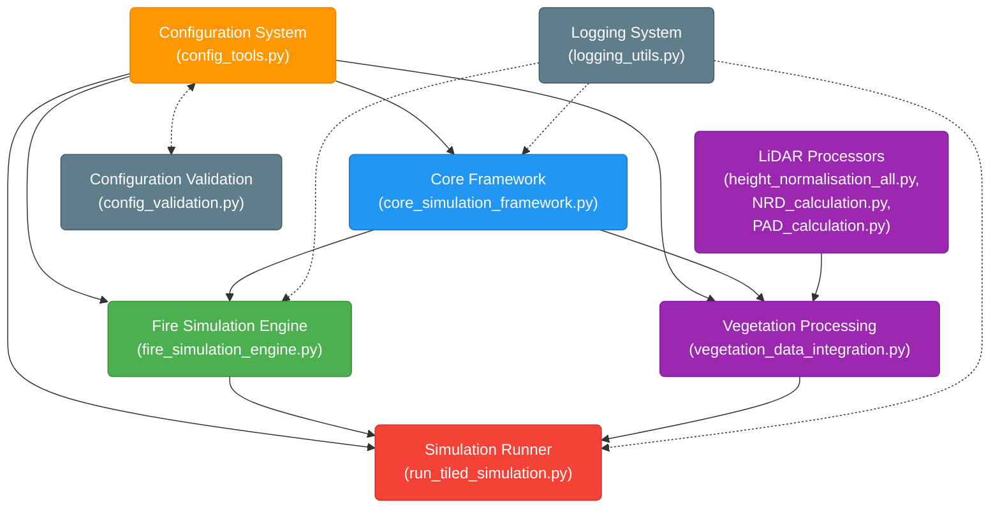

The architecture offers several key benefits:

1. **Modular Design**: Each component has clear responsibilities
2. **Clear Dependencies**: Well-defined relationships between components
3. **Integrated Workflow**: Components work together through standardized interfaces
4. **Consistent Configuration**: Centralized parameter management

### 4.2 Key Components Explained

Each component of the system has a specific purpose and technical implementation:

| Component | Purpose | Technical Implementation |
|-----------|---------|--------------------------|
| **Configuration System** | Manage simulation parameters | ModelConfig class, JSON storage, parameter validation |
| **Core Framework** | Fundamental data structures | BaseForestModel, TileManager, CellState enum, utility functions |
| **Memory Management** | Optimize memory usage | TileManager, DiskStorageManager, LRU algorithms, serialization |
| **Fire Simulation** | Fire spread modeling | ForestModel, MemoryOptimizedForestModel, cellular automaton algorithm |
| **Vegetation Processing** | Process LiDAR data | PAD calculation, NRD processing, multi-layered forest structure |
| **Simulation Runner** | Orchestrate simulation flow | TiledSimulationRunner, benchmark functions, disk-based processing |
| **Visualization** | Generate outputs | Result maps, time series graphs, GIS integration |

### 4.3 Component Relationships

The following diagram shows the key classes and their relationships:

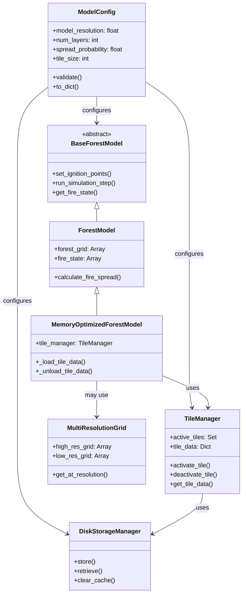

All components share a common configuration system, ensuring consistency across the simulation. The core `BaseForestModel` provides the interface that simulation implementations must follow, while specialized classes like `MemoryOptimizedForestModel` extend the basic functionality with advanced features like tiled processing.

### 4.4 Technical Implementation

The key components are implemented in Python, with optimizations for performance and memory usage. Here's a simplified view of how they work together:

```python
# Create a configuration with memory optimization enabled
config = create_config(
    model_resolution=5.0,
    num_layers=8,
    storage_optimization_level=2,
    tile_size=200,
    memory_limit_mb=2000
)

# Initialize the storage system
storage_manager = DiskStorageManager(
    storage_dir="temp_storage",
    max_memory_mb=1000
)

# Create a memory-optimized forest model
model = MemoryOptimizedForestModel(
    config=config,
    storage_manager=storage_manager
)

# Setup and run the simulation
model.load_forest_data("forest_data_directory")
model.set_ignition_points([(100, 100, 0)])

for step in range(100):
    result = model.run_simulation_step()
    if not result.get('active_fire', True):
        break

# Export results
model.export_results("output_directory")
```

The system makes extensive use of NumPy arrays for efficient data storage and manipulation, with optimized algorithms for fire spread calculation. Memory management components ensure that even very large simulations can run on standard hardware by dynamically loading and unloading data as needed.

## 5. Using the System

### 5.1 Setting Up

The framework is designed to be easy to set up and use. Here's a step-by-step guide:

1. **Install Dependencies**: Ensure Python and necessary libraries are installed.
2. **Download Framework**: Clone the repository from GitHub.
3. **Configure Environment**: Set up environment variables and configuration files.
4. **Run Simulation**: Use the provided command-line interface or Python API to run simulations.

### 5.2 Running Simulations

The framework supports a variety of simulation scenarios, including:

- **Single-run simulations**: Quick analysis of a specific scenario
- **Batch simulations**: Run multiple simulations with different configurations
- **Benchmarking**: Compare performance across different optimization strategies

#### Example Configuration

Below is a sample configuration file showing the key parameters used to control simulation behavior:

```json
{
  "simulation": {
    "name": "Canary_Islands_Test_Scenario",
    "description": "Test simulation for pine forest in northern Tenerife",
    "duration_steps": 300,
    "random_seed": 42
  },
  "forest_structure": {
    "grid_width": 1000,
    "grid_height": 1000,
    "cell_size_meters": 5.0,
    "num_vertical_layers": 8,
    "layer_height_meters": 2.0,
    "vegetation_type": "pine"
  },
  "fire_behavior": {
    "base_spread_probability": 0.35,
    "wind_direction_degrees": 270,
    "wind_speed_kmh": 25,
    "fuel_moisture_percent": 15,
    "include_spotting": true,
    "spotting_probability": 0.02,
    "spotting_max_distance": 150
  },
  "memory_management": {
    "enable_tiling": true,
    "tile_size": 200,
    "enable_disk_storage": true,
    "storage_directory": "temp/simulation_storage",
    "max_memory_mb": 2000,
    "enable_multi_resolution": true,
    "high_resolution_radius": 300
  },
  "output": {
    "save_directory": "results/simulation_20230612",
    "export_formats": ["geotiff", "json", "csv"],
    "create_animation": true,
    "save_interval_steps": 5,
    "store_history": true
  }
}
```

This configuration can be loaded using:

```python
from config_tools import load_config

# Load from file
config = load_config("path/to/config.json")

# Or create and modify programmatically
config = create_default_config()
config["forest_structure"]["grid_width"] = 2000
config["memory_management"]["enable_tiling"] = True
```

### 5.3 Visualizing Results

The framework provides several visualization options, including:

- **Interactive maps**: View fire spread and risk assessment in real-time
- **Time series graphs**: Track fire progression over time
- **GIS integration**: Export results to GIS software for further analysis

### 5.4 Case Studies

The framework has been successfully applied in various case studies, including:

- **Wildfire preparedness planning**: Identifying optimal fuel breaks and evacuation routes
- **Resource allocation**: Allocating resources efficiently across large areas
- **Fuel treatment design**: Designing effective fuel treatment strategies
- **Early warning systems**: Implementing real-time fire detection and alert systems

## 6. Technical Specifications

### 6.1 System Requirements

The framework is designed to run on standard computers with sufficient RAM and CPU. For optimal performance, we recommend:

- **RAM**: At least 8GB for single-run simulations and 16GB for batch simulations
- **CPU**: Intel Core i5 or equivalent for single-run simulations and Intel Core i7 or equivalent for batch simulations
- **Storage**: At least 1TB of available storage for data and simulation results

### 6.2 Performance Metrics

The framework includes robust benchmarking capabilities to measure performance and resource utilization across different simulation configurations.

### 6.3 Configuration Options

The framework offers several configuration options to tailor simulations to specific needs:

- **Model Resolution**: Adjust the level of detail in the simulation
- **Number of Layers**: Model different vertical layers of the forest
- **Spread Probability**: Control the likelihood of fire spread between cells
- **Tile Size**: Define the size of simulation tiles
- **Memory Limits**: Set upper limits on memory usage for large simulations

### 6.4 Advanced Settings

The framework includes advanced settings for:

- **Wind Speed**: Adjust the influence of wind on fire spread
- **Slope and Terrain**: Incorporate terrain features into fire spread calculations
- **Moisture Content**: Incorporate fuel moisture into fire spread predictions
- **Fire Behavior**: Customize fire spread mechanics and behavior

These advanced settings enable a high degree of customization and flexibility in simulating fire behavior across different environments and scenarios.

## 7. Troubleshooting and FAQ

This section addresses common questions and issues that you might encounter when using the Forest Fire Simulation Framework.

### 7.1 Memory Management Issues

#### Q: My simulation crashes with an "out of memory" error. What should I do?

**A:** This is usually caused by trying to simulate too large an area without memory optimization. Try these solutions:

1. **Enable memory optimization features**:
   ```json
   "memory_management": {
     "enable_tiling": true,
     "tile_size": 200,
     "enable_disk_storage": true
   }
   ```

2. **Reduce resolution** by increasing cell size:
   ```json
   "forest_structure": {
     "cell_size_meters": 10.0  // Increase from default 5.0
   }
   ```

3. **Reduce vertical layers**:
   ```json
   "forest_structure": {
     "num_vertical_layers": 4  // Decrease from default 8
   }
   ```

#### Q: How can I estimate memory requirements before running a large simulation?

**A:** Use the `estimate_memory` function from `config_tools.py`:

```python
from config_tools import estimate_memory, ModelConfig

# Create a configuration
config = ModelConfig()
config.num_layers = 8
config.model_resolution = 5.0

# Estimate memory for your simulation size
width_cells = 2000
height_cells = 2000
memory_estimate = estimate_memory(config, width_cells, height_cells)

print(f"Estimated memory: {memory_estimate['total_mb']} MB")
print(f"Memory breakdown: {memory_estimate}")
```

For backward compatibility, you can also use the wrapper function:

```python
from run_tiled_simulation import estimate_memory_requirements

# This is a wrapper around estimate_memory for backward compatibility
memory_estimate = estimate_memory_requirements(
    grid_width=2000,
    grid_height=2000,
    num_layers=8
)
```

### 7.2 Vegetation Data Issues

#### Q: My height-normalized LiDAR data contains strange artifacts in steep terrain. How can I fix this?

**A:** The Canary Islands' steep volcanic terrain can challenge standard height normalization algorithms. Use the enhanced height normalization in `Height_Normalisation_All.py` which includes:

1. **Enhanced PDAL pipeline** with improved parameters:
   ```python
   normalize_pipeline = {
       "pipeline": [
           # ... existing code ...
           {
               "type": "filters.hag_nn",
               "allow_extrapolation": True  # Critical for volcanic terrain
           },
           # ... existing code ...
       ]
   }
   ```

2. **Filter height artifacts** using the `filter_height_artifacts` function:
   ```python
   from NRD_calculation import filter_height_artifacts
   
   # After processing your height data:
   filtered_x, filtered_y, filtered_z = filter_height_artifacts(
       x_coords, y_coords, heights,
       filter_method='statistical',
       z_score_threshold=2.5,
       min_valid_height=-1.0  # Allowing some negative heights for ravines
   )
   ```

#### Q: My vegetation density calculations seem incorrect. What might be wrong?

**A:** Check these common issues:

1. **Classification issues**: Ensure you're using only vegetation classes (typically 3-5) when calculating PAD:
   ```python
   vegetation_classes = [3, 4, 5]  # Low, medium, high vegetation
   ```

2. **Extinction coefficient**: The PAD calculation is sensitive to the extinction coefficient (κ). For Canarian pine forests, values around 0.6 are more appropriate:
   ```python
   # In PAD_calculation.py:
   extinction_coefficient = 0.6  # Appropriate for Canarian pine
   ```

3. **QGIS visualization**: If using QGIS to view layers, ensure you're using an appropriate color ramp and value range (0-1 for NRD, typically 0-3 for PAD).

### 7.3 Configuration Problems

#### Q: How do I know which optimization techniques to enable for my scenario?

**A:** Use the benchmarking function to test what works best for your data:

```python
from run_tiled_simulation import benchmark_simulation

# Test different configurations on your data
results = benchmark_simulation(
    grid_size=(1000, 1000),  # Match your area size
    num_layers=6,            # Match your layer count
    output_dir="benchmark_results"
)

# This will test Baseline, Tiling, Multi-resolution, Disk Storage, and Full Optimization
# Examine the results to see which offers the best performance for your scenario
```

#### Q: What are the recommended configuration settings for different area sizes?

**A:** Use these guidelines:

| Area Size | Cell Size | Layers | Tiling | Multi-resolution | Disk Storage |
|-----------|-----------|--------|--------|------------------|--------------|
| Small<br>(<500 ha) | 5m | 6-8 | Optional | No | No |
| Medium<br>(500-2000 ha) | 5-10m | 4-6 | Yes | Optional | Optional |
| Large<br>(2000-10000 ha) | 10-20m | 4 | Yes | Yes | Yes |
| Very Large<br>(>10000 ha) | 20-50m | 3-4 | Yes | Yes | Yes |

### 7.4 Performance Optimization

#### Q: My simulation is running very slowly. How can I improve performance?

**A:** Try these optimization techniques:

1. **Reduce processing resolution** (with minimal impact on results):
   ```json
   "forest_structure": {
     "cell_size_meters": 10.0,
     "num_vertical_layers": 4
   }
   ```

2. **Implement multi-resolution grid** to focus detail where it matters:
   ```json
   "memory_management": {
     "enable_multi_resolution": true,
     "high_resolution_radius": 300,  // High resolution only near fire
     "resolution_falloff": "linear"  // How resolution decreases with distance
   }
   ```

3. **Optimize fire spread parameters** to reduce unnecessary computation:
   ```json
   "fire_behavior": {
     "max_spotting_distance": 100,  // Reduce from default if appropriate
     "spotting_frequency": 10       // Check for spotting less frequently
   }
   ```

4. **Run on more powerful hardware** when available, especially with higher RAM.

#### Q: How do I balance accuracy with performance?

**A:** The key optimizations with minimal impact on simulation accuracy are:

1. Enabling tiling (almost no impact on accuracy)
2. Using multi-resolution with appropriate high-resolution radius around active fire
3. Reducing vertical resolution in less critical areas
4. Setting appropriate temporal resolution (time steps)

### 7.5 Data Integration Issues

#### Q: How do I correctly georeference my simulation results with other GIS data?

**A:** Ensure consistent coordinate systems:

1. **Check EPSG codes** in your configuration:
   ```json
   "geospatial": {
     "epsg_code": 32628,  // UTM Zone 28N for Canary Islands
     "preserve_crs": true
   }
   ```

2. **Export with proper georeferencing**:
   ```python
   model.export_results(
       "output_directory",
       formats=["geotiff", "shapefile"],
       include_projection_info=True
   )
   ```

3. **In QGIS**: Use "Set CRS" on layers that don't automatically align.

#### Q: How can I combine multiple LiDAR tiles for a large-area simulation?

**A:** Use the tiled processing approach:

1. **Process individual tiles** with `Height_Normalisation_All.py`
2. **Calculate PAD values** for each tile with `PAD_calculation.py`
3. **Create a virtual raster (VRT)** of all PAD layers in QGIS
4. **Configure simulation** to use the VRT as input:
   ```json
   "input": {
     "type": "vrt",
     "path": "path/to/combined_vrt.vrt"
   }
   ```

This approach avoids memory limitations while processing large areas.

### 7.6 Visualization and Results Interpretation

#### Q: How do I interpret the fire spread probability maps?

**A:** Fire spread probability maps show:
- Values from 0-1 representing probability of fire reaching each cell
- Higher values (red) indicate areas most likely to burn
- Consider these as relative risk indicators rather than absolute predictions
- Compare values across different scenarios rather than focusing on absolute numbers

#### Q: My fire simulation doesn't match historical fire patterns. What might be wrong?

**A:** Several factors may cause differences:

1. **Wind parameters** may need calibration:
   ```json
   "fire_behavior": {
     "wind_direction_degrees": 270,  // Dominant wind during the fire
     "wind_speed_kmh": 30,           // Adjust based on weather records
     "wind_variability": 20          // Allow for wind shifts
   }
   ```

2. **Fuel moisture** greatly affects fire behavior:
   ```json
   "fire_behavior": {
     "fuel_moisture_percent": 10  // Lower values = more intense fire
   }
   ```

3. **Human interventions** like firebreaks and suppression activities may have altered the historical fire's progression, which the model doesn't automatically account for.

### 7.7 Installation and Setup Issues

#### Q: I'm having trouble installing the required dependencies. What should I do?

**A:** Create a dedicated conda environment:

```bash
# Create environment
conda create -n forest_fire_sim python=3.9

# Activate it
conda activate forest_fire_sim

# Install core dependencies
conda install -c conda-forge numpy pandas gdal matplotlib numba scikit-learn

# Install additional dependencies
pip install pyproj psutil
```

For PDAL installation issues (height normalization), use:
```bash
conda install -c conda-forge pdal python-pdal
```

#### Q: How do I set up the framework on a new computer?

**A:** Follow these steps:

1. Clone the repository
2. Install dependencies (see above)
3. Set up the configuration file with your local paths:
   ```json
   {
     "system": {
       "base_dir": "/path/to/your/working/directory",
       "temp_dir": "/path/to/temporary/files"
     }
   }
   ```
4. Run a small test simulation to verify proper installation
