# Comprehensive Forest Fire Simulation Framework - Workflow Documentation

## Abstract

This document presents a comprehensive workflow for the forest fire simulation framework developed for modeling fire behavior in complex terrain environments. The framework integrates LiDAR-derived vegetation data, advanced calibration methods, and high-performance computing to provide accurate fire spread predictions. The workflow encompasses six main phases: data preparation, model calibration, simulation execution, deployment scaling, analysis & visualization, and validation & research integration.

## Table of Contents

1. [System Overview](#1-system-overview)
2. [Data Preparation & Preprocessing](#2-data-preparation--preprocessing)
3. [Model Calibration & Parameter Optimization](#3-model-calibration--parameter-optimization)
4. [Simulation Framework & Execution](#4-simulation-framework--execution)
5. [HPC Deployment & Scaling](#5-hpc-deployment--scaling)
6. [Analysis & Visualization Pipeline](#6-analysis--visualization-pipeline)
7. [Validation & Research Integration](#7-validation--research-integration)
8. [System Integration & Data Flow](#8-system-integration--data-flow)

---

## 1. System Overview

### 1.1 Framework Architecture

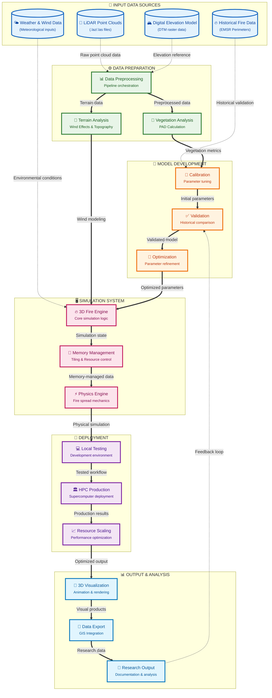

### 1.2 Workflow Phases Overview

| Phase | Purpose | Key Activities | Output |
|-------|---------|---------------|--------|
| **Data Preparation** | Transform raw data into simulation-ready format | LiDAR processing, vegetation analysis, terrain modeling | PAD rasters, terrain data, wind maps |
| **Model Calibration** | Optimize parameters against historical data | Grid search, sensitivity analysis, EMSR validation | Calibrated parameter sets |
| **Simulation Execution** | Run fire spread simulations | 3D fire modeling, state tracking, physics simulation | Fire spread results |
| **HPC Deployment** | Scale simulations for production use | Resource allocation, parallel processing, job management | Production-scale results |
| **Analysis & Visualization** | Generate insights and visualizations | 3D rendering, statistical analysis, export generation | Visual outputs, analysis reports |
| **Validation & Research** | Validate results and support research | Accuracy assessment, documentation, publication support | Research deliverables |

---

### 1.3 Alternative Data Flow Visualization

The following Sankey diagram provides an alternative view of how data flows through the forest fire simulation system, emphasizing volume and transformation at each stage:

```mermaid
sankey-beta

    LiDAR Data,Data Preprocessing,15
    DEM Data,Data Preprocessing,10
    Weather Data,Data Preprocessing,5
    EMSR Data,Data Preprocessing,3
    
    Data Preprocessing,Vegetation Analysis,20
    Data Preprocessing,Terrain Analysis,15
    Data Preprocessing,Quality Control,8
    
    Vegetation Analysis,Model Calibration,15
    Terrain Analysis,Model Calibration,10
    Quality Control,Model Calibration,5
    
    Model Calibration,Parameter Optimization,25
    Model Calibration,Validation,15
    
    Parameter Optimization,Fire Simulation Engine,30
    Validation,Fire Simulation Engine,10
    
    Fire Simulation Engine,Memory Management,35
    Memory Management,Physics Engine,35
    
    Physics Engine,Local Testing,20
    Physics Engine,HPC Deployment,15
    
    Local Testing,Production Scaling,15
    HPC Deployment,Production Scaling,20
    
    Production Scaling,3D Visualization,25
    Production Scaling,Data Export,15
    Production Scaling,Analysis Tools,10
    
    3D Visualization,Research Output,20
    Data Export,Research Output,10
    Analysis Tools,Research Output,15
```

### 1.4 Process Flow Timeline

This swimlane diagram shows the temporal relationship and responsibilities across different system components:

```mermaid
gantt
    title Forest Fire Simulation Workflow Timeline
    dateFormat X
    axisFormat %s
    
    section Data Input
    LiDAR Collection        :0, 2
    DEM Processing          :0, 1
    Weather Data            :1, 3
    Historical Fire Data    :0, 1
    
    section Preprocessing
    Height Normalization    :2, 4
    Vegetation Extraction   :3, 6
    Terrain Analysis        :4, 7
    Quality Control         :6, 8
    
    section Model Development
    Initial Calibration     :8, 12
    Parameter Optimization  :10, 15
    Validation Testing      :12, 16
    Sensitivity Analysis    :14, 18
    
    section Simulation
    Local Testing          :16, 20
    HPC Deployment         :18, 22
    Production Runs        :20, 35
    Resource Scaling       :22, 30
    
    section Analysis
    3D Visualization       :25, 40
    Statistical Analysis   :30, 42
    Export Generation      :35, 45
    Research Documentation :40, 50
```

---

## 2. Data Preparation & Preprocessing

### 2.1 LiDAR Processing Pipeline

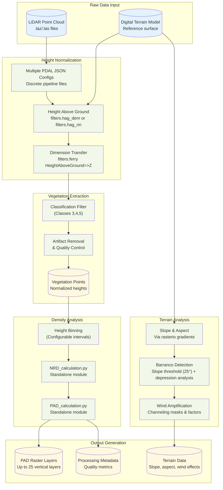

### 2.2 Data Quality Control Process

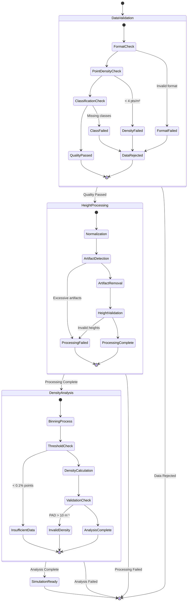

### 2.3 Key Processing Parameters

| Component | Parameter | Value | Purpose |
|-----------|-----------|-------|---------|
| **LiDAR Input** | Point Density | >4 pts/m² | Ensure adequate sampling |
| **Height Normalization** | Bin Size | 2.0m | Vertical layer resolution |
| **Vegetation Classes** | Classification Codes | 3,4,5 | Low/Medium/High vegetation |
| **Quality Control** | Z-score Threshold | 2.5σ | Artifact removal |
| **PAD Calculation** | Max Height | 160m | Canopy height limit |
| **Output Resolution** | Horizontal | 5m | Grid cell size |
| **Vertical Layers** | Count | Up to 25 layers | Realistic 3D structure resolution |

### 2.4 Advanced Terrain Feature Detection

#### 2.4.1 Barranco Detection Algorithm

**Literature-Based Implementation**:
- **Slope Threshold**: 25° (literature range: 20-30° for volcanic terrain)
- **Depression Depth**: 3.0m minimum (literature range: 2-5m)  
- **Minimum Area**: 6 cells (literature range: 4-8 cells)

**Detection Process**:
1. **Slope Analysis**: Calculate terrain slope from DEM using rasterio gradients
2. **Threshold Application**: Identify cells exceeding barranco_threshold (25°)
3. **Depression Analysis**: Apply minimum depression depth criteria (3m)
4. **Connectivity Analysis**: Group connected steep areas meeting minimum area requirement
5. **Direction Calculation**: Compute flow directions within barranco systems

**Output Files**: `barranco_mask.npy`, `barranco_directions.npy`, `depression_mask.npy`

#### 2.4.2 Wind Channeling Implementation

**Literature-Based Parameters**:
- **Channeling Strength**: 0.8 (literature range: 0.7-1.0 for barrancos)
- **Amplification Factor**: 2.5x (literature range: 2.0-3.0x wind speed increase)

**Channeling Process**:
1. **Barranco Identification**: Use detected barranco masks as base
2. **Wind Amplification**: Apply 2.5x wind speed multiplier within channels
3. **Direction Modification**: Align wind direction with barranco orientation

**Output Files**: `wind_channeling_mask.npy`, `wind_amplification.npy`, `wind_direction_modification.npy`

**Tenerife Results**: 3,839 cells identified as barranco/wind channeling areas

---

## 3. Model Calibration & Parameter Optimization

### 3.1 Calibration Framework Overview

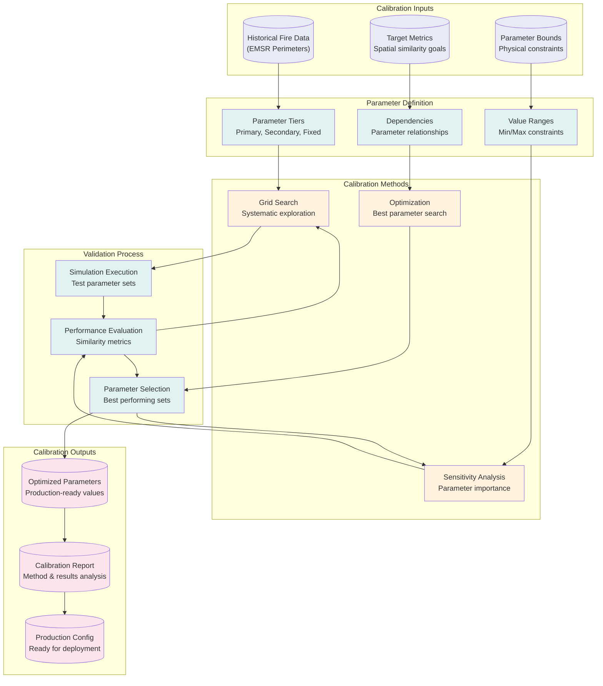

### 3.2 Calibration Process Workflow

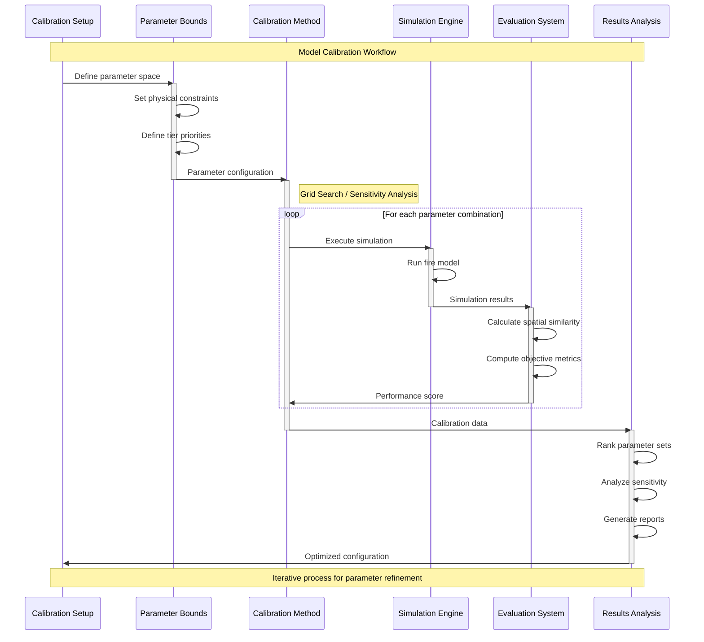

### 3.3 Calibration Methods & Objectives

#### 3.3.1 Parameter Tiers

| Tier | Parameters | Calibration Priority | Method |
|------|------------|---------------------|---------|
| **Primary** | spread_probability, wind_influence_on_spread, slope_influence | High - Direct impact | Grid Search + Sensitivity |
| **Secondary** | ignition_threshold, min_fuel_value, ember_probability | Medium - Moderate impact | Sensitivity Analysis |
| **Tertiary** | barranco_amplification, barranco_direction_weight, terrain_effect_strength | Low - Fine-tuning | Limited range testing |
| **Fixed** | model_resolution, layer_height_meters, num_layers | None - System constants | No calibration |

#### 3.3.2 Objective Functions

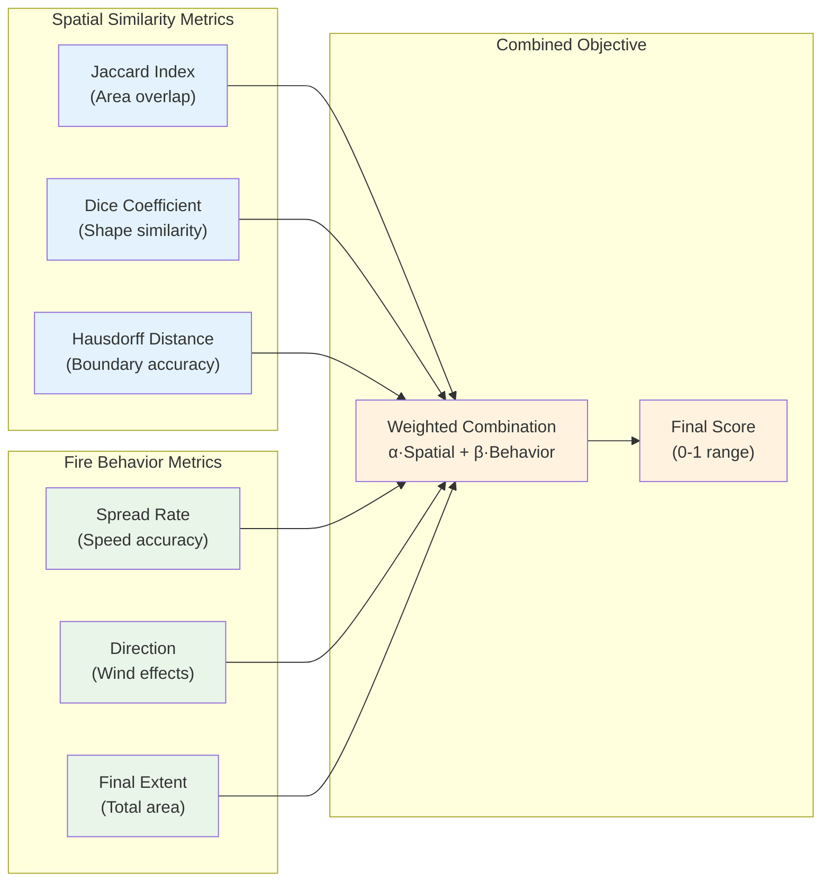

---

## 4. Simulation Framework & Execution

### 4.1 Core Simulation Architecture

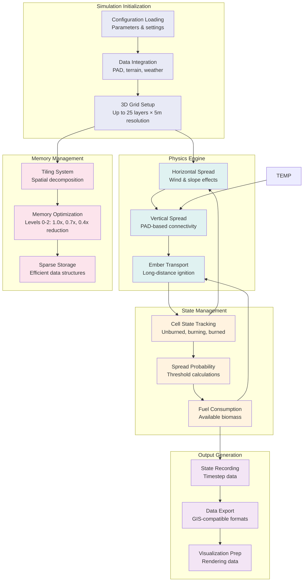

### 4.2 Fire Spread Mechanics

**Important Note**: The current implementation uses a **deterministic threshold-based system** rather than random probability comparisons. Fire ignition occurs when calculated spread probability exceeds a fixed `ignition_threshold` (default 0.5).

#### 4.2.1 Deterministic Ignition Process

The fire spread calculation follows this deterministic process:

1. **Probability Calculation**: `P = spread_probability × fuel_factor × wind_factor × slope_factor × distance_factor`
2. **Threshold Comparison**: Ignition occurs if `P ≥ ignition_threshold` 
3. **No Random Elements**: No `random()` calls in ignition decisions
4. **Fixed Fuel Consumption**: Fuel reduces by `fuel_consumption_rate` per timestep
5. **Deterministic Burnout**: Cell burns out when `fuel ≤ min_fuel_value`

**Note**: While core ignition is deterministic, ember transport uses extensive randomization:
- **Ember Generation**: Random probability check (`np.random.random() < ember_prob`)
- **Travel Distance**: Exponential distribution (`np.random.exponential(base_distance)`)  
- **Travel Direction**: Random angle with wind bias (`np.random.uniform(0, 2π)`)
- **Height Changes**: Random vertical movement (`np.random.randint(-2, ember_rise+1)`)
- **Number of Embers**: Random count per cell (`np.random.randint(1, 4)`)

#### 4.2.2 Ember Transport System

**Ember Generation Process**:
1. **Probability Calculation**: Base ember probability × height factor × wind factor
2. **Generation Check**: Random probability test determines if embers are created
3. **Multiple Embers**: 1-3 embers generated per successful event
4. **Distance Calculation**: Exponential distribution for realistic spread patterns
5. **Direction Calculation**: Random base angle with wind direction bias
6. **Height Movement**: Embers can rise (up to `ember_rise` layers) or fall
7. **Target Validation**: Check bounds and attempt ignition at landing site

**Key Parameters**:
- `ember_probability`: Base generation probability (default: 0.1)
- `ember_distance`: Base travel distance in cells (default: 5)
- `ember_height_factor`: Height multiplier effect (default: 0.2)
- `ember_wind_factor`: Wind direction bias strength (default: 0.4)
- `ember_rise`: Maximum upward movement (default: 2 layers)

#### 4.2.3 State Transition Diagram

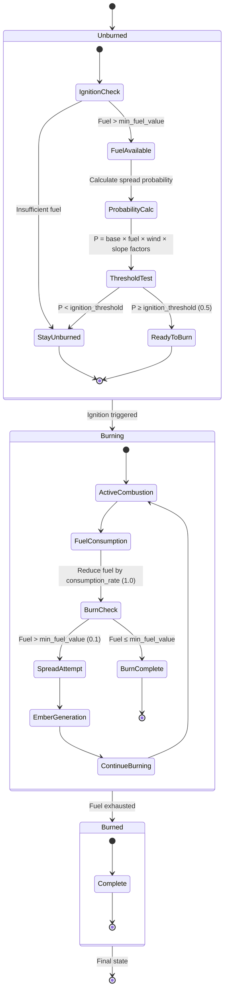

### 4.3 Simulation Parameters & Settings

| Category | Parameter | Default Value | Range | Impact |
|----------|-----------|---------------|-------|--------|
| **Fire Physics** | spread_probability | 0.4 | 0.1 - 0.8 | Base probability for spread calculation |
| | ignition_threshold | 0.5 | 0.1 - 1.0 | **Deterministic threshold for ignition** |
| | fuel_consumption_rate | 1.0 | 0.1 - 2.0 | Fixed fuel consumed per timestep |
| | wind_influence_on_spread | 0.5 | 0.0 - 1.0 | Wind effect amplification factor |
| | slope_influence | 0.3 | 0.0 - 1.0 | Topographic influence factor |
| **Environment** | min_fuel_value | 0.1 | 0.01 - 1.0 | Minimum fuel for burning |
| | fuel_moisture_baseline | 0.3 | 0.0 - 0.8 | Base fuel moisture content |
| | initial_fuel_load | 0.0 | 0.0 - 10.0 | Default fuel per cell |
| **Terrain** | barranco_amplification | 2.0 | 1.0 - 5.0 | Canyon wind amplification |
| | terrain_effect_strength | 0.6 | 0.0 - 1.0 | Overall terrain influence |
| **Transport** | ember_probability | 0.1 | 0.01 - 0.25 | Ember generation probability |
| | ember_distance | 5 cells | 2 - 15 cells | Maximum ember travel distance |
| | ember_ignition | 0.3 | 0.1 - 0.8 | Ember ignition probability |
| **Simulation** | max_steps | 20 | 10 - 1000 | Simulation duration |
| | num_layers | 10 | 5 - 25 | Vertical resolution (capped at 25) |

---

## 5. HPC Deployment & Scaling

### 5.1 HPC Deployment Pipeline

```mermaid
flowchart TD
    subgraph "Development Environment"
        LOCAL["Local Development<br/>Testing & debugging"]
        VALID["Configuration Validation<br/>Parameter verification"]
        TEST["Small-scale Testing<br/>Performance validation"]
    end
    
    subgraph "HPC Preparation"
        SLURM["SLURM Job Script<br/>32 cores, 32-128GB memory"]
        MODULE["Module Loading<br/>Python/3.11.3, GDAL/3.7.1, GEOS/3.12.0"]
        CONFIG["Environment Variables<br/>GDAL optimization, NUMEXPR threading"]
    end
    
    subgraph "Resource Allocation"
        NODES["Node Selection<br/>CPU & memory requirements"]
        MEMORY["Memory Planning<br/>Tile size optimization"]
        PARALLEL["Parallelization<br/>Worker distribution"]
    end
    
    subgraph "Job Execution"
        SUBMIT["Job Submission<br/>Queue management"]
        MONITOR["Progress Monitoring<br/>Resource utilization"]
        MANAGE["Job Management<br/>Error handling"]
    end
    
    subgraph "Production Processing"
        LARGE["Large-scale Simulation<br/>Full resolution processing"]
        BATCH["Batch Processing<br/>Multiple scenarios"]
        OPTIM["Performance Optimization<br/>Resource efficiency"]
    end
    
    subgraph "Results Management"
        COLLECT["Results Collection<br/>Output aggregation"]
        TRANSFER["Data Transfer<br/>Storage & archiving"]
        CLEANUP["Resource Cleanup<br/>Temporary file removal"]
    end
    
    %% Process flow
    LOCAL --> VALID
    VALID --> TEST
    TEST --> SLURM
    
    SLURM --> MODULE
    MODULE --> CONFIG
    CONFIG --> NODES
    
    NODES --> MEMORY
    MEMORY --> PARALLEL
    PARALLEL --> SUBMIT
    
    SUBMIT --> MONITOR
    MONITOR --> MANAGE
    MANAGE --> LARGE
    
    LARGE --> BATCH
    BATCH --> OPTIM
    OPTIM --> COLLECT
    
    COLLECT --> TRANSFER
    TRANSFER --> CLEANUP
    
    %% Feedback loops
    TEST --> LOCAL
    MANAGE --> SUBMIT
    OPTIM --> MEMORY
    
    %% Styling
    classDef dev fill:#e8eaf6
    classDef prep fill:#e0f2f1
    classDef resource fill:#fff3e0
    classDef exec fill:#fce4ec
    classDef prod fill:#f3e5f5
    classDef results fill:#e1f5fe
    
    class LOCAL,VALID,TEST dev
    class SLURM,MODULE,CONFIG prep
    class NODES,MEMORY,PARALLEL resource
    class SUBMIT,MONITOR,MANAGE exec
    class LARGE,BATCH,OPTIM prod
    class COLLECT,TRANSFER,CLEANUP results
```

### 5.2 HPC Resource Scaling

```mermaid
graph LR
    subgraph "Local Setup"
        S1["Grid: 100×100×10"]
        S2["Memory: 2GB"]
        S3["Cores: 4"]
        S4["Time: 20 min"]
        S1 --> S2 --> S3 --> S4
    end
    
    subgraph "HPC Sensitivity Analysis"
        H1["Grid: 120×120×8"]
        H2["Memory: 32GB"]
        H3["Cores: 32 (28 workers)"]
        H4["Time: 20-30 min"]
        H1 --> H2 --> H3 --> H4
    end
    
    subgraph "HPC Production"
        P1["Grid: Production scale"]
        P2["Memory: 128GB"]
        P3["Cores: 32"]
        P4["Time: Variable"]
        P1 --> P2 --> P3 --> P4
    end
    
    subgraph "Performance Scaling"
        SCALE["Scaling Factors<br/>Grid: 10000x larger<br/>Memory: 25x larger<br/>Cores: 8x more<br/>Speed: 6x faster"]
    end
    
    S4 --> H1
    H4 --> P1
    P4 --> SCALE
    
    %% Styling
    classDef standard fill:#e3f2fd
    classDef hpc fill:#e8f5e8
    classDef production fill:#fff3e0
    classDef scaling fill:#fce4ec
    
    class S1,S2,S3,S4 standard
    class H1,H2,H3,H4 hpc
    class P1,P2,P3,P4 production
    class SCALE scaling
```

### 5.3 HPC Configuration Specifications

| Configuration | Grid Size | Memory | CPU Cores | Typical Runtime | Use Case |
|---------------|-----------|--------|-----------|-----------------|----------|
| **Local Testing** | 100×100×10 | 1-2GB | 4 | 10-20 min | Development, debugging |
| **Small Production** | 600×600×25 | 8-16GB | 8 | 30-45 min | Quick analysis, validation |
| **HPC Sensitivity** | 120×120×8 | 32GB | 32 (28 workers) | 20-30 min | Parameter analysis |
| **HPC Production** | Configurable | 128GB | 32 | Variable | Production simulations |
| **Tenerife Scale** | 15121×24741×25 | 128GB | 32 | Variable | Full island studies |

---

## 6. Analysis & Visualization Pipeline

### 6.1 Visualization System Architecture

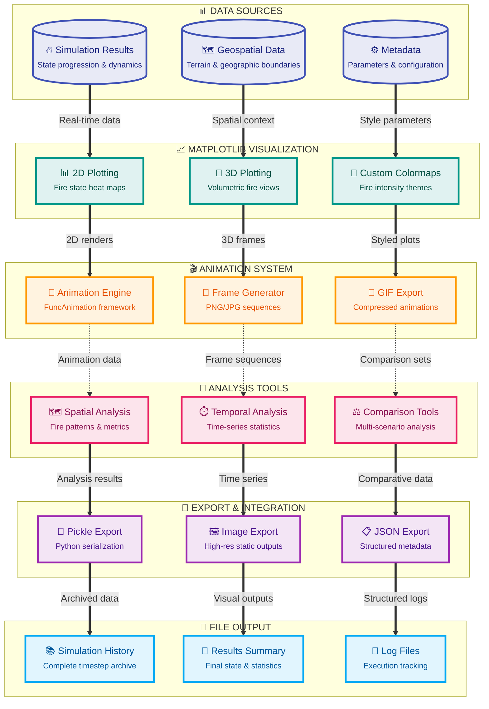

### 6.2 Visualization Output Types

```mermaid
graph TB
    ROOT["🎨 VISUALIZATION OUTPUTS<br/><small>Comprehensive output portfolio</small>"]
    
    subgraph STATIC ["📊 STATIC VISUALIZATIONS"]
        direction TB
        FIREMAPS["🗺️ 2D Fire Maps"]
        RENDERS3D["🏞️ 3D Static Renders"]
        STATPLOTS["📈 Statistical Plots"]
        
        FIREMAPS --> BURNPROG["🔥 Burn Progression Maps<br/><small>Temporal fire spread</small>"]
        FIREMAPS --> EXTENTOV["🎯 Final Extent Overlays<br/><small>Boundary visualization</small>"]
        FIREMAPS --> INTMAPS["🌡️ Intensity Heat Maps<br/><small>Fire severity mapping</small>"]
        
        RENDERS3D --> TERRVIEW["🏔️ Terrain Perspective Views<br/><small>3D landscape context</small>"]
        RENDERS3D --> VERTSTRUC["📏 Vertical Fire Structure<br/><small>Height profiling</small>"]
        RENDERS3D --> MULTIANGLE["🎬 Multi-angle Composites<br/><small>Comprehensive views</small>"]
        
        STATPLOTS --> SPREADRATE["📊 Spread Rate Curves<br/><small>Temporal analysis</small>"]
        STATPLOTS --> PARAMSENS["⚖️ Parameter Sensitivity<br/><small>Model analysis</small>"]
        STATPLOTS --> VALIDATION["✅ Validation Comparisons<br/><small>Accuracy assessment</small>"]
    end
    
    subgraph DYNAMIC ["🎬 DYNAMIC VISUALIZATIONS"]
        direction TB
        REALTIME["⚡ Real-time 3D"]
        ANIMATIONS["📱 Animation Sequences"]
        INTERACTIVE["🌐 Interactive Web"]
        
        REALTIME --> NAVIGATION["🧭 Interactive Navigation<br/><small>User-controlled views</small>"]
        REALTIME --> PARAMS["⚙️ Parameter Adjustment<br/><small>Live model tuning</small>"]
        REALTIME --> SCENARIOS["🔄 Multi-scenario Comparison<br/><small>Comparative analysis</small>"]
        
        ANIMATIONS --> MOVIES["🎥 Fire Progression Movies<br/><small>Animated sequences</small>"]
        ANIMATIONS --> TIMELAPSE["⏰ Time-lapse Evolution<br/><small>Compressed timeline</small>"]
        ANIMATIONS --> MULTIPERSP["📐 Multi-perspective Views<br/><small>Different viewpoints</small>"]
        
        INTERACTIVE --> BROWSERS["🌍 Browser-based Viewers<br/><small>Web accessibility</small>"]
        INTERACTIVE --> EMBEDDED["🔗 Embedded Visualizations<br/><small>Platform integration</small>"]
        INTERACTIVE --> COLLAB["👥 Collaborative Analysis<br/><small>Team-based review</small>"]
    end
    
    subgraph ANALYTICAL ["🔬 ANALYTICAL OUTPUTS"]
        direction TB
        GISINTEG["🗺️ GIS Integration"]
        RESEARCH["📄 Research Deliverables"]
        VALREPORTS["📋 Validation Reports"]
        
        GISINTEG --> QGIS["🎯 QGIS Project Files<br/><small>Open-source compatibility</small>"]
        GISINTEG --> ARCGIS["🏢 ArcGIS Compatibility<br/><small>Enterprise integration</small>"]
        GISINTEG --> SHAPES["📁 Shapefile Exports<br/><small>Standard GIS format</small>"]
        
        RESEARCH --> PUBFIGS["📚 Publication Figures<br/><small>Academic papers</small>"]
        RESEARCH --> PRESENTATIONS["🎤 Presentation Materials<br/><small>Conference content</small>"]
        RESEARCH --> DOCGRAPHICS["📖 Documentation Graphics<br/><small>Technical documentation</small>"]
        
        VALREPORTS --> ACCURACY["🎯 Accuracy Assessments<br/><small>Model performance</small>"]
        VALREPORTS --> PERFMETRICS["📊 Performance Metrics<br/><small>System benchmarks</small>"]
        VALREPORTS --> CALIBRESULTS["⚙️ Calibration Results<br/><small>Parameter optimization</small>"]
    end
    
    ROOT --> STATIC
    ROOT --> DYNAMIC  
    ROOT --> ANALYTICAL
    
    %% Enhanced styling
    classDef rootStyle fill:#4A90E2,stroke:#2E5C8A,stroke-width:4px,color:white
    classDef categoryStyle fill:#7ED321,stroke:#5BA517,stroke-width:3px,color:#2D4A0B
    classDef subcatStyle fill:#F5A623,stroke:#C7851A,stroke-width:2px,color:#8B4513
    classDef itemStyle fill:#E3F2FD,stroke:#2196F3,stroke-width:2px,color:#0D47A1
    
    class ROOT rootStyle
    class FIREMAPS,RENDERS3D,STATPLOTS,REALTIME,ANIMATIONS,INTERACTIVE,GISINTEG,RESEARCH,VALREPORTS categoryStyle
    class BURNPROG,EXTENTOV,INTMAPS,TERRVIEW,VERTSTRUC,MULTIANGLE,SPREADRATE,PARAMSENS,VALIDATION,NAVIGATION,PARAMS,SCENARIOS,MOVIES,TIMELAPSE,MULTIPERSP,BROWSERS,EMBEDDED,COLLAB,QGIS,ARCGIS,SHAPES,PUBFIGS,PRESENTATIONS,DOCGRAPHICS,ACCURACY,PERFMETRICS,CALIBRESULTS itemStyle
```

### 6.3 Analysis & Export Specifications

| Output Type | Format | Resolution | Purpose | Generation Time |
|-------------|--------|------------|---------|-----------------|
| **Fire State Maps** | PNG, JPG | Matplotlib default | Fire progression visualization | 1-5 seconds |
| **Simulation Data** | Python Pickle (.pkl) | Native arrays | Data persistence & analysis | 2-10 seconds |
| **Animations** | GIF (via imageio) | Variable | Process visualization | 30-180 seconds |
| **Metadata** | JSON | Text | Configuration & statistics | <1 second |
| **History Files** | Pickle (.pkl) | Timestep arrays | Complete simulation history | 5-60 seconds |
| **Log Files** | Text (.log, .txt) | Text | Execution tracking & debugging | Continuous |
| **Statistical Data** | JSON, Text | Structured data | Analysis metrics | 1-2 seconds |
| **Terrain Data** | NumPy (.npy) | Native grid | Preprocessed terrain arrays | 10-30 seconds |

---

## 7. Validation & Research Integration

### 7.1 Validation Framework

```mermaid
flowchart TB
    subgraph "Historical Data"
        EMSR[("EMSR Fire Perimeters<br/>Satellite-derived boundaries")]
        DATES[("Fire Event Dates<br/>Temporal progression")]
        WEATHER[("Historical Weather<br/>Wind & conditions")]
    end
    
    subgraph "Simulation Preparation"
        SETUP["Simulation Setup<br/>Historical conditions"]
        IGNITE["Ignition Point Selection<br/>Known fire origins")]
        PARAMS["Parameter Application<br/>Calibrated values")]
    end
    
    subgraph "Validation Simulation"
        RUN["Historical Simulation<br/>Reproduce known fires"]
        TRACK["Progress Tracking<br/>Compare with observations")]
        RECORD["Result Recording<br/>Detailed metrics collection")]
    end
    
    subgraph "Accuracy Assessment"
        SPATIAL["Spatial Accuracy<br/>Boundary comparison"]
        TEMPORAL["Temporal Accuracy<br/>Progression timing"]
        BEHAVIOR["Behavior Accuracy<br/>Spread patterns & rates")]
    end
    
    subgraph "Statistical Analysis"
        METRICS["Similarity Metrics<br/>Jaccard, Dice, Hausdorff"]
        STATS["Statistical Tests<br/>Significance assessment"]
        CONF["Confidence Intervals<br/>Uncertainty quantification")]
    end
    
    subgraph "Validation Results"
        REPORT[("Validation Report<br/>Comprehensive assessment")]
        IMPROVE[("Model Improvements<br/>Parameter refinements")]
        PUBLISH[("Research Publications<br/>Scientific documentation")]
    end
    
    %% Process flow
    EMSR --> SETUP
    DATES --> IGNITE
    WEATHER --> PARAMS
    
    SETUP --> RUN
    IGNITE --> TRACK
    PARAMS --> RECORD
    
    RUN --> SPATIAL
    TRACK --> TEMPORAL
    RECORD --> BEHAVIOR
    
    SPATIAL --> METRICS
    TEMPORAL --> STATS
    BEHAVIOR --> CONF
    
    METRICS --> REPORT
    STATS --> IMPROVE
    CONF --> PUBLISH
    
    %% Feedback loops
    IMPROVE --> PARAMS
    REPORT --> SETUP
    
    %% Styling
    classDef historical fill:#e8eaf6
    classDef prep fill:#e0f2f1
    classDef sim fill:#fff3e0
    classDef assess fill:#fce4ec
    classDef stats fill:#f3e5f5
    classDef results fill:#e1f5fe
    
    class EMSR,DATES,WEATHER historical
    class SETUP,IGNITE,PARAMS prep
    class RUN,TRACK,RECORD sim
    class SPATIAL,TEMPORAL,BEHAVIOR assess
    class METRICS,STATS,CONF stats
    class REPORT,IMPROVE,PUBLISH results
```

### 7.2 EMSR Data Integration Implementation

#### 7.2.1 EMSR Fire Perimeter Discovery

**Auto-Discovery System**:
- **Directory Structure**: Scans `EMSR Delineations/` with day-organized folders
- **File Recognition**: Identifies `.shp` files with EMSR naming conventions
- **Multi-Day Support**: Handles temporal progression (Day 1-4 for Tenerife 2023 fire)
- **Path Flexibility**: HPC and local directory fallbacks

**Discovery Process**:
1. **Directory Scanning**: Parse day directories (`Day 1 (18_08_23)`, etc.)
2. **Date Extraction**: Extract dates and day numbers from folder names
3. **Shapefile Location**: Find fire perimeter shapefiles within each day
4. **Metadata Extraction**: Read fire ID, CRS, and geometry information
5. **Validation**: Verify spatial data integrity and completeness

#### 7.2.2 Historical Fire Data Processing

**Spatial Processing**:
- **CRS Standardization**: Convert all data to EPSG:25828 (Tenerife UTM Zone 28N)
- **Grid Alignment**: Rasterize to full Tenerife domain (15,121 × 24,741 × 5m resolution)
- **Area Calculation**: Compute fire areas in hectares for validation metrics
- **Bounds Verification**: Ensure fire perimeters fit within simulation domain

**Temporal Processing**:
- **Training/Test Split**: Days 1-2 for training, Days 3-4 for testing
- **Progression Tracking**: Model temporal fire growth patterns
- **Multiple Targets**: Support multiple fire events within calibration

**Implementation Parameters**:
- Grid Resolution: 5m × 5m cells
- Domain Size: 75.6km × 123.7km (full Tenerife)
- Memory Requirements: 64-128GB for full-domain processing
- Processing Time: 15-30 minutes per fire perimeter

#### 7.2.3 Calibration Target Generation

**Spatial Similarity Metrics**:
- **Jaccard Index**: Intersection over union of burned areas
- **Dice Coefficient**: 2 × overlap / (area1 + area2)  
- **Sorensen Coefficient**: Alternative similarity measure
- **Hausdorff Distance**: Maximum boundary separation distance

**Objective Function Weights**:
- Spatial Similarity: 60%
- Fire Behavior: 40%
- Component breakdown: Jaccard (40%), Dice (30%), Sorensen (30%)

### 7.3 Research Pipeline Integration

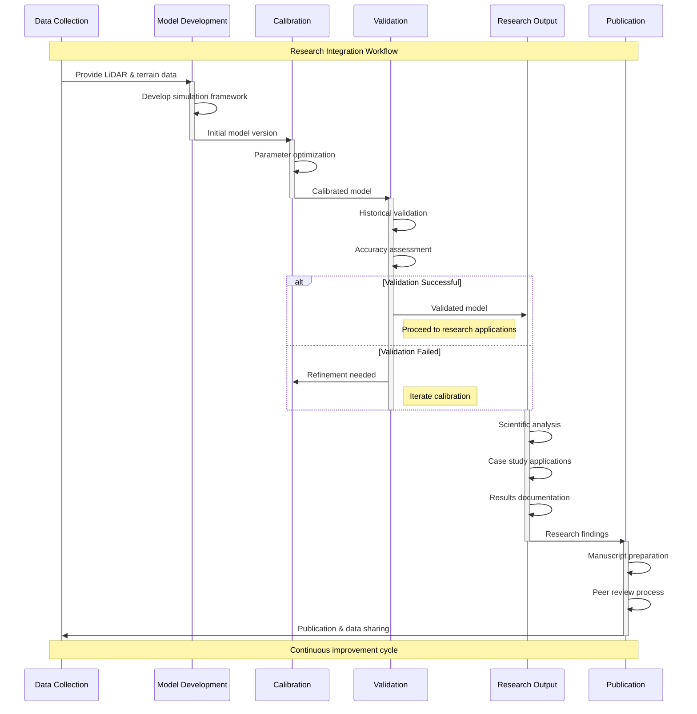

### 7.3 Validation Metrics & Benchmarks

| Metric Category | Measure | Acceptable Range | Excellent Performance | Purpose |
|----------------|---------|------------------|----------------------|---------|
| **Spatial Similarity** | Jaccard Index | 0.60 - 0.75 | > 0.80 | Boundary accuracy |
| | Dice Coefficient | 0.70 - 0.85 | > 0.90 | Shape similarity |
| | Hausdorff Distance | < 100m | < 50m | Boundary precision |
| **Temporal Accuracy** | Progression Correlation | 0.70 - 0.85 | > 0.90 | Time evolution |
| | Peak Spread Time | ±2 hours | ±1 hour | Critical timing |
| **Fire Behavior** | Final Area Ratio | 0.80 - 1.20 | 0.90 - 1.10 | Total extent |
| | Spread Rate Correlation | 0.60 - 0.80 | > 0.85 | Velocity accuracy |
| **Statistical** | R² Correlation | 0.70 - 0.85 | > 0.90 | Overall fit |
| | RMSE (normalized) | < 0.30 | < 0.20 | Prediction error |

---

## 8. System Integration & Data Flow

### 8.1 Complete System Data Flow

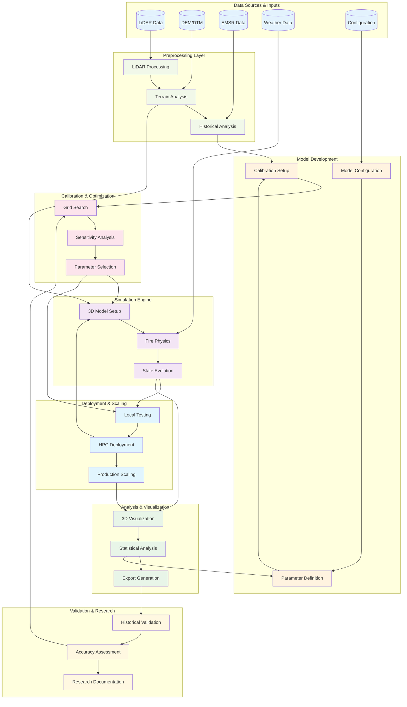

### 8.2 Integration Points & Dependencies

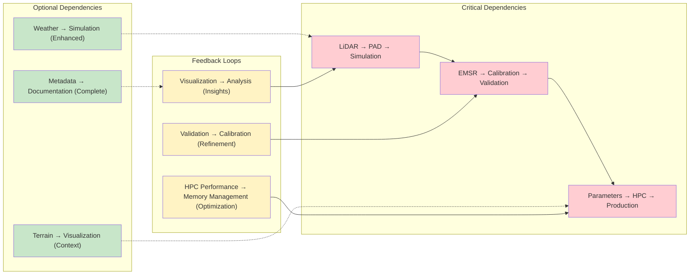

### 8.3 System Performance & Scaling Summary

| System Component | Local Performance | HPC Performance | Scaling Factor | Bottlenecks |
|------------------|------------------|-----------------|----------------|-------------|
| **Data Preprocessing** | 1-2 hours | 15-30 minutes | 4-8x | I/O bandwidth |
| **Calibration** | 8-12 hours | 45-90 minutes | 8-16x | Parameter space size |
| **Simulation (Small)** | 20-40 minutes | 5-15 minutes | 4-8x | Memory allocation |
| **Simulation (Large)** | 4-8 hours | 1-3 hours | 4-6x | Grid complexity |
| **Visualization** | Real-time | Real-time | 1x | Graphics hardware |
| **Analysis** | 10-30 minutes | 2-8 minutes | 5-15x | Statistical computation |
| **Overall Pipeline** | 12-24 hours | 2-6 hours | 6-12x | Dependencies & I/O |

---

## Conclusion

This comprehensive workflow documentation presents a complete forest fire simulation framework designed for research applications in complex terrain environments. The framework integrates multiple sophisticated components:

1. **Advanced Data Processing**: LiDAR-derived vegetation structure analysis with terrain-aware preprocessing
2. **Rigorous Calibration**: Multi-method parameter optimization with historical fire validation  
3. **Deterministic Fire Physics**: 3D fire simulation with threshold-based ignition and efficient memory management
4. **Comprehensive Analysis**: Multi-format visualization and statistical analysis tools
5. **Research Integration**: Validation workflows and publication-ready documentation

The modular design allows for flexible application across different research contexts while maintaining scientific rigor through calibration and validation against historical fire events. The HPC deployment capability enables large-scale studies while the interactive visualization system supports detailed analysis and communication of results.

This framework provides a solid foundation for advancing fire behavior research and supports the development of improved fire management strategies through accurate, validated simulations of fire behavior in complex natural environments.

---

*This document serves as the comprehensive workflow guide for the forest fire simulation framework developed as part of ongoing research into fire behavior modeling and prediction.*
